For S3D and 4D meta-analysis see (K. Kim, et al. 2017).


```{r setup_condensed, include=F}
## Setup
library("knitr")
knitr::opts_chunk$set(
  echo = F,
  message   = F, warning = F, error = F,
  results   = "asis",                # Opts: "asis", "markup", "hold", "hide"
  fig.align = "center",              # Opts: "left", "right", "center", "default"
  fig.width = 8, fig.height = 5,
  out.width = "100%",
  fig.pos   = "h", out.extra   = "", # Figures forced closer to chunk location.
  collapse  = TRUE, cache = FALSE, cache.lazy  = FALSE
)
```

```{r init}
## Initialize
library("spinifex")
library("tourr")
library("ggplot2")
library("tibble")
library("dplyr")

dat  <- flea[, 1:6]
clas <- flea$species

invisible(capture.output(holes_path <- save_history(dat, tour_path = guided_tour(holes()))))
holes_basis <- as.matrix(holes_path[,, dim(holes_path)[3]])

n <- nrow(dat)
p <- ncol(dat)
k_cl <- length(unique(clas))
pca_obj <- prcomp(dat)

pca_var_rate <- pca_obj$sdev^2 / sum(pca_obj$sdev^2)

df_pcaVar <- data.frame(
  pc_number = paste0("PC", 1:p),
  rate_var_explained = pca_var_rate,
  cumsum_rate_var_explained = cumsum(pca_var_rate)
)
```
# Cluster seperation and task evalution

In general defining feature importance is a common task. Though it is typically model dependant is 

- The relative magnitude of the eigen values, as visualized in a scree plot ("Screeplot" R. Cattell, 1966)
- Slope of $p-$dim line seperating two clusters scaled by the inverse of the variance-covariance matrix ("LDA" R. Fishce, 1936)
- As ratios of F-values for features ("ANOVA" R. Fisher 1918) or as interactions of features ("MANOVA" S. Wilks  1932)
- _feature imporance_ Percent increase in misclassification rate when a feature is removed. ("Random forests" L. Breiman, 2001)
- _permutation feature importance_ diffence between importance of the real variable and that of OOB re-sampling of 1 variable (holding the remaining data constant) [Interpretable Machine Learning (ebook), 5.5) feature-importance](https://christophm.github.io/interpretable-ml-book/feature-importance.html) ("PIMP", Altmann et al. 2010)
- _Raw importance_, is the $(untouched~count - feature_m~count) / Number~of~trees$, ("Auto-WEKA" C. Thornton, 2013)
- _Model reliance_, is the fraction each feature is used over all permutations. (A. Fisher, 2018)

## Measuring which variables are sensitive to cluster seperation

We'll take inspiration from the Scree plot and try to apply it to the LDA-like approach
Consider a sree plot of flea data. This shows which componets are contributing to the *full sample, full dimensionality,* $[n,p]$ variation of the data.

```{r Screeplot}
(g1 <- ggplot(data = df_pcaVar) + 
   ## Individual var bars
   geom_bar(stat = "identity", 
            mapping = aes(x = pc_number, y = rate_var_explained, 
                          fill = "Variable variance")) + 
   ## Cummulative var line
   geom_line(mapping = aes(x = pc_number, y = cumsum_rate_var_explained,
                           color = "Cummulative variance", group = 1),lwd = 1.2) +
   geom_point(mapping = aes(x = pc_number, y = cumsum_rate_var_explained,
                            color = "Cummulative variance"), shape = 18, size = 4) +
   ## Themes, legends and colors 
   theme_minimal() +
   labs(title = "variance by principal component, flea data",
        x = "Component number", 
        y = "Variance",
        colour = "", fill = "") + 
   # theme(legend.position = c(0.9, 0.5)) + ## legend position doesn't work now because different geoms??
   scale_fill_manual(values = "#1B9E77") + 
   scale_colour_manual(values = "#D95F02"))
# RColorBrewer::brewer.pal(n=2, "Dark2")
```

The user study task trys to explore the *full sample, full dimensionality* $[n,p]$ seperation of two specified clusters. In an analogous manner, __let's try to create a screeplot-like output to evalute the contributions of the original variables.__ Note that this is related to what R. Fisher is attempting in his 1936 paper. Similarly we start by finding cluster means and covariances.

```{r clusterMeans}
df_clusterMeans <- NULL
ls_clusterSigmas <- list()
for (i in 1:k_cl) {
  .cl  <- unique(clas)[i]
  .sub <- dat[clas == .cl, ]
  .row <- apply(.sub, 2, mean)
  df_clusterMeans <- rbind(df_clusterMeans, .row)
  ls_clusterSigmas[[i]] <- cov(.sub)
}
df_clusterMeans <- as.data.frame(df_clusterMeans)
rownames(df_clusterMeans) <- paste0("Cluster means of: ", unique(clas))
names(ls_clusterSigmas) <- paste0("Cluster covariances of: ", unique(clas))
```

__Cluster means:__
`r kable(df_clusterMeans, digits = 2)`

__Cluster variance-covariance matrices:__
For `r paste0(unique(clas), collapse = ", ")` respectively
`r kable(ls_clusterSigmas, digits = 4)` 

Suppose the clusters in questions are *Concinna* and *Heptapot*. The line between the the cluster means of these groups is their difference. This is sufficeint for Linear Discriminant Analysis (LDA) which assumes homogenious variation between clusters. We'll follow Fisher's Discriminant Analysis, which accounts for within cluster variance.

$$ Cluster Seperation_{[1,p]} = (\mu_{b[1,p]} - \mu_{a[1,p]})^2~/~(\Sigma_{a[p, p]} + \Sigma_{b[p, p]})~~~;~a,~b~are~clusters \in X_{[n,p]}$$

```{r clusterSep}
source('./R/ggproto_screeplot_ClSep.r')
df_clSep_CH <- df_scree_clSep(dat, clas, do_scale_to_1 = FALSE)
df_clSep_CH <- df_clSep_CH %>% select(-data_colnum)

kable(df_clSep_CH, digits = 2)
```

We discard the sign as we only care about magnitude each variable contributed to the seperation of the specified clusters. We scale the absolute terms by the inverse of the sumation. Now let's visualize this similar to the screeplot.

```{r clSepScreeplot}
palette(RColorBrewer::brewer.pal(3, "Dark2")) 
(g2 <- ggplot2::ggplot() + ggproto_screeplot_clSep(dat, clas) + theme_minimal())
```

## Evaluating the response

Now that we have a measure we want to define an objective cutoff for evaluation. We want the measure to a few attributes:

- Continuous relative to the cluster seperation
- Sum of squares should equal 1
- Symetric, diverging around uniform weight

Following these, we define a measure to be:

$$Marks = \sum_{i = 1}^{p}(\sqrt{ClusterSeperation_i} - (1 / (p - 1)) * I(Response_i)$$

```{r answerWeights, results="hold"}
bar_unif <- 1/(p-1)

df_clSep_eval <- mutate(df_clSep_CH, .keep = "none",
                        variable        = var,
                        var_clSep       = var_clSep,
                        Weight          = sqrt(var_clSep) - bar_unif,
                        exampleResponse = c(1, 1, 0, 1, 0, 1),
                        Marks           = Weight * exampleResponse)

(g3 <- g2 +
  geom_hline(yintercept = bar_unif, size = 1) +
  geom_text(aes(x = 7, y = bar_unif + .04, 
                label = "Uniform Wt, 1/(p-1) = .2"),
            size = 4, hjust = 1) +
  geom_segment(data = df_clSep_eval, colour = "green", size = 2,
               aes(x = 1, y = bar_unif, xend = 1, yend = Weight[1] + bar_unif) 
  ) +
  geom_segment(data = df_clSep_eval, colour = "green", size = 2,
               aes(x = 2, y = bar_unif, xend = 2, yend = Weight[2] + bar_unif), 
  ) +
  geom_segment(data = df_clSep_eval, colour = "green", size = 2,
               aes(x = 3, y = bar_unif, xend = 3, yend = Weight[3] + bar_unif), 
  ) +
  geom_segment(data = df_clSep_eval, colour = "green", size = 2,
               aes(x = 4, y = bar_unif, xend = 4, yend = Weight[4] + bar_unif), 
  ) +
  geom_segment(data = df_clSep_eval, colour = "red", size = 2,
               aes(x = 5, y = bar_unif, xend = 5, yend = Weight[5] + bar_unif), 
  ) +
  geom_segment(data = df_clSep_eval, colour = "red", size = 2,
               aes(x = 6, y = bar_unif, xend = 6, yend = Weight[6] + bar_unif), 
  )
)
```

Here, we add lines indicating the weight of each variable if selected as important. we then apply our measure to evalue task responses, we review an example response below:

`r kable(df_clSep_eval, digits = 2)`
`r paste0("Total Marks = ", round(sum(df_clSep_eval$Marks), 2))`

## Projected data view

All linear projections are nesciarily a lossy representation of the full data. By this we mean that no single 2D frame can show the whole set of infromation for $p>=3$ -dimensional sample. Any pair of Pricipal Components nessciaronly shows less than all the variation, namely the sum of their contributions, typicaly stated as percentage of full sample variation. Analogously any single projection cannot show the full information explain the cluster seperation of 2 given clusters.

In applcation, viewing a PC1 by PC2 biplot of flea data contains `r round(100 * df_pcaVar[2,3], 2)` percent of the variation explained in the sample. While viewing (an orthogonal project) the top 2 variables (namely: `r as.character(df_clSep_CH[1:2, 1])` ) explain `r round(100 * df_clSep_CH[2, 3], 2)` percent of the within sample cluster seperation between *Concinna* and *Heptapot*.

<!-- _finish this thought_ -->

<!-- ## Mental task -->

<!-- _todo_ -->

## Cluster seperation on single-variable permuted data

```{r permFeatImp, eval=FALSE}
#### USES EVAL

source('./R/permutation_feature_importance.r')
require("ggplot2")
for (i in 1:6){
  .gg <- rep_permute_var_clSep(data = dat, class = clas, permute_rank_num = i)
  ggsave(filename = paste0("permute_clSep", i, ".png"),
         plot =  .gg,
         path = "./output/")
}
```
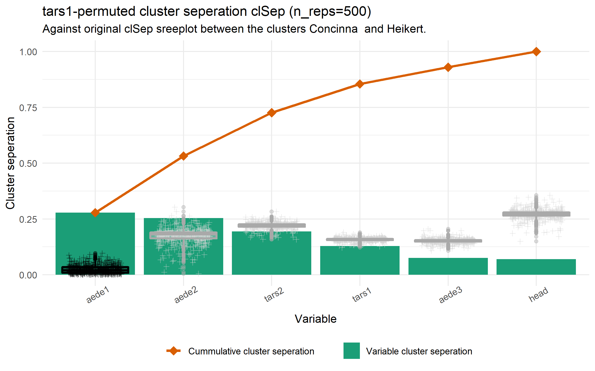
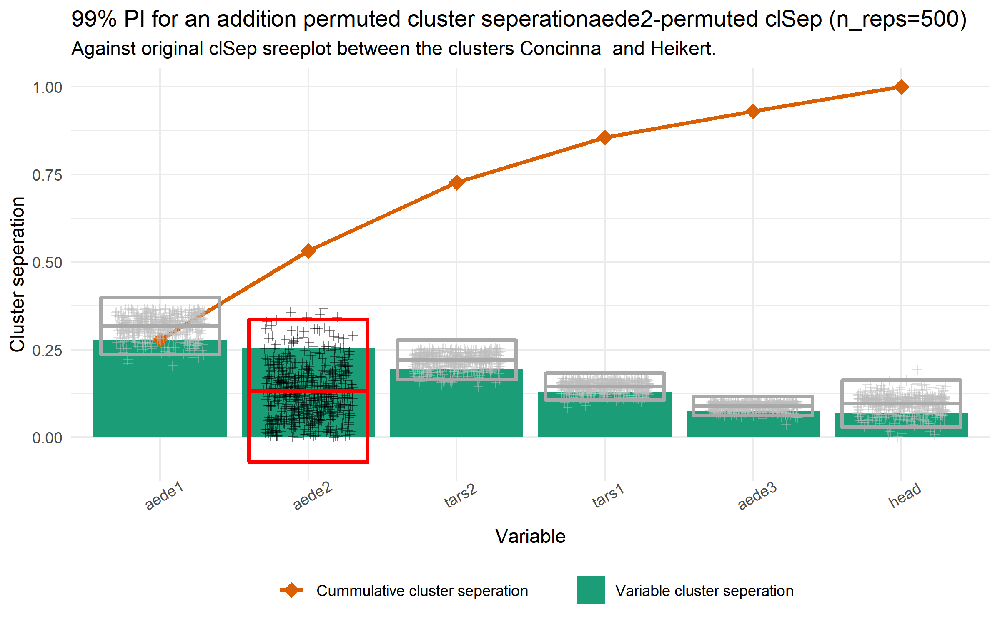
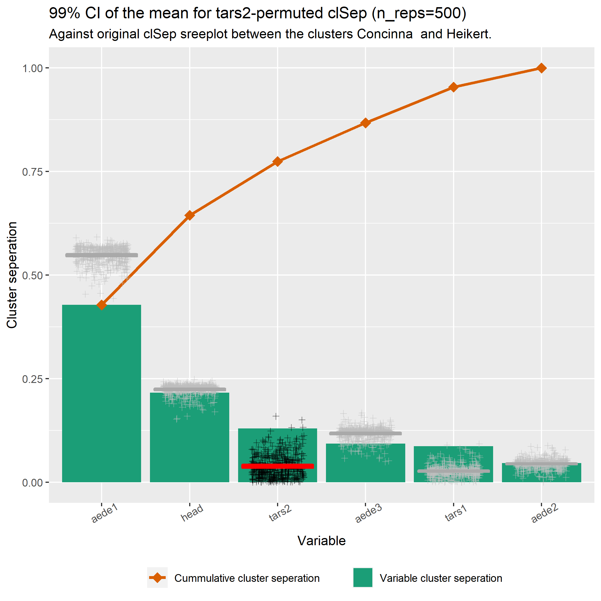
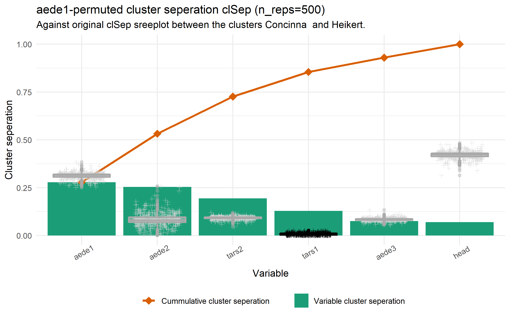
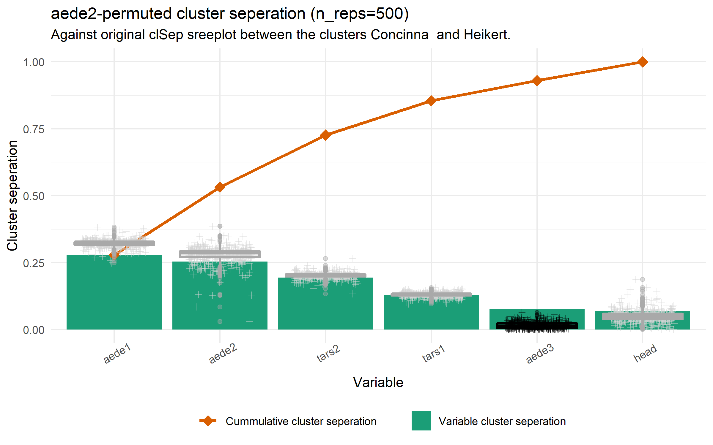
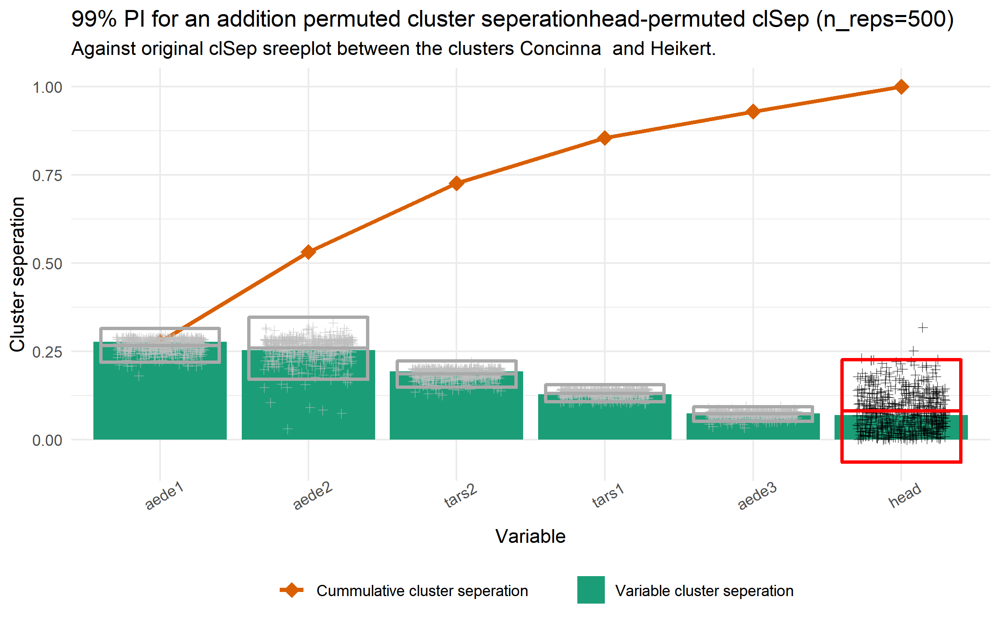


## Application to other toy sets

In order to stress test this Cluster seperation viewed by a screeplot we apply it to other toy datasets.

```{r toyPermFeatImp, eval=FALSE}
#### USES EVAL

require("ggplot2")
source('./R/permutation_feature_importance.r')

palette(RColorBrewer::brewer.pal(3, "Dark2"))
theme_set(theme_minimal())

dat <- spinifex::wine[, 2:ncol(spinifex::wine)]
clas <- spinifex::wine[, 1]
.gg <- rep_permute_var_clSep(data = dat, class = clas, permute_rank_num = 1)
ggsave(filename = paste0("wine_permute_clSep1.png"),
       plot =  .gg,
       path = "./output/")

dat <- spinifex::breastcancer[, 2:9]
clas <- spinifex::breastcancer[, 10]
.gg <- rep_permute_var_clSep(data = dat, class = clas, permute_rank_num = 1)
ggsave(filename = paste0("breastcancer_permute_clSep1.png"),
       plot =  .gg,
       path = "./output/")

dat <- tourr::olive[, 3:ncol(tourr::olive)]
clas <- tourr::olive[, 1]
.gg <- rep_permute_var_clSep(data = dat, class = clas, permute_rank_num = 1)
ggsave(filename = paste0("olive_permute_clSep1.png"),
       plot =  .gg,
       path = "./output/")

dat <- tourr::ratcns[, 1:9]
clas <- tourr::ratcns[, 10]
.gg <- rep_permute_var_clSep(data = dat, class = clas, permute_rank_num = 1)
ggsave(filename = paste0("ratcns_permute_clSep1.png"),
       plot =  .gg,
       path = "./output/")

pengu <- as.data.frame(palmerpenguins::penguins)
pengu <- pengu[complete.cases(pengu), ]
dat <- pengu[, 3:6]
clas <- pengu$species
.gg <- rep_permute_var_clSep(data = dat, class = clas, permute_rank_num = 1)
ggsave(filename = paste0("penguins_permute_clSep1.png"),
       plot =  .gg,
       path = "./output/")
clas <- pengu$sex
.gg <- rep_permute_var_clSep(data = dat, class = clas, permute_rank_num = 1)
ggsave(filename = paste0("penguins_InvalidAssumptions_permute_clSep1.png"),
       plot =  .gg,
       path = "./output/")
pengu2 <- pengu[pengu$species == unique(pengu$species)[1], ]
dat <- pengu2[, 3:6]
clas <- pengu2$sex
.gg <- rep_permute_var_clSep(data = dat, class = clas, permute_rank_num = 1)
ggsave(filename = paste0("penguins_sexIn1Species_permute_clSep1.png"),
       plot =  .gg,
       path = "./output/")
```

### Penguins, between 2 levels of spieces
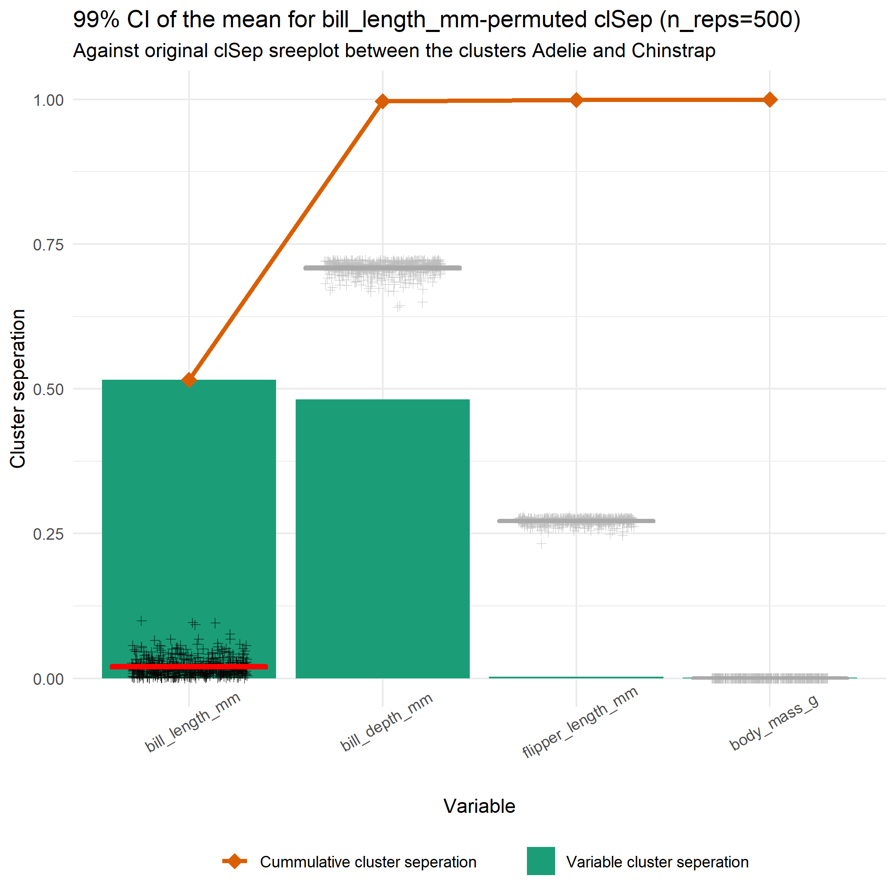

### Penguins, between 2 levels of sex (invalid)
(invalid assumptions, as there are 3 species clusters for each sex)
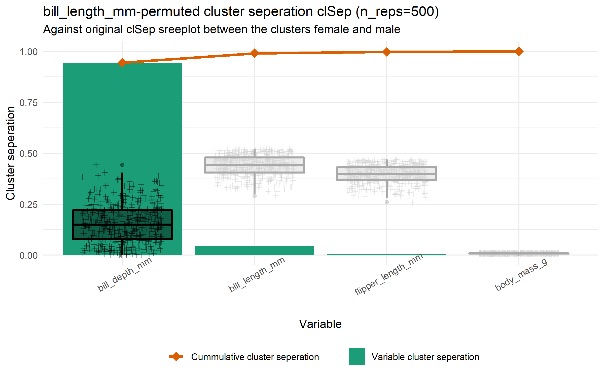
### Penguins, between 2 levels of sex with 1 species
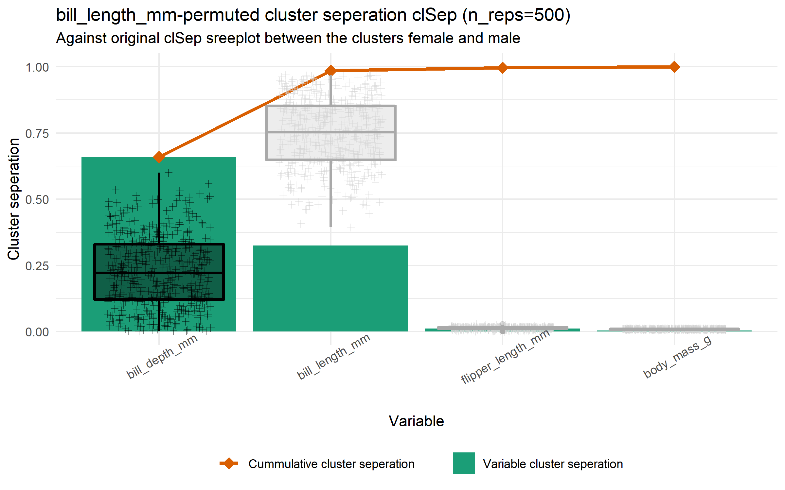

### Wine, between 2 levels of type of wine
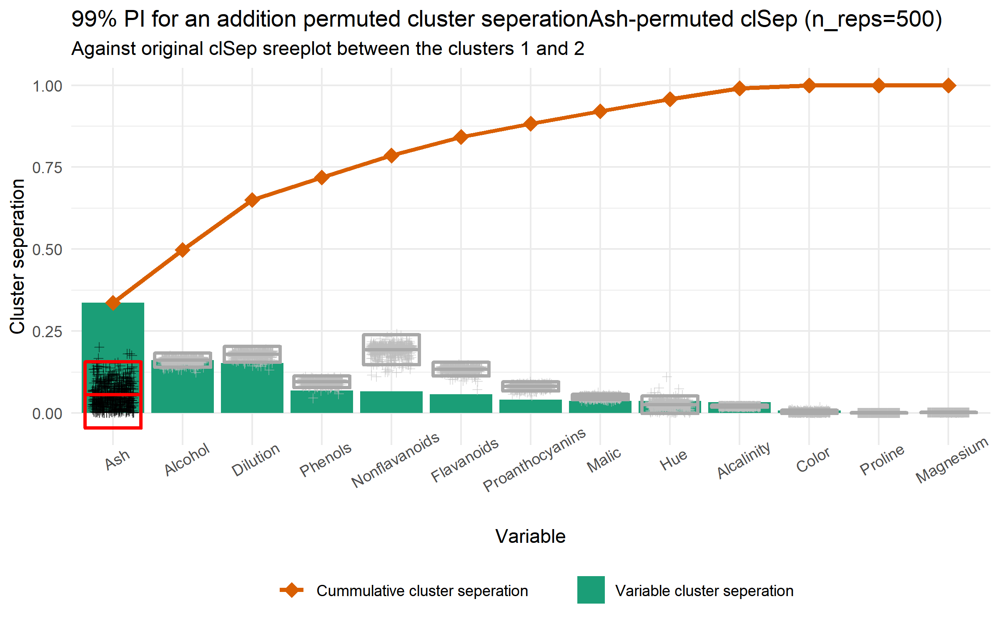

### Breastcancer, between benign/malignant tumors
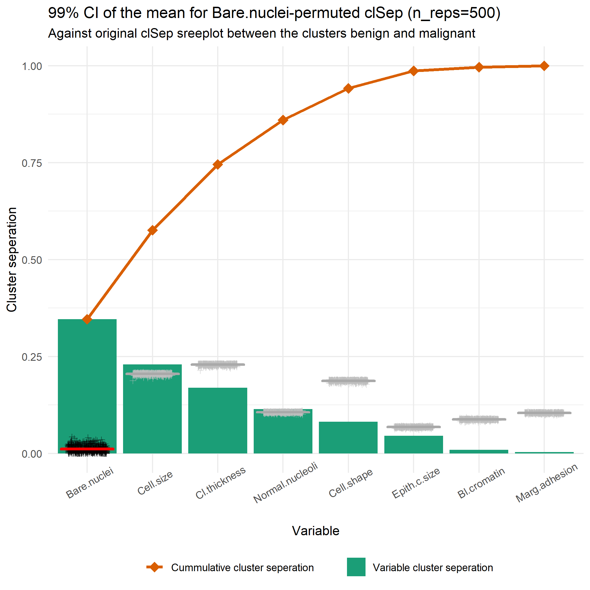

### Olive, between 2 levels of region of Italy
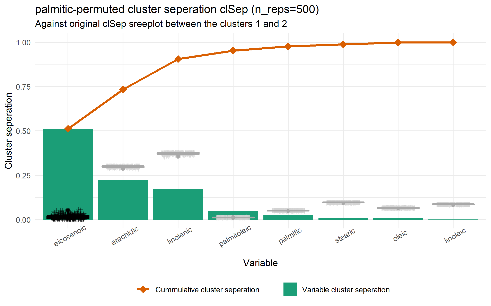

### Rat CNS gene expression, between 2 levels of "the high-level classes"
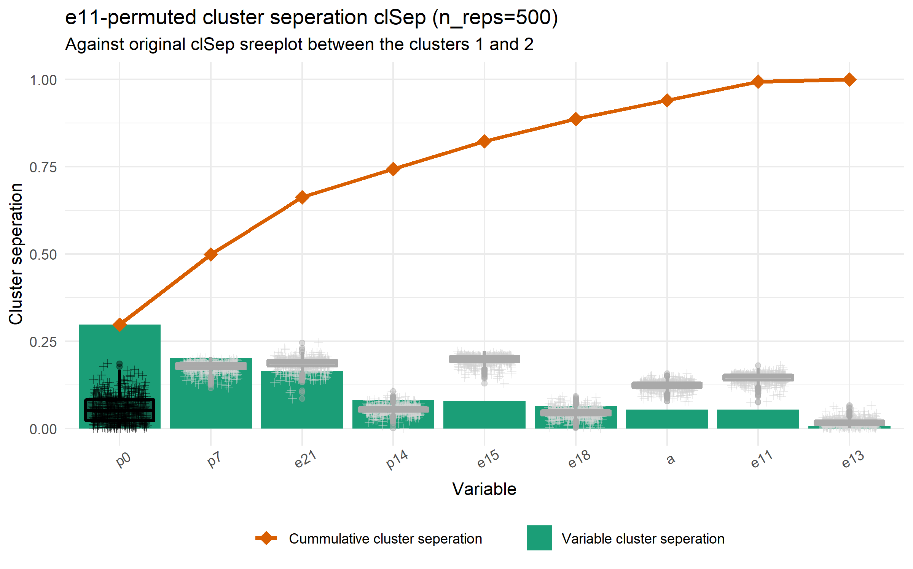

# Simulation difficulty


In order to properly distinguish a difference between the 3 vizualization factors the data must be of suitable complexity, such that it has the following properties:

1. Must be complex enough not to see within the any pair of the first 4 Principal Components; such that PCA is not sufficent for exploring cluster seperation
2. Must not be so complex as to preclude any meaningful response given the factor visuals and time constraints.

Let's try to evaluate our current generation of data simulations against these properties

```{r simPcaPairs, eval=FALSE}
#### USES EVAL

## Series spans from 301:312
dat          <- readRDS("./apps/data/simulation_data301.rds")
dat_clusters <- attributes(dat)$cl_lvl
dat_std      <- tourr::rescale(as.matrix(dat))
dat_pca_rot  <- prcomp(dat)$rotation
proj_dat_pca <- as.data.frame(dat_std %*% dat_pca_rot)

library(GGally)
ggparis_proj_dat_pca <- 
  ggpairs(proj_dat_pca[, 1:4], 
          title = "ggpairs of PC1:4 for simulation_data301",
          ggplot2::aes(colour = dat_clusters))
#scale_color_brewer("Dark2") ## scale_color/fill* don't work as explected on ggpairs()

ggplot2::ggsave(filename = "ggpairs_pca_sim301.png",
                plot =  ggparis_proj_dat_pca,
                path = "./output/")
```


Seems sufficent to be complex enough not to be seen as a pair of components within the first 4 Principal Components. Now to see if we can see anything in radial tours of all variables.

_note: spinifex needs cleanup_

```{r simRadialTours, eval=FALSE}
#### USES EVAL

require("spinifex")
### Init for radial tour:
dat          <- readRDS("./apps/data/simulation_data301.rds")
dat_clusters <- attributes(dat)$cl_lvl
dat_std      <- tourr::rescale(as.matrix(dat))
bas_pca      <- prcomp(dat)$rotation[, 1:2]

i_s <- 1:ncol(dat)
for(i in i_s) {
  .this_radial_tour <-  
    play_manual_tour(basis = bas_pca, data = dat_std, manip_var = i,
                     render_type = render_gganimate, 
                     color = dat_clusters, 
                     shape = dat_clusters, 
                     axes = "left", fps = 8,
                     gif_filename = paste0("radialTour_sim301_mvar.gif", i),
                     gif_path = "./output",
    )
}
```
<!-- 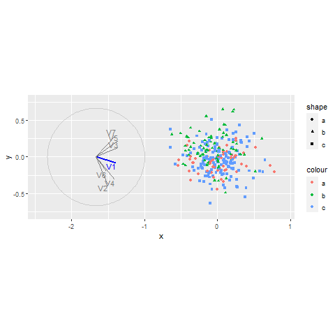 -->
<!--  -->
<!--  -->
<!--  -->
<!--  -->
<!--  -->
<!-- 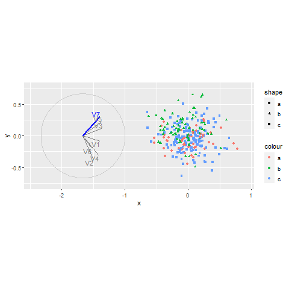 -->

# References


Fisher, Ronald A. "The Use of Multiple Measurements in Taxonomic Problems." Annals of Eugenics 7, no. 2 (September 1936): 179-88. https://doi.org/10.1111/j.1469-1809.1936.tb02137.x.


