For S3D and 4D meta-analysis see (K. Kim, et al. 2017).


```{r setup_condensed, include=F}
## Setup
library("knitr")
knitr::opts_chunk$set(
  echo = F,
  message   = FALSE, warning = FALSE, error = FALSE,
  results   = "asis",                # Opts: "asis", "markup", "hold", "hide"
  fig.align = "center",              # Opts: "left", "right", "center", "default"
  fig.width = 8, fig.height = 5,
  out.width = "100%",
  fig.pos   = "h", out.extra   = "", # Figures forced closer to chunk location.
  collapse  = TRUE, cache = FALSE, cache.lazy = FALSE
)
```

```{r init}
## Initialize
require("spinifex")
require("tourr")
require("ggplot2")
require("tibble")
require("dplyr")
source("./R/ggproto_screeplot_pca.r")
source("./R/ggproto_screeplot_clSep.r")
source("./R/permutation_feature_importance.r")
source("./R/MMP_clSep.r")
source("./R/sim_pDim_kCl.r") ## cluster levels stored in attribute "cl_lvl". Try attr(mySim, "cl_lvl")
set.seed(20200725)
theme_set(theme_minimal())
palette(RColorBrewer::brewer.pal(8, "Dark2"))
DO_RERUN_HEAVY_OUTPUT            <- FALSE
DO_RERUN_SIM302_PAIRS_n_TOURGIFS <- FALSE
output_path <- "./output_SimDifficulty"

dat  <- flea[, 1:6]
clas <- flea$species
p    <- ncol(dat)
k_cl <- length(unique(clas))

## if trying in tours:
# invisible(capture.output(holes_path <- save_history(dat, tour_path = guided_tour(holes()))))
# holes_basis <- as.matrix(holes_path[,, dim(holes_path)[3]])
```
# Cluster seperation and task evalution

In general defining feature importance is a common task. Though it is typically model dependant is 

- The relative magnitude of the eigen values, as visualized in a scree plot ("Screeplot" R. Cattell, 1966)
- Slope of $p-$dim line seperating two clusters scaled by the inverse of the variance-covariance matrix ("LDA" R. Fishce, 1936)
- As ratios of F-values for features ("ANOVA" R. Fisher 1918) or as interactions of features ("MANOVA" S. Wilks  1932)
- _feature imporance_ Percent increase in misclassification rate when a feature is removed. ("Random forests" L. Breiman, 2001)
- _permutation feature importance_ diffence between importance of the real variable and that of OOB re-sampling of 1 variable (holding the remaining data constant) [Interpretable Machine Learning (ebook), 5.5) feature-importance](https://christophm.github.io/interpretable-ml-book/feature-importance.html) ("PIMP", Altmann et al. 2010)
- _Raw importance_, is the $(untouched~count - feature_m~count) / Number~of~trees$, ("Auto-WEKA" C. Thornton, 2013)
- _Model reliance_, is the fraction each feature is used over all permutations. (A. Fisher, 2018)

## Measuring which variables are sensitive to cluster seperation

We take inspiration from the Scree plot and try to apply it to the LDA-like approach. Consider a sree plot of flea data. This shows which componets are contributing to the *full sample, full dimensionality,* $[n,p]$ variation of the data.

```{r pcaScreeplot}
df_pcaVar <- df_scree_pca(dat)
ggplot2::ggplot() + ggproto_screeplot_pca(dat)
```

The user study task trys to explore the *full sample, full dimensionality* $[n,p]$ seperation of two specified clusters. In an analogous manner, __create a screeplot-like output to evalute the contributions of the variables the cluster seperation (clSep) described in the data.__ This is related to what R Fisher is attempting in his 1936 paper on discriminant analysis. Similarly we start by finding cluster means and covariances.

```{r clusterMeansCov}
df_clusterMeans <- NULL
ls_clusterSigmas <- list()
for (i in 1:k_cl) {
  .cl  <- unique(clas)[i]
  .sub <- dat[clas == .cl, ]
  .row <- apply(.sub, 2, mean)
  df_clusterMeans <- rbind(df_clusterMeans, .row)
  ls_clusterSigmas[[i]] <- cov(.sub)
}
df_clusterMeans <- as.data.frame(df_clusterMeans)
rownames(df_clusterMeans) <- paste0("Cluster means of: ", unique(clas))
names(ls_clusterSigmas)   <- paste0("Cluster covariances of: ", unique(clas))
```

__Cluster means:__
`r kable(df_clusterMeans, digits = 2)`

__Cluster variance-covariance matrices:__
For `r paste0(unique(clas), collapse = ", ")` respectively
`r kable(ls_clusterSigmas, digits = 4)` 

Suppose the clusters in questions are *Concinna* and *Heptapot*. The line between the the cluster means of these groups is their difference. This is sufficeint for Linear Discriminant Analysis which assumes homogenious variation between clusters. We start from  Fisher's Discriminant Analysis, which accounts for within cluster variance.

$$ clSep_{[1,p]} = (\mu_{b[1,p]} - \mu_{a[1,p]})^2~/~(\Sigma_{a[p, p]} + \Sigma_{b[p, p]})~~~;~a,~b~are~clusters \in X_{[n,p]}$$

They we alter the sum of the within cluster covariances to its pooled equivalant (take the weighted average of them.)

$$ Cluster Seperation_{[1,p]} = (\mu_{b[1,p]} - \mu_{a[1,p]})^2~/~
(\Sigma_{a[p, p]} * n_a + \Sigma_{b[p, p]} * n_b) / (n_a + n_b) ~~~;~a,~b~are~clusters \in X_{[n,p]}$$

```{r clusterSep}
df_clSep <- df_scree_clSep(dat, clas, do_scale = TRUE)
df_clSep <- df_clSep %>% select(-data_colnum)

kable(df_clSep, digits = 2)
```

We discard the sign as we only care about magnitude each variable contributed to the seperation of the specified clusters. We scale the absolute terms by the inverse of the sumation. Now lets visualize this similar to the screeplot.

```{r clSepScreeplot}
ggplot() + ggproto_screeplot_clSep(dat, clas) + theme_minimal()
```

However, we are concerned about the following case: if the singal of one variable is sufficent to explian the seperation of the clusters, but is dwarfed by the contribution of another variable. We review the correlation matrix to see if our concerns are valid, then we try to about for this by permuting (or shuffling) the values in a single column and watching how the contributions change.

## Cluster seperation on single-variable permuted data

<!-- ### ggcorr within clusters -->
<!-- # ```{r ggcorr} -->
<!-- # if (DO_RERUN_HEAVY_OUTPUT == TRUE) { -->
<!-- #   for (i in 1:2) { -->
<!-- #     .cl  <- unique(clas)[i] -->
<!-- #     .sub <- dat[clas == .cl, ] -->
<!-- #     .gg <- GGally::ggcorr(.sub, label = TRUE, label_alpha = TRUE) -->
<!-- #     ggsave(filename = paste0("ggcorr_cl", .cl, ".png"), -->
<!-- #            plot =  .gg, -->
<!-- #            path = output_path) -->
<!-- #   } -->
<!-- # } -->
<!-- # ``` -->
<!-- # 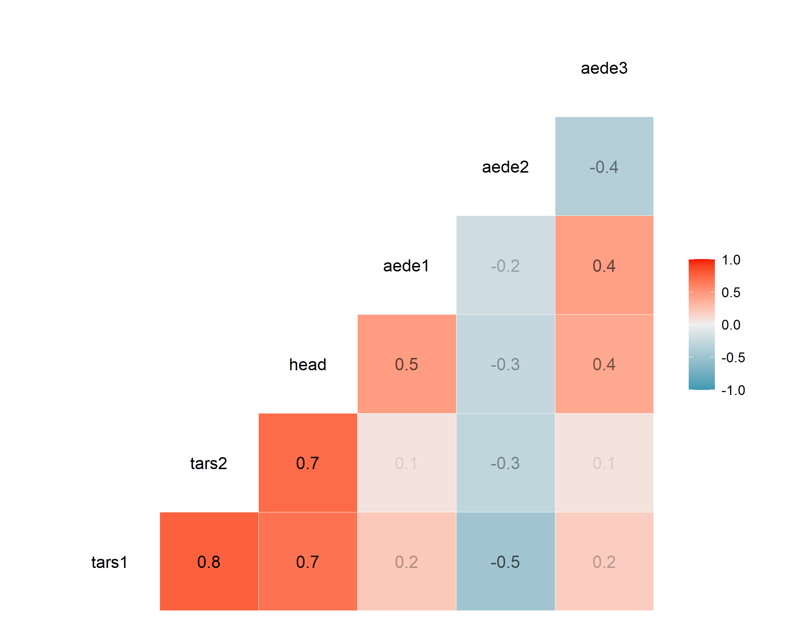 -->
<!-- # 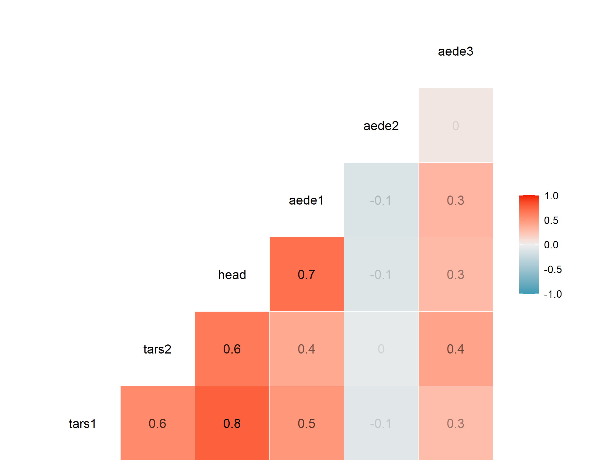 -->
<!-- # 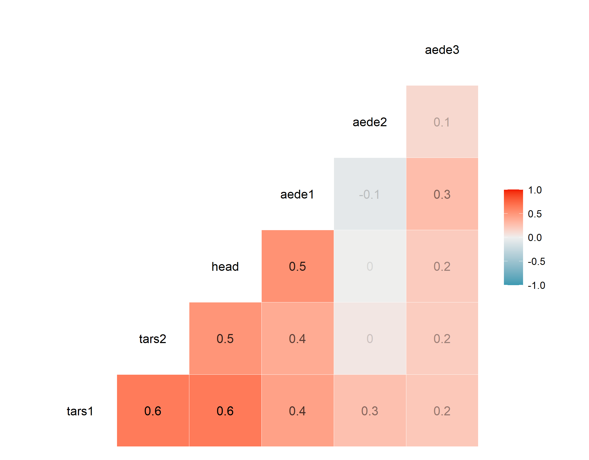 -->

It's seems our concerns are valid, at least in this case.

```{r permFeatImp}
if (DO_RERUN_HEAVY_OUTPUT == TRUE) {
  for (i in 1:6) {
    .gg <- ggplot() + ggproto_rep_permute_var_clSep(dat, clas, permute_rank_num = i)
    ggsave(filename = paste0("permute_clSep", i, ".png"),
           plot =  .gg,
           path = output_path)
  }
}
```
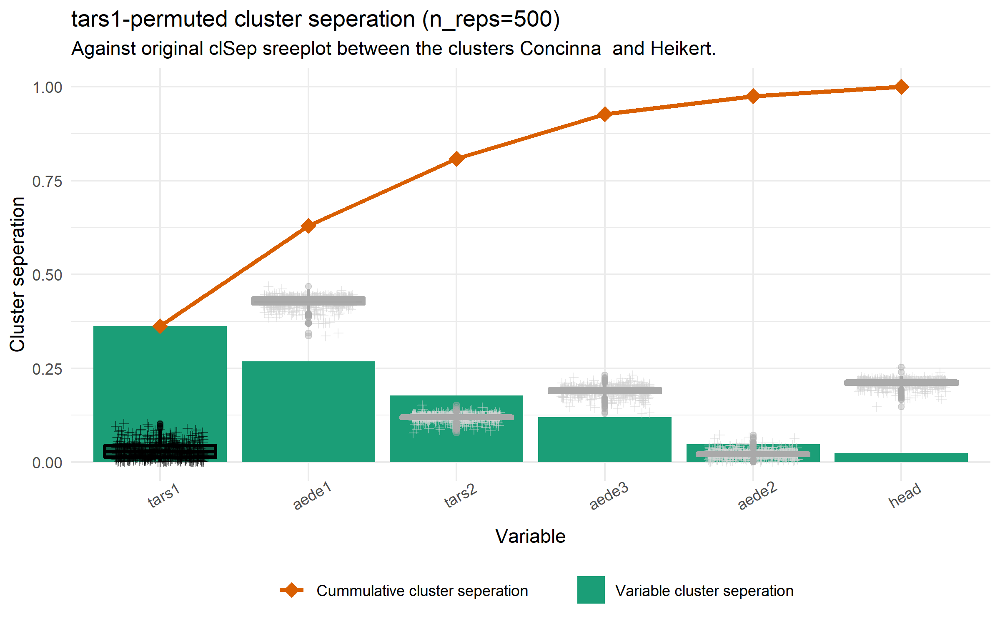
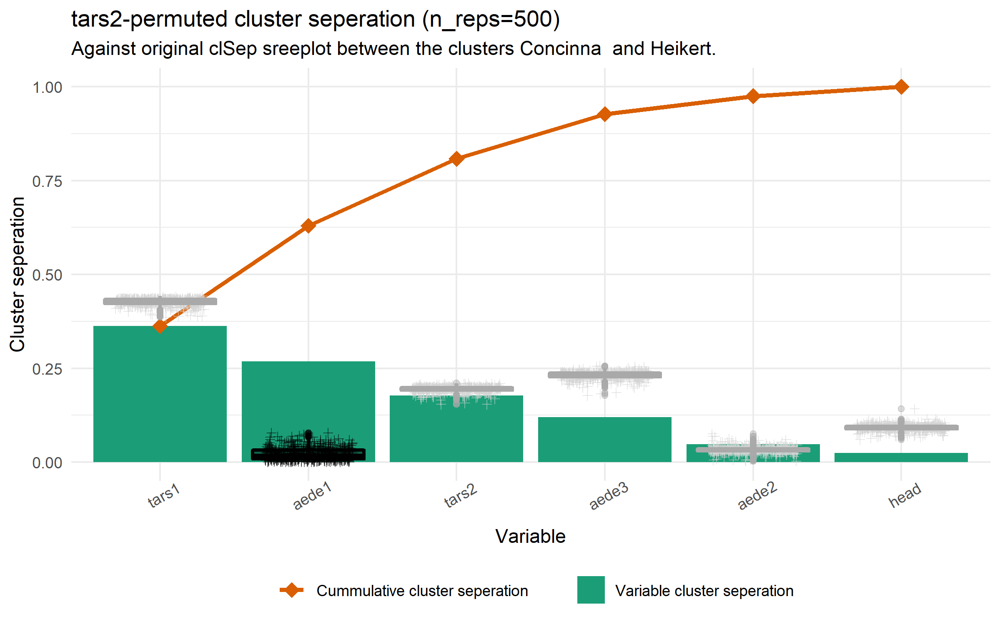
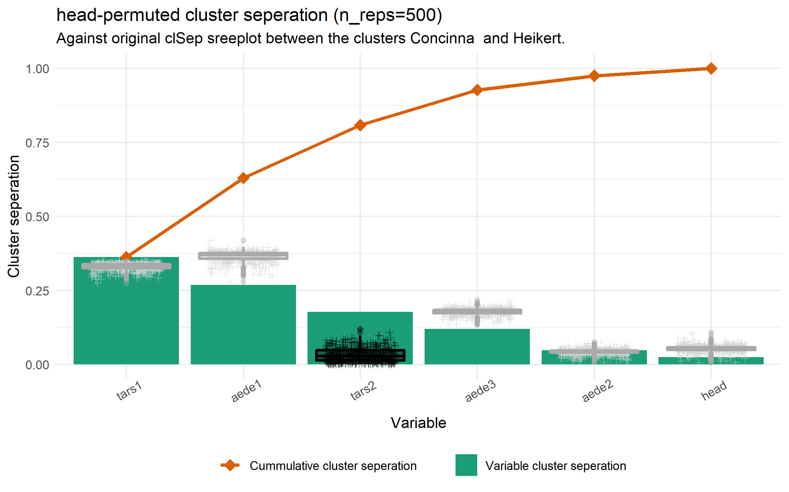
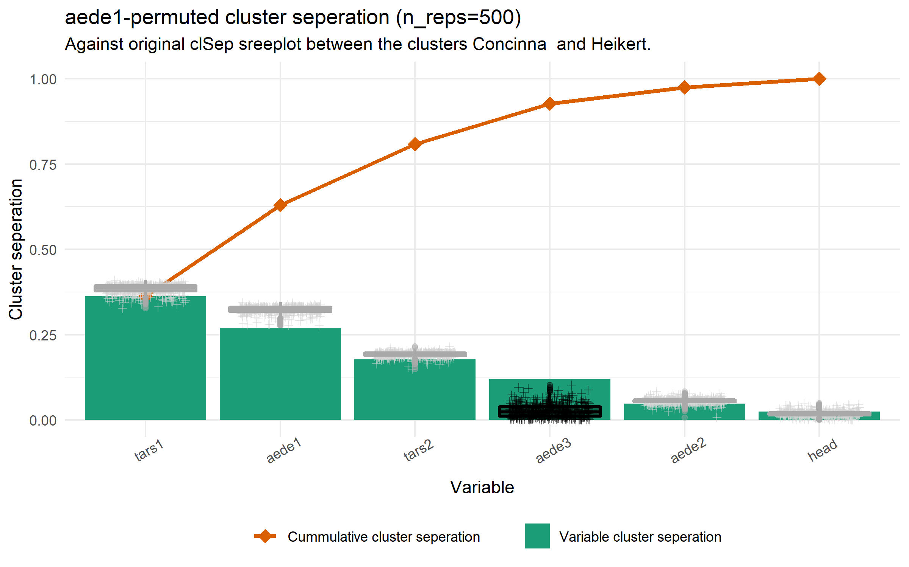
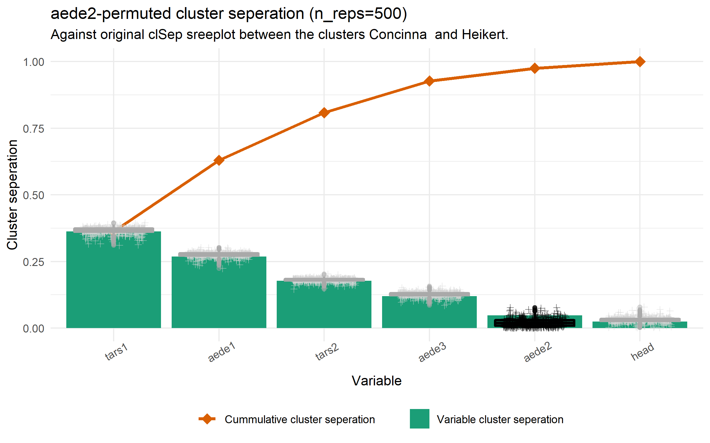
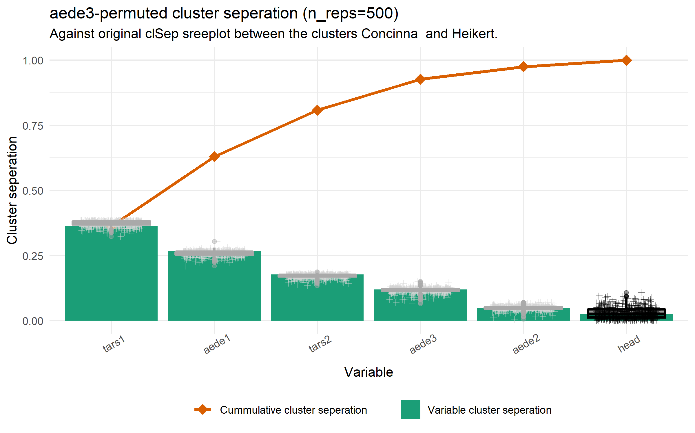

Permuting some variables can significantly impact the cluster seperation explained by other variables. especially when they are correlated and a variable with a large contribution is permuted. We save the means of all permuted clSeps over the `p` permutations into a matrix$[pxp]$. We then find the mean of these means of single-variable permututations for a metric we call mean, mean permuted cluster seperation, or _MMP clSep_. Comparing with the original full sample clSep we find:


$$MMP~clSep_i = mean_i(mean_i(permuted~reps)) $$

```{r origxMMP}
if (DO_RERUN_HEAVY_OUTPUT == TRUE) {
  .gg <- ggplot() + ggproto_origxMMP_clSep(dat, clas)
  ggsave(filename = paste0("origxMMP_clSep.png"),
         plot =  .gg,
         path = output_path)
}
```
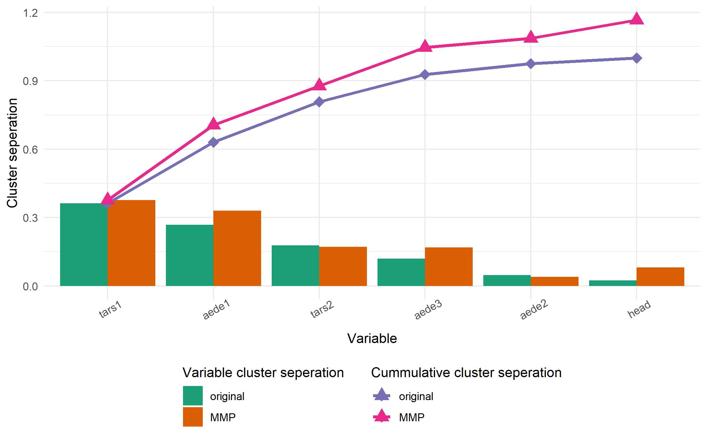

We note that the varable head is a significant case. If we plot MMP clSep be it's self and order the screeplot accordingly we have

```{r MMP}
if (DO_RERUN_HEAVY_OUTPUT == TRUE) {
  .gg <- ggplot() + ggproto_MMP_clSep(dat, clas)
  ggsave(filename = paste0("MMP_clSep.png"),
         plot =  .gg,
         path = output_path)
}
```
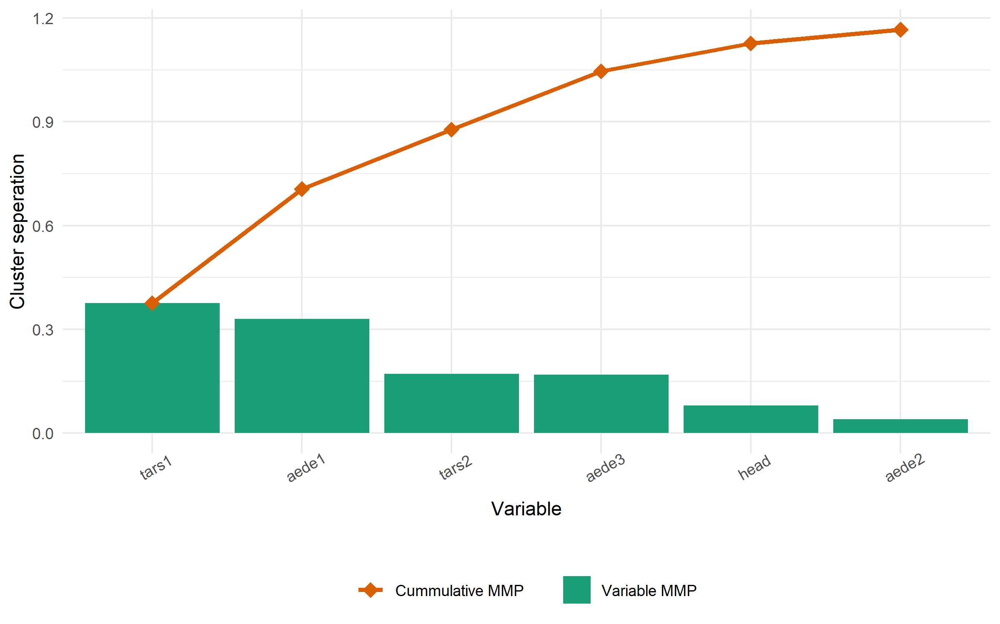

## Evaluating the response

Now that we have a measure we want to define an objective cutoff for evaluation. We want the measure to a few attributes:

- Continuous relative to the cluster seperation
- Sum of squares should equal 1
- Symetric, diverging around uniform weight

Following these, we define a measure to be:
$$diff_i = MMP~clSep_i - (1 / p)$$
$$marks = \sum_{i=1}^{p} I(response_i) * sgn(diff_i) * \sqrt{|diff_i|}$$

```{r answerWeights, results="hold"}
## MMP clSep
df_MMP <- df_scree_MMP_clSep(dat, clas, do_reorder_by_MMP = TRUE)
## Add example response, cause not working in mutate...
df_MMP$exampleResponse <- c(1, 1, 0, 1, 0, 1)
bar_unif <- 1 / p

df_MMP_eval <- df_MMP %>% 
  mutate(.keep = "all",
         diff   = MMP_clSep - bar_unif,
         weight = sign(diff) * sqrt(abs(diff)),
         marks  = weight * exampleResponse) %>% 
  arrange(desc(MMP_clSep))

if (DO_RERUN_HEAVY_OUTPUT == TRUE) {
  .gg <- ggplot() + ggproto_MMP_clSep(dat, clas, do_overlay_answer = TRUE)
  ggsave(filename = paste0("MMP_clSep_answers.png"),
         plot = .gg,
         path = output_path)
}
```
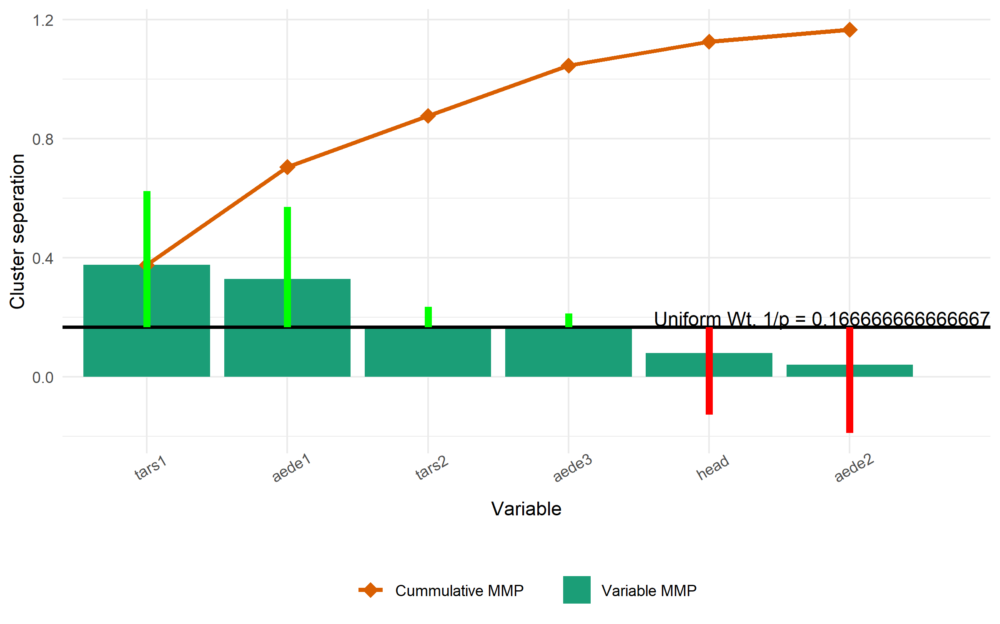

Here, we add lines indicating the weight of each variable if selected as important. we then apply our measure to evalue task responses, we review an example response below:

`r kable(df_MMP_eval, digits = 2)`
`r paste0("Total marks = ", round(sum(df_MMP_eval$marks), 2))`

## Projected data view

All linear projections are nesciarily a lossy representation of the full data. By this we mean that no single 2D frame can show the whole set of infromation for $p>=3$ -dimensional sample. Any pair of Pricipal Components nessciaronly shows less than all the variation, namely the sum of their contributions, typicaly stated as percentage of full sample variation. Analogously any single projection cannot show the full information explain the cluster seperation of 2 given clusters.

In applcation, viewing a PC1 by PC2 biplot of flea data contains `r round(100 * df_pcaVar[2,3], 2)` percent of the variation explained in the sample. While viewing (an orthogonal project) the top 2 variables (namely: `r as.character(df_clSep[1:2, 1])` ) explain `r round(100 * df_clSep[2, 3], 2)` percent of the within sample cluster seperation between *Concinna* and *Heptapot*.


## Application to other toy sets

In order to stress test this Cluster seperation viewed by a screeplot we apply it to other toy datasets.

```{r toyPermFeatImp}
if (DO_RERUN_HEAVY_OUTPUT == TRUE) {
  dat <- spinifex::wine[, 2:ncol(spinifex::wine)]
  clas <- spinifex::wine[, 1]
  .gg <- ggplot() + ggproto_MMP_clSep(dat, clas, do_overlay_answer = TRUE)
  ggsave(filename = paste0("wine_MMP_clSep.png"),
         plot =  .gg,
         path = output_path)
  
  dat <- spinifex::breastcancer[, 2:9]
  clas <- spinifex::breastcancer[, 10]
  .gg <- ggplot() + ggproto_MMP_clSep(dat, clas, do_overlay_answer = TRUE)
  ggsave(filename = paste0("breastcancer_MMP_clSep.png"),
         plot =  .gg,
         path = output_path)
  
  dat <- tourr::olive[, 3:ncol(tourr::olive)]
  clas <- tourr::olive[, 1]
  .gg <- ggplot() + ggproto_MMP_clSep(dat, clas)
  ggsave(filename = paste0("olive_MMP_clSep.png"),
         plot =  .gg,
         path = output_path)
  
  dat <- tourr::ratcns[, 1:9]
  clas <- tourr::ratcns[, 10]
  .gg <- ggplot() + ggproto_MMP_clSep(dat, clas, do_overlay_answer = TRUE)
  ggsave(filename = paste0("ratcns_MMP_clSep.png"),
         plot =  .gg,
         path = output_path)
  
  pengu <- as.data.frame(palmerpenguins::penguins)
  pengu <- pengu[complete.cases(pengu), ]
  dat <- pengu[, 3:6]
  clas <- pengu$species
  .gg <- ggplot() + ggproto_MMP_clSep(dat, clas, do_overlay_answer = TRUE)
  ggsave(filename = paste0("penguins_MMP_clSep.png"),
         plot =  .gg,
         path = output_path)
  clas <- pengu$sex
  .gg <- ggplot() + ggproto_MMP_clSep(dat, clas, do_overlay_answer = TRUE)
  ggsave(filename = paste0("penguins_InvalidAssumptions_MMP_clSep.png"),
         plot =  .gg,
         path = output_path)
  pengu2 <- pengu[pengu$species == unique(pengu$species)[1], ]
  dat <- pengu2[, 3:6]
  clas <- pengu2$sex
  .gg <- ggplot() + ggproto_MMP_clSep(dat, clas, do_overlay_answer = TRUE)
  ggsave(filename = paste0("penguins_sexIn1Species_MMP_clSep.png"),
         plot =  .gg,
         path = output_path)
}
```

### Penguins, between levels of spieces
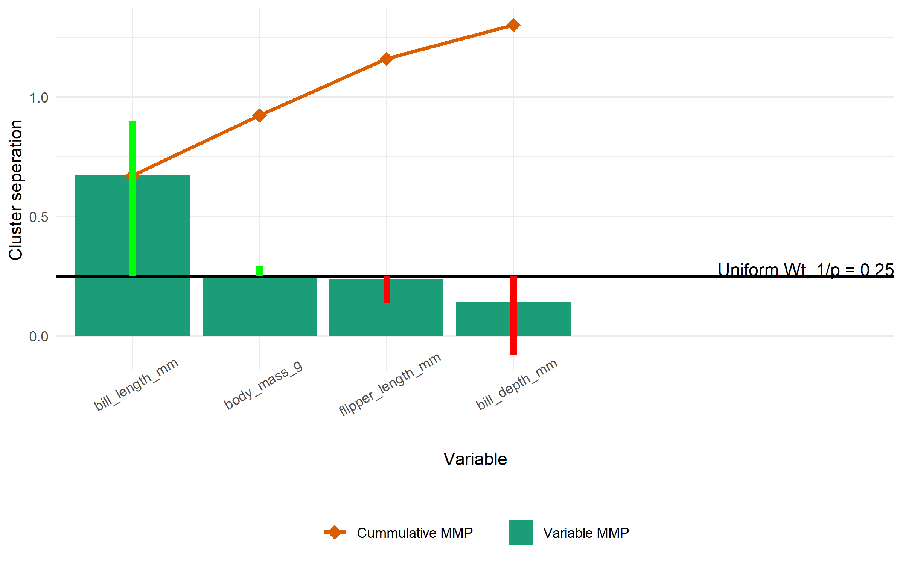

### Penguins, between levels of sex (invalid)
(invalid assumptions, as there are 3 species clusters for each sex)

### Penguins, between levels of sex with 1 species
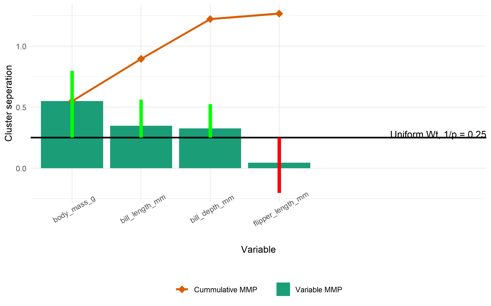

### Wine, between levels of type of wine
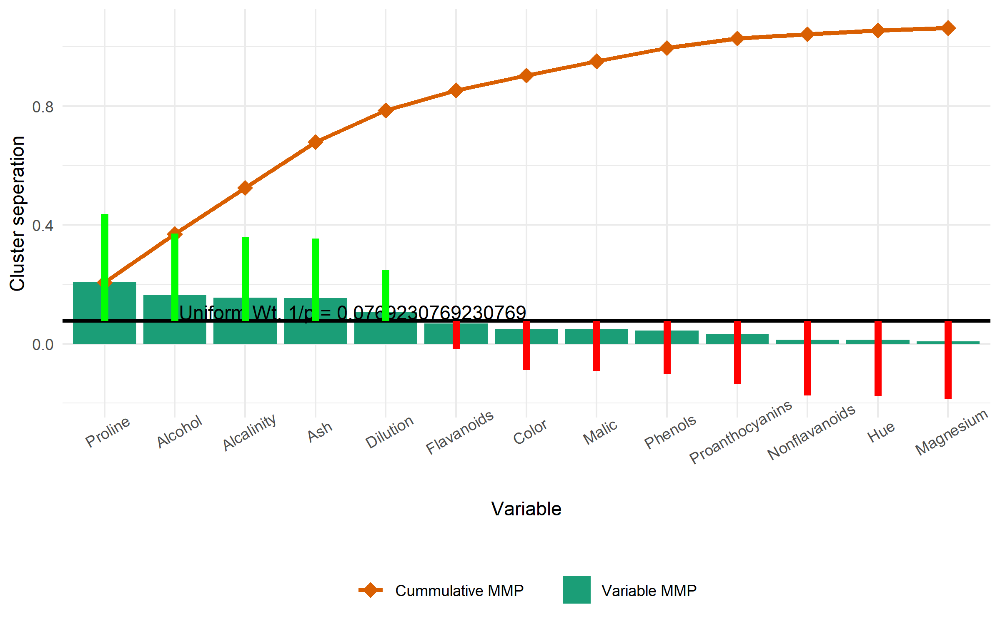

### Breastcancer, between benign/malignant tumors
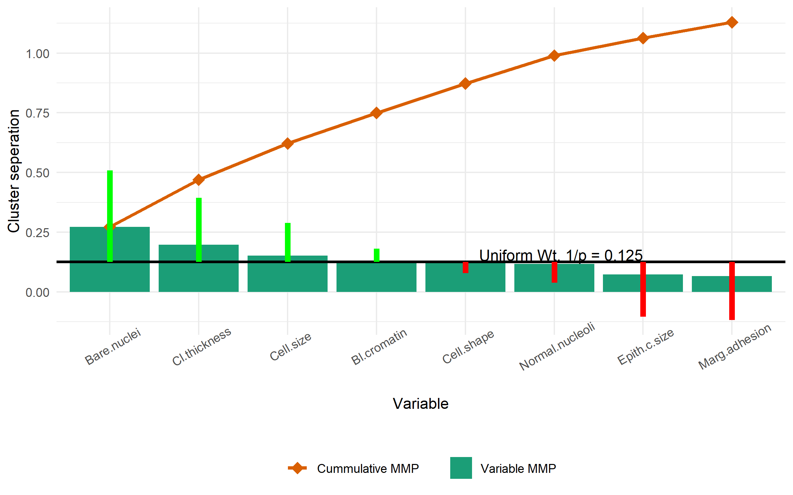

### Olive, between levels of region of Italy
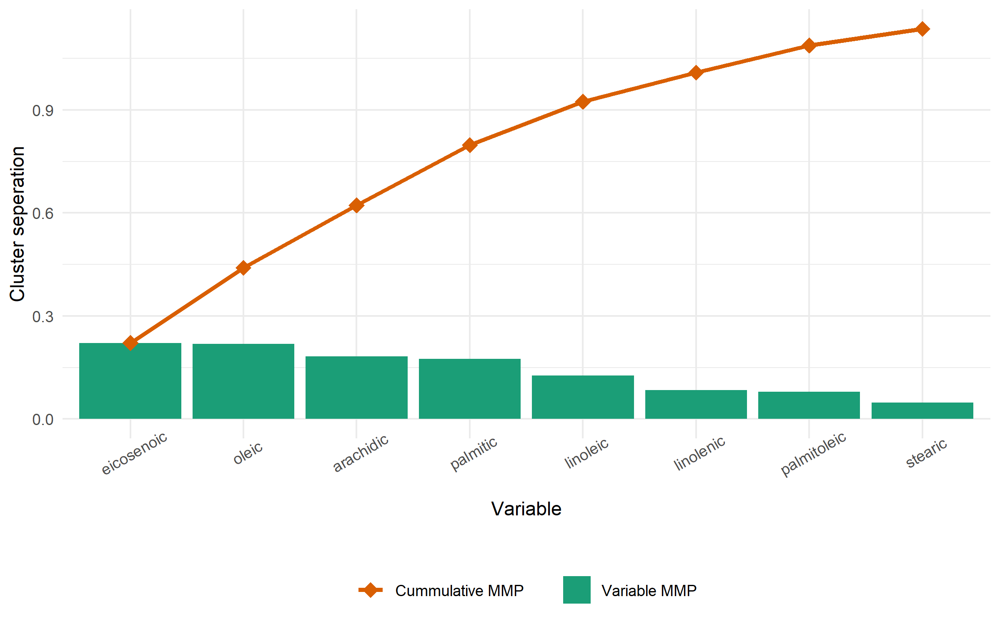

### Rat CNS gene expression, between levels of "the high-level classes"
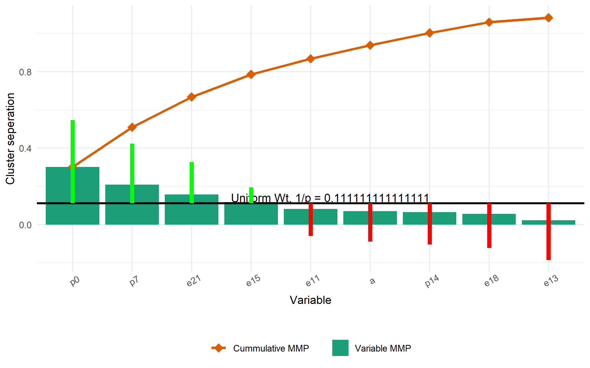

## Testing our expectations

Can we simulate the Cluster seperation that we expect? Lets create a simmulation that has variable contributions for the following cases:

Observe how changing the variance-covariances changes cluster seperation given that cluster means differ as 80, 20, rep(0) (singal from means is large relative to variance)

1. 2 varaibles
2. 5 varaibles
3. 5 variables, within each cluster V1-V2 covariance set to .3

Each cluster's covariance:
```{r case3covar}
.cov <- as.data.frame(diag(5))
.cov[1, 2] <- .cov[2, 1] <- .3
rownames(.cov) <- colnames(.cov)
knitr::kable(as.data.frame(.cov))
```

4. 5 variables, Cluster a covariance: all off diagonal set to .7, diagonals set to 5. Cluster 'a' covariance: diag(5)

Cluster 'a' covariance:
```{r case4covar}
.cov1 <- matrix(rep(.7, 25), ncol = 5)
diag(.cov1) <- 5
.cov1 <- as.data.frame(.cov1)
.cov2 <- diag(5)
.cov2 <- as.data.frame(.cov2)
rownames(.cov1) <- rownames(.cov2) <- colnames(.cov1)
knitr::kable(.cov1)
```
Cluster 'b' covariance:
`r knitr::kable(.cov2)`

```{r simCases}
if (DO_RERUN_HEAVY_OUTPUT == TRUE) {
mns2 <- list(c(80, 20), rep(0,2)) ## differences of 8, 2, 0, 0, 0
mns5 <- list(c(80, 20, rep(0, 3)), rep(0, 5)) ## differences of 8, 2, 0, 0, 0
## case 1) 2 variable 80-20
covs <- list(diag(2), diag(2))
sim_case1 <- sim_pDim_kCl(means = mns2, sigmas = covs, do_shuffle = FALSE)
dat <- sim_case1
clas <- attr(sim_case1, "cl_lvl")
.gg <- ggplot() + ggproto_MMP_clSep(dat, clas)
ggsave(filename = paste0("sim_case1_MMP_clSep.png"),
       plot =  .gg,
       path = output_path)

## case 2) 5 variable "80-20"
covs <- list(diag(5), diag(5))
sim_case2 <- sim_pDim_kCl(means = mns5, sigmas = covs, do_shuffle = FALSE)
dat <- sim_case2
clas <- attr(sim_case2, "cl_lvl")
.gg <- ggplot() + ggproto_MMP_clSep(dat, clas)
ggsave(filename = paste0("sim_case2_MMP_clSep.png"),
       plot =  .gg,
       path = output_path)

## case 3) 5 variable "80-20", V1-V2 covariance set to .3
.cov <- diag(5)
.cov[1, 2] <- .cov[2, 1] <- .3
covs <- list(.cov, .cov)
sim_case3 <- sim_pDim_kCl(means = mns5, sigmas = covs, do_shuffle = FALSE)
dat <- sim_case3
clas <- attr(sim_case3, "cl_lvl")
.gg <- ggplot() + ggproto_MMP_clSep(dat, clas)
ggsave(filename = paste0("sim_case3_MMP_clSep.png"),
       plot =  .gg,
       path = output_path)

## case 4) 5 variable "80-20", Cluster 1 covariance, all off-diagonal set to .4
.cov1 <- matrix(rep(.7, 25), ncol = 5)
diag(.cov1) <- 5
.cov2 <- diag(5)
covs <- list(.cov1, .cov2)
sim_case4 <- sim_pDim_kCl(means = mns5, sigmas = covs, do_shuffle = FALSE)
dat <- sim_case4
clas <- attr(sim_case4, "cl_lvl")
.gg <- ggplot() + ggproto_MMP_clSep(dat, clas)
ggsave(filename = paste0("sim_case4_MMP_clSep.png"),
       plot =  .gg,
       path = output_path)
}
```
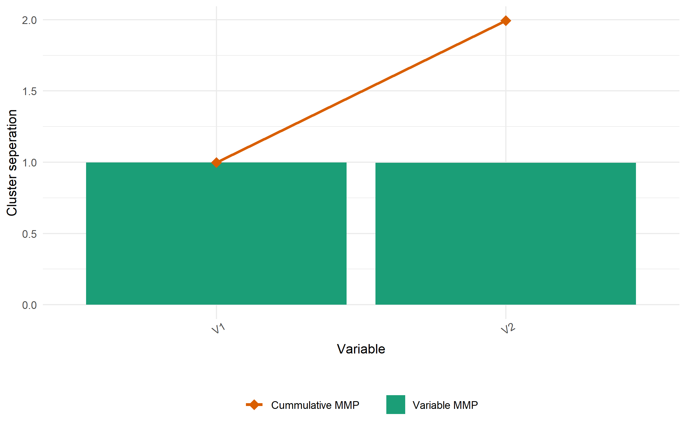
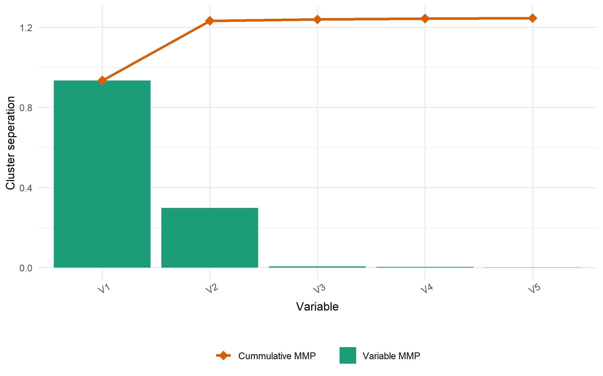
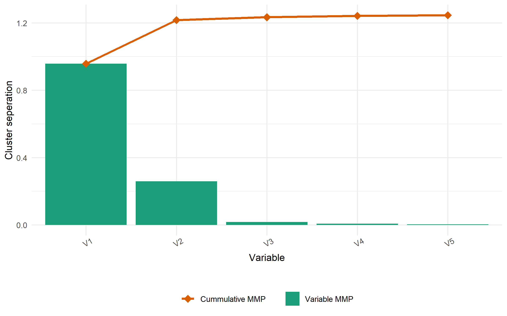
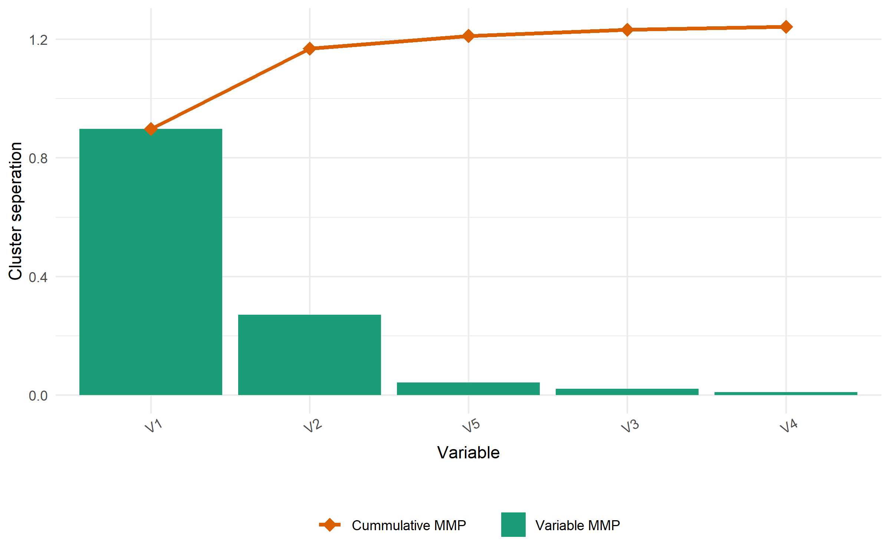

# Simulation difficulty

In order to properly distinguish a difference between the 3 vizualization factors the data must be of suitable complexity, such that it has the following properties:

1. Must be complex enough not to see within the any pair of the first 4 Principal Components; such that PCA is not sufficent for exploring cluster seperation
2. Must not be so complex as to preclude any meaningful response given the factor visuals and time constraints.

Lets try to evaluate our current generation of data simulations against these properties

## User study simulation 302
This was a 300 series simulation done at the end of the generation 1 user study shiny app.

### MMP cluster seperation

```{r sim302clSep}
### Initialization for sim 302, 
dat  <- readRDS("./apps/data/simulation_data302.rds")
clas <- attributes(dat)$cl_lvl
if (DO_RERUN_HEAVY_OUTPUT == TRUE) {
  .gg <- ggplot() + ggproto_MMP_clSep(dat, clas)
  ggsave(filename = paste0("sim302_MMP_clSep.png"),
         plot =  .gg,
         path = output_path)
}
```
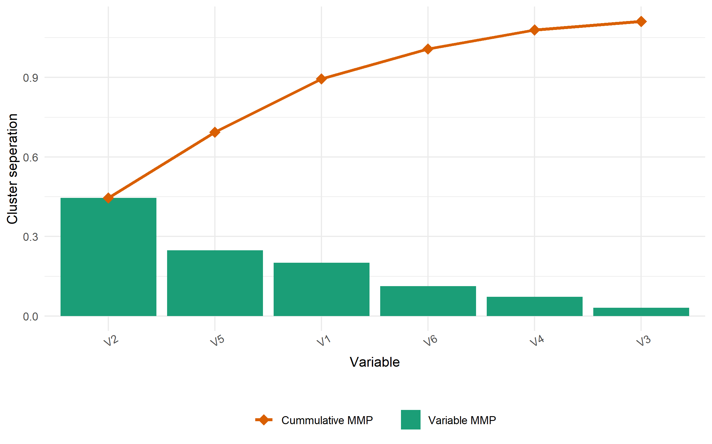

### PCA

```{r simPcaPairs}
if (DO_RERUN_SIM302_PAIRS_n_TOURGIFS == TRUE) {
  ## Series spans from 301:312
  dat_std      <- tourr::rescale(as.matrix(dat))
  dat_pca_rot  <- prcomp(dat)$rotation
  proj_dat_pca <- as.data.frame(dat_std %*% dat_pca_rot)
  
  ggparis_proj_dat_pca <- 
    GGally::ggpairs(proj_dat_pca[, 1:4], 
                    title = "ggpairs of PC1:4 for simulation_data302",
                    ggplot2::aes(colour = clas)) +
    ggplot2::scale_color_manual(values = palette()[1:k_cl]) +
    ggplot2::scale_fill_manual( values = palette()[1:k_cl])

  ggplot2::ggsave(filename = "ggpairs_pca_sim302.png",
                  plot =  ggparis_proj_dat_pca,
                  path = output_path)
}
```
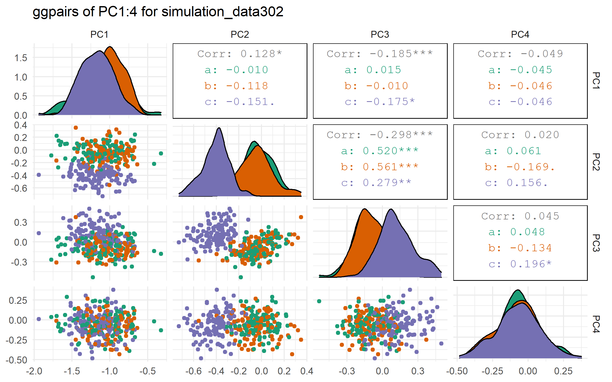

Seems sufficent to be complex enough not to be seen as a pair of components within the first 4 Principal Components. Now to see if we can see anything in radial tours of all variables. We view cl Sep to explore which variables should contain contributions.

### Radial tour gifs for each manip var

```{r radialTour_sim302}
if (DO_RERUN_SIM302_PAIRS_n_TOURGIFS == TRUE) {
  pca_bas <- as.matrix(prcomp(dat)$rotation[, 1:2])
  for (i in 1:ncol(dat)){
    play_manual_tour(basis = pca_bas, data = dat, manip_var = i)
    play_manual_tour(basis = pca_bas, 
                     data = dat, 
                     manip_var = i,
                     render_type = render_gganimate, 
                     col = clas, pch = clas,
                     axes = "left",
                     gif_filename = paste0("radialTour_sim302_mvar", i, ".gif"),
                     gif_path = output_path)
  }
}
```

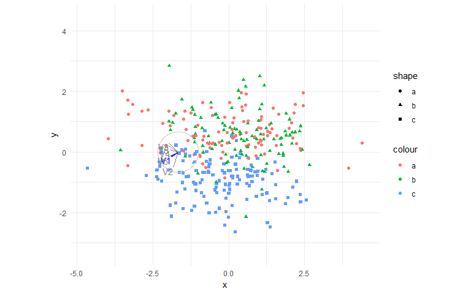
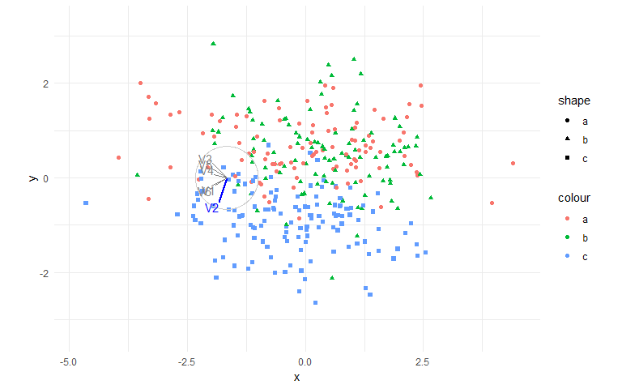
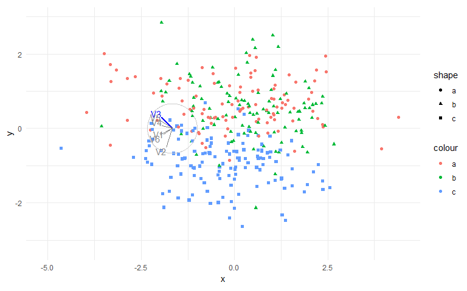
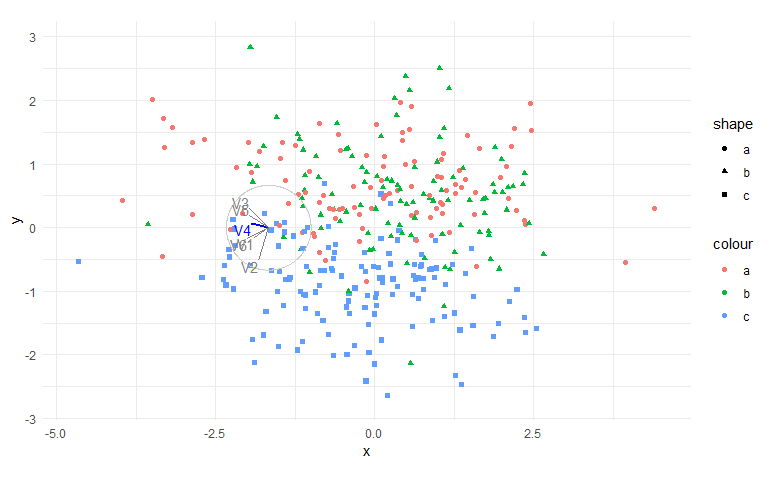
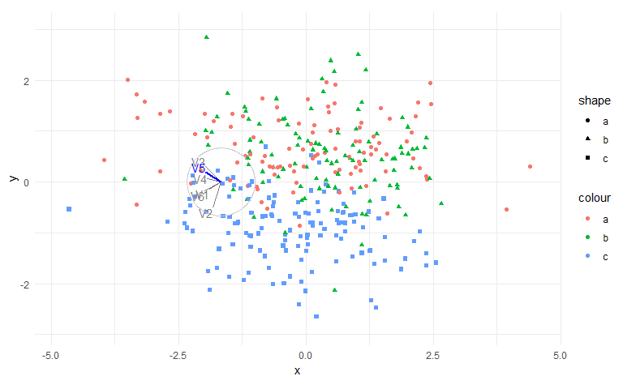
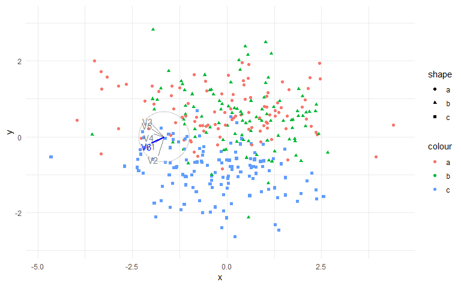


# References


Fisher, Ronald A. "The Use of Multiple Measurements in Taxonomic Problems." Annals of Eugenics 7, no. 2 (September 1936): 179-88. https://doi.org/10.1111/j.1469-1809.1936.tb02137.x.

