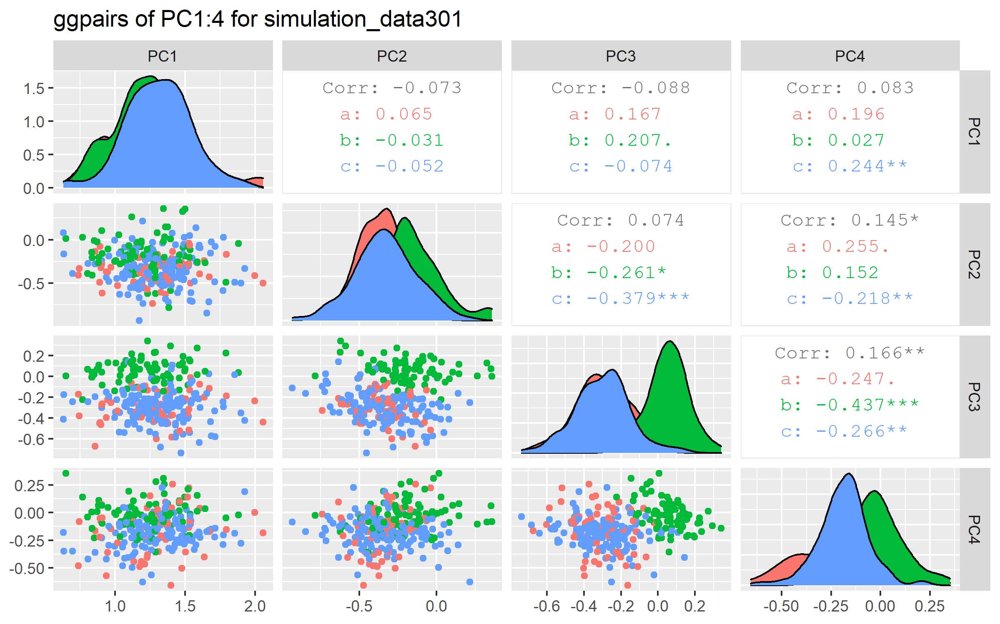

For S3D and 4D meta-analysis see (K. Kim, et al. 2017).


```{r setup_condensed, include=F}
## Setup
library("knitr")
knitr::opts_chunk$set(
  echo = F,
  message   = F, warning = F, error = F,
  results   = "asis",                # Opts: "asis", "markup", "hold", "hide"
  fig.align = "center",              # Opts: "left", "right", "center", "default"
  fig.width = 8, fig.height = 5,
  out.width = "100%",
  fig.pos   = "h", out.extra   = "", # Figures forced closer to chunk location.
  collapse  = TRUE, cache = FALSE, cache.lazy  = FALSE
)
```

```{r init}
## Initialize
library("spinifex")
library("tourr")
library("ggplot2")
library("tibble")
library("dplyr")

dat <- tourr::rescale(tourr::flea[,1:6])
rb       <- basis_random(n = ncol(dat))
class    <- tourr::flea$species

invisible(capture.output(holes_path <- save_history(dat, tour_path = guided_tour(holes()))))
holes_basis <- as.matrix(holes_path[,, dim(holes_path)[3]])

n <- nrow(dat)
p <- ncol(dat)
k_cl <- length(unique(class))
pca_obj <- prcomp(dat)

pca_var_rate <- pca_obj$sdev^2 / sum(pca_obj$sdev^2)

df_pcaVar <- data.frame(
  pc_number = paste0("PC", 1:p),
  rate_var_explained = pca_var_rate,
  cumsum_rate_var_explained = cumsum(pca_var_rate)
)
```
# Cluster seperation and task evalution

In general defining feature importance is a common task. Though it is typically model dependant is 

- The relative magnitude of the eigen values, as visualized in a scree plot ("Screeplot" R. Cattell, 1966)
- Slope of $p-$dim line seperating two clusters scaled by the inverse of the variance-covariance matrix ("LDA" R. Fishce, 1936)
- As ratios of F-values for features ("ANOVA" R. Fisher 1918) or as interactions of features ("MANOVA" S. Wilks  1932)
- _feature imporance_ Percent increase in misclassification rate when a feature is removed. ("Random forests" L. Breiman, 2001)
- _permutation feature importance_ diffence between importance of the real variable and that of OOB re-sampling of 1 variable (holding the remaining data constant) [Interpretable Machine Learning (ebook), 5.5) feature-importance](https://christophm.github.io/interpretable-ml-book/feature-importance.html) ("PIMP", Altmann et al. 2010)
- _Raw importance_, is the $(untouched~count - feature_m~count) / Number~of~trees$, ("Auto-WEKA" C. Thornton, 2013)
- _Model reliance_, is the fraction each feature is used over all permutations. (A. Fisher, 2018)

## Measuring which variables are sensitive to cluster seperation

We'll take inspiration from the Scree plot and try to apply it to the LDA-like approach
Consider a sree plot of flea data. This shows which componets are contributing to the *full sample, full dimensionality,* $[n,p]$ variation of the data.

```{r Screeplot}
(g1 <- ggplot(data = df_pcaVar) + 
   ## Individual var bars
   geom_bar(stat = "identity", 
            mapping = aes(x = pc_number, y = rate_var_explained, 
                          fill = "Individual var explained")) + 
   ## Cummulative var line
   geom_line(mapping = aes(x = pc_number, y = cumsum_rate_var_explained,
                           color = "Cumsum of var explained", group = 1),lwd = 1.2) +
   geom_point(mapping = aes(x = pc_number, y = cumsum_rate_var_explained,
                            color = "Cumsum of var explained"), shape = 18, size = 4) +
   ## Themes, legends and colors 
   theme_minimal() +
   labs(title = "pca screeplot of normalized flea data",
        x = "Component number", 
        y = "Variance explained",
        colour = "", fill = "") + 
   # theme(legend.position = c(0.9, 0.5)) + ## legend position doesn't work now because different geoms??
   scale_fill_manual(values = "#1B9E77") + 
   scale_colour_manual(values = "#D95F02"))
# RColorBrewer::brewer.pal(n=2, "Dark2")
```

The user study task trys to explore the *full sample, full dimensionality* $[n,p]$ seperation of two specified clusters. In an analogous manner, __let's try to create a screeplot-like output to evalute the contributions of the original variables.__

```{r lda, eval=FALSE}
#### USES EVAL

.cl  <- unique(class)[1:2]
.sub <- dat[class == .cl, ]
.lda_dat <- data.frame(.sub, species = class[class == .cl]) 

library(MASS)
(lda_obj <- lda(species~., data = .lda_dat))
```

This happens to be precisely the setup for Linear Discriminant Analysis (LDA) (Fisher, 1936). Start by finding cluster means (originally had considered median). We have:

```{r clusterMeans}
df_clusterMeans <- NULL
for (i in 1:k_cl) {
  .cl  <- unique(class)[i]
  .sub <- dat[class == .cl, ]
  .row <- apply(.sub, 2, mean)
  df_clusterMeans <- rbind(df_clusterMeans, .row)
}
df_clusterMeans <- as.data.frame(df_clusterMeans)
rownames(df_clusterMeans) <- unique(class)

kable(df_clusterMeans, digits = 2)
``` 


Suppose the clusters in questions are *Concinna* and *Heptapot*, now let's find the $p$-dim line between the cluster means. Let of the cluster mean of *Concinna* be the constant vetor (offset from origin). The vector between the cluser means is the slope, the $p$-dim, coefficients.

```{r clMeansAsPLine}
df_pLine_clusterMeans_CH <- rbind(df_clusterMeans[1, ],
                                  df_clusterMeans[2, ] - df_clusterMeans[1, ])
rownames(df_pLine_clusterMeans_CH) <- 
  c(paste0("constants: ClMn_", unique(class)[1]),
    paste0("coefficients: ClMn_", unique(class)[2], "-", unique(class)[1]))

kable(df_pLine_clusterMeans_CH, digits = 2)
``` 

We have a vector of variable-coffecients corisponding to the sepration of the cluster means. Now we need to account for the variation held within the variables. To do so we need scale each variable the reciporical of the covariance matrix:

Solving for the product

$$ Cluster Seperation_{[1,p]} = Coefficients{[1, p]} * 1/Covariance(flea)_{[p, p]}$$

```{r clusterSep}
.inverse_covar <- 1 / cov(dat)
df_clusterSep_CH <- .inverse_covar * df_pLine_clusterMeans_CH[2, ]
rownames(df_clusterSep_CH) <- rownames(paste0(
  "clusterSeperation_", unique(class)[1], unique(class)[2]))

kable(df_clusterSep_CH, digits = 2)
```

This is the remaining variable coefficents that best describe the *full sample, full dimensionality* seperation of the cluster means between *Concinna* and *Heptapot* after controling for variance and covariances. We discard the sign as we only care about magnitude of seperation. Now let's visualize this similar to the screeplot.


```{r clSepScreeplot}
.clSep <- abs(df_clusterSep_CH)
.clSep_rate <- t(.clSep[order(.clSep, decreasing = T)]) / sum(.clSep)
.var_nm_ord <- factor(row.names(.clSep_rate), 
                      levels = unique(row.names(.clSep_rate)))

df_Scree_ClSep <- data.frame(variable = .var_nm_ord,
                             rate_clSep = as.vector(.clSep_rate),
                             cumsum_rate_clSep = cumsum(.clSep_rate))

(g2 <- ggplot(data = df_Scree_ClSep) + 
    ## Individual clSep bars
    geom_bar(stat = "identity", 
             mapping = aes(x = variable, y = rate_clSep, 
                           fill = "Individual clSep explained")) + 
    ## Cummulative clSep line
    geom_line(mapping = aes(x = variable, y = cumsum_rate_clSep, group = 1,
                            color = "Cumsum of clSep explained"), lwd = 1.2) +
    geom_point(mapping = aes(x = variable, y = cumsum_rate_clSep,
                             color = "Cumsum of clSep explained"), shape = 18, size = 4) +
    ## Themes, legends and colors 
    theme_minimal() +
    labs(title = "Variables contributions to the seperation of cluster means [Concinna-Heptapot]",
         x = "Variable", 
         y = "Seperation of cluster means", 
         colour = "", fill = "") + 
    # theme(legend.position = c(0.9, 0.5)) + ## legend position doesn't work now because different geoms??
    scale_fill_manual(values = "#1B9E77") + 
    scale_colour_manual(values = "#D95F02"))
# RColorBrewer::brewer.pal(n=5, "Dark2")
```

## Evaluating the response

Now that we have a measure we want to define an objective cutoff for evaluation. We want the measure to a few attributes:

- Continuous relative to the cluster seperation
- Sum of squares should equal 1
- Symetric, diverging around uniform weight

Following these, we define a measure to be:

$$Marks = \sum_{i = 1}^{p}(\sqrt{ClusterSeperation_i} - (1 / (p - 1)) * I(Response_i)$$

```{r answer, results="hold"}
bar_unif <- 1/(p-1)

df_taskEval <- select(df_Scree_ClSep, variable, rate_clSep)
df_taskEval <- mutate(df_taskEval, .keep = "none",
                      variable = variable,
                      ClSep    = rate_clSep,
                      Weight   = sqrt(rate_clSep) - bar_unif,
                      exampleResponse = c(1, 1, 0, 1, 0, 1),
                      Marks    = Weight * exampleResponse)

g2 +
  geom_hline(yintercept = bar_unif, size= 1) +
  geom_text(aes(x = 7, y = bar_unif + .04, 
                label = "Uniform Wt, 1/(p-1) = .2"),
            size = 4, hjust = 1) +
  geom_segment(data = df_taskEval, colour = "green", size = 2,
               aes(x = 1, y = bar_unif, xend = 1, yend = Weight[1] + bar_unif) 
  ) +
  geom_segment(data = df_taskEval, colour = "green", size = 2,
               aes(x = 2, y = bar_unif, xend = 2, yend = Weight[2] + bar_unif), 
  ) +
  geom_segment(data = df_taskEval, colour = "green", size = 2,
               aes(x = 3, y = bar_unif, xend = 3, yend = Weight[3] + bar_unif), 
  ) +
  geom_segment(data = df_taskEval, colour = "green", size = 2,
               aes(x = 4, y = bar_unif, xend = 4, yend = Weight[4] + bar_unif), 
  ) +
  geom_segment(data = df_taskEval, colour = "red", size = 2,
               aes(x = 5, y = bar_unif, xend = 5, yend = Weight[5] + bar_unif), 
  ) +
  geom_segment(data = df_taskEval, colour = "red", size = 2,
               aes(x = 6, y = bar_unif, xend = 6, yend = Weight[6] + bar_unif), 
  )

  
```

Here, we add lines indicating the weight of each variable if selected as important. we then apply our measure to evalue task responses, we review an example response below:

```{r exampleScoring}
kable(df_taskEval, digits = 2)
```
`r paste0("Total Marks = ", round(sum(df_taskEval$Marks),2))`

## Projected data view

All linear projections are nesciarily a lossy representation of the full data. By this we mean that no single 2D frame can show the whole set of infromation for $p>=3$ -dimensional sample. Any pair of Pricipal Components nessciaronly shows less than all the variation, namely the sum of their contributions, typicaly stated as percentage of full sample variation. Analogously any single projection cannot show the full information explain the cluster seperation of 2 given clusters.

In applcation, viewing a PC1 by PC2 biplot of flea data contains `r round(100*df_pcaVar[2,3],2)` percent of the variation explained in the sample. While viewing (an orthogonal project) the top 2 variables (namely: `r as.character(df_Scree_ClSep[1:2, 1])` ) explain `r round(100*df_Scree_ClSep[2, 3],2)` percent of the within sample cluster seperation between *Concinna* and *Heptapot*.

_finish this thought_

## Mental task

_todo_

## Further application on toy data

In order to stress test this sort of screeplot visualization of the Cluster seperation to other toy datasets.


### Wine

```{r}
require("ggplot2")
source("./geom_clustsep_screeplot.r")
palette(RColorBrewer::brewer.pal(3, "Dark2"))
theme_set(theme_minimal())

dat <- spinifex::wine[, 2:ncol(spinifex::wine)]
clas <- spinifex::wine[, 1]
ggplot() + ggproto_screeplot_ClSep(dat, clas, 1, 2)
```

# Simulation difficulty


In order to properly distinguish a difference between the 3 vizualization factors the data must be of suitable complexity, such that it has the following properties:

1. Must be complex enough not to see within the any pair of the first 4 Principal Components; such that PCA is not sufficent for exploring cluster seperation
2. Must not be so complex as to preclude any meaningful response given the factor visuals and time constraints.

Let's try to evaluate our current generation of data simulations against these properties

```{r simPcaPairs, eval=TRUE}
#### USES EVAL

## Series spans from 301:312
dat          <- readRDS("./apps/data/simulation_data301.rds")
dat_clusters <- attributes(dat)$cl_lvl
dat_std      <- tourr::rescale(as.matrix(dat))
dat_pca_rot  <- prcomp(dat)$rotation
proj_dat_pca <- as.data.frame(dat_std %*% dat_pca_rot)

library(GGally)
ggparis_proj_dat_pca <- 
  ggpairs(proj_dat_pca[, 1:4], 
          title = "ggpairs of PC1:4 for simulation_data301",
          ggplot2::aes(colour = dat_clusters))
#scale_color_brewer("Dark2") ## scale_color/fill* don't work as explected on ggpairs()

ggplot2::ggsave(filename = "ggpairs_pca_sim301.png",
                plot =  ggparis_proj_dat_pca,
                path = "./output/")
```



Seems sufficent to be complex enough not to be seen as a pair of components within the first 4 Principal Components. Now to see if we can see anything in radial tours of all variables.

_note: spinifex needs cleanup_

```{r simRadialTours, eval=FALSE}
#### USES EVAL

library("spinifex")

### Create local function, spinifex not assigning theta correctly atm 
ns_play_radial_tour <- function(data,
                                basis,
                                manip_var = sample(1:ncol(data)),
                                theta = NULL,
                                render_type = render_gganimate,
                                ...) {
  ### Test examples
  # data <- flea_std;basis <- rb; manip_var <- 1; theta = NULL; 
  # render_type <- render_gganimate;
  manip_space <- create_manip_space(basis = basis, manip_var = manip_var)
  mv_sp <- manip_space[manip_var, ]
  theta <- NULL
  if (is.null(theta)) {
    theta <- atan(basis[manip_var, 2] / basis[manip_var, 1])
    ### Was trying to incorprate the below this after CRAN ver, but not working. 
    # ang_minor <- atan(mv_sp[2] / mv_sp[1])
    # offset <- 270 + sign(mv_sp[1]) * 90
    # theta <- (offset + sign(mv_sp[1]) * sign(mv_sp[2]) * ang_minor) %% 360
  }
  tour_hist <- manual_tour(basis = basis, manip_var = manip_var, theta = theta, ...)
  tour_df   <- array2df(array = tour_hist, data = data)
  render_type(slides = tour_df, ...)
}

### Init for radial tour:
dat          <- readRDS("./apps/data/simulation_data301.rds")
dat_clusters <- attributes(dat)$cl_lvl
dat_std      <- tourr::rescale(as.matrix(dat))
bas_pca      <- prcomp(dat)$rotation[, 1:2]

i_s <- 1:ncol(dat)
# ls_dat_radial_tour <- list()
for(i in i_s) {
  .this_radial_tour <- 
    ns_play_radial_tour(basis = bas_pca, data = dat_std, manip_var = i,
                        render_type = render_gganimate, 
                        col = col_of(dat_clusters), 
                        pch = pch_of(dat_clusters), 
                        axes = "left", fps = 8)
  
  #TODO: BREAK INTO NAME AND PATH.
  .gif_filepath <- paste(".output/radialTour_sim301_mv", i, ".gif")
  ?gganimate::anim_save(.gif_filepath, .this_radial_tour)
  # ## store gganimate in a list obj that isn't currently used
  # ls_dat_radial_tour[[i]] <- .this_radial_tour 
  # .this_radial_tour ## explicitly call the gganimate tour
}
```
<!--  -->
<!--  -->
<!--  -->
<!--  -->
<!--  -->
<!--  -->
<!--  -->

# References


Fisher, Ronald A. "The Use of Multiple Measurements in Taxonomic Problems." Annals of Eugenics 7, no. 2 (September 1936): 179-88. https://doi.org/10.1111/j.1469-1809.1936.tb02137.x.


