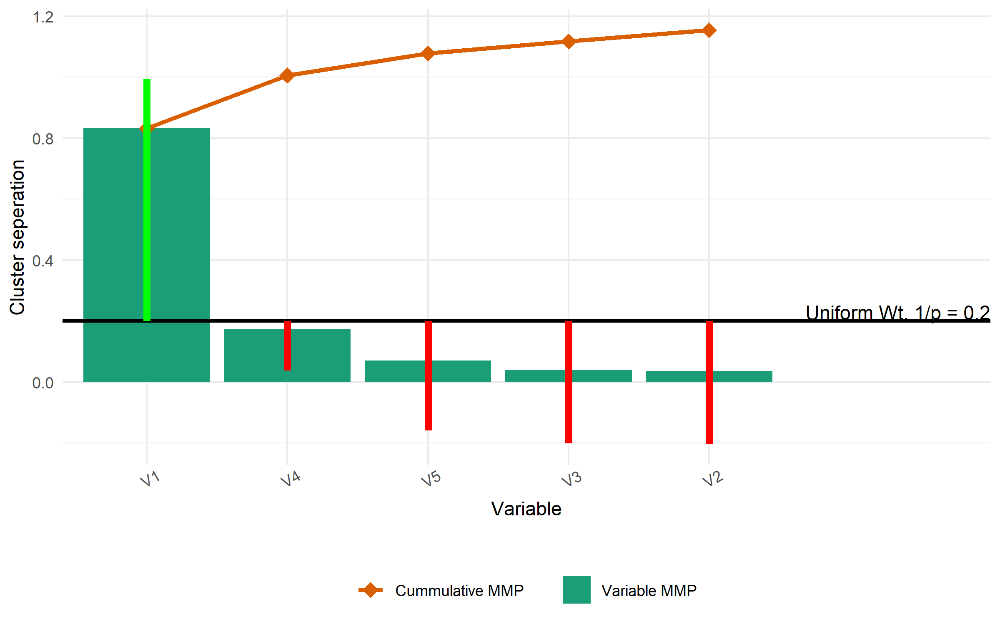
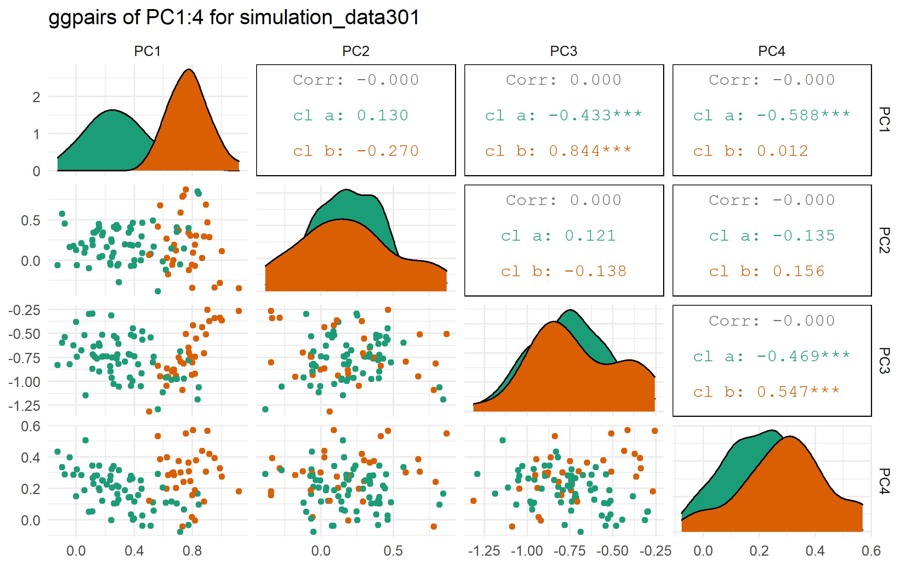
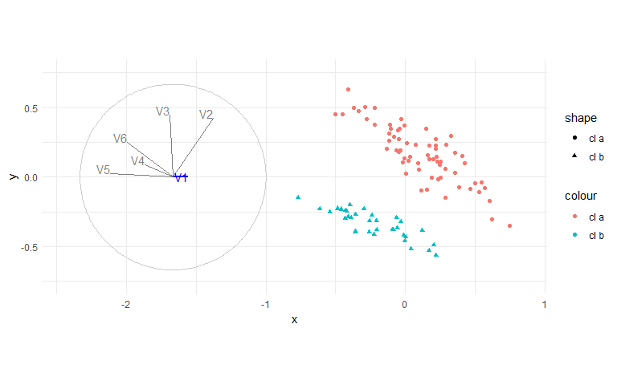
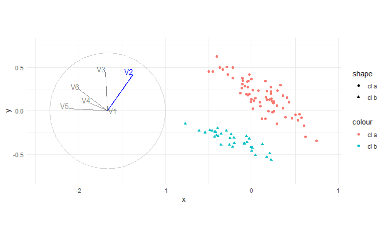
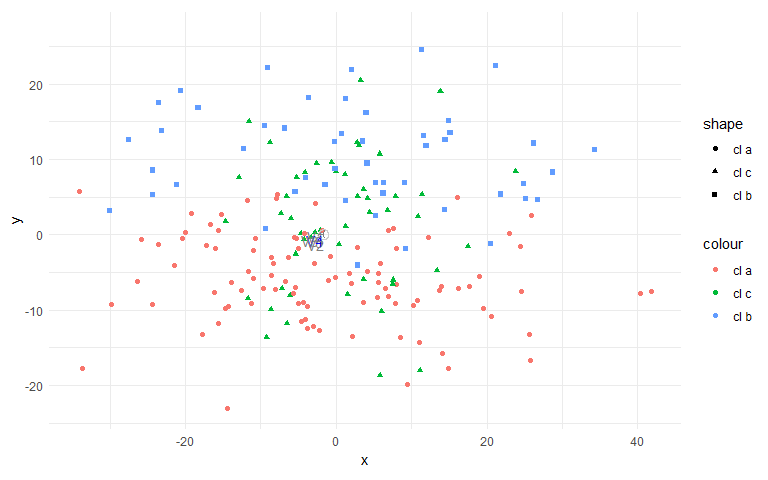
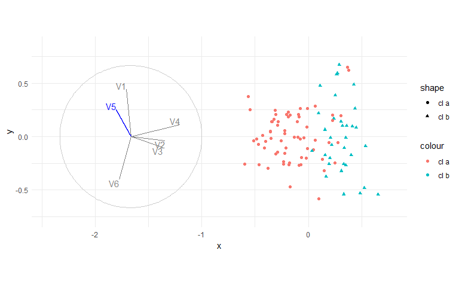
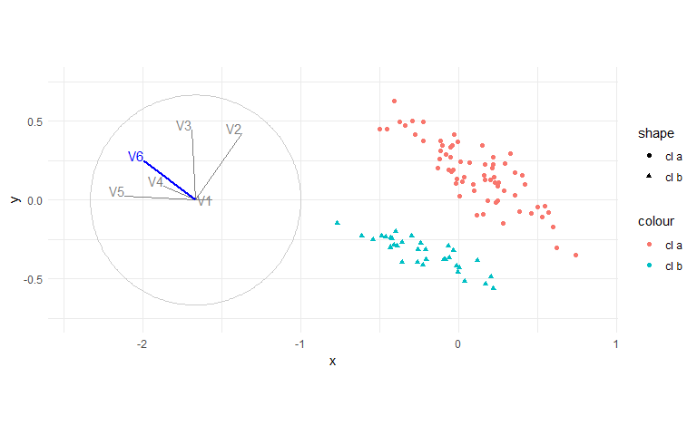
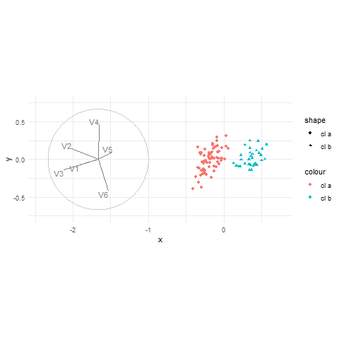

```{r setup_condensed, include=F}
## Setup
library("knitr")
knitr::opts_chunk$set(
  echo = F,
  message   = FALSE, warning = FALSE, error = FALSE,
  results   = "markup",                # Opts: "asis", "markup", "hold", "hide"
  fig.align = "center",              # Opts: "left", "right", "center", "default"
  fig.width = 8, fig.height = 5,
  out.width = "100%",
  fig.pos   = "h", out.extra   = "", # Figures forced closer to chunk location.
  collapse  = TRUE, cache = FALSE, cache.lazy = FALSE
)
```

```{r init}
## Initialize
require("spinifex")
require("tourr")
require("ggplot2")
require("tibble")
require("dplyr")
source("./R/geom_lda_points.r")
source("./R/ggproto_screeplot_pca.r")
source("./R/ggproto_screeplot_clSep.r")
source("./R/permutation_feature_importance.r")
source("./R/MMP_clSep.r")
source("./R/sim_pDim_kCl.r") ## Cluster levels stored in attribute "cl_lvl". Try attr(mySim, "cl_lvl")

set.seed(20200813)
theme_set(theme_minimal())
palette(RColorBrewer::brewer.pal(8, "Dark2"))
DO_REFRESH_FIGURES <- TRUE ## Causes sizable run time.
output_path <- "./output_sim_clSep/"


## Init for simulation; sim_pDim_kCl
n_cl <- list(66, 33)
p <- 6
mns <- list(rgamma(p, .5), rgamma(p, .5))
any(lapply(mns, max) > 3)
diag_p <- diag(p)
diag(diag_p) <- rnorm(n = p, sd = 2)
indx_ut <- upper.tri(diag_p)
indx_lt <- lower.tri(diag_p)
len_ut <- sum(indx_ut)

## Make symetric cov matrices
cov1 <- cov2 <- diag_p
cov1[indx_ut] <- rnorm(len_ut, sd = .3)
cov1[indx_lt] <- t(cov1)[indx_lt]
cov2[indx_ut] <- rnorm(len_ut, sd = .3)
cov2[indx_lt] <- t(cov2)[indx_lt]
covs <- list(cov1, cov2)

dat <- sim_pDim_kCl(means = mns, sigmas = covs, cl_points = n_cl)

clas <- attr(dat, "cl_lvl")
clas <- factor(clas, levels = unique(clas))
lvls <- levels(clas)
p    <- ncol(dat)
k_cl <- length(unique(clas))
dat  <- dat %>% as.matrix %>% tourr::rescale() %>% as.data.frame()
```

# Simulation from sim_pDim_kCl()

## View simulation

```{r View}
ls_cl_clmns  <- NULL
ls_cl_cor    <- NULL
ls_cl_ggcorr <- NULL
ls_header    <- NULL
for (i in 1:k_cl){
  sub <- dat[clas == lvls[i], ]
  ls_header[[i]] <- paste0("Cluster #", i, ", level: ", lvls[i])
  ls_cl_clmns[[i]] <- colMeans(sub)
  ls_cl_cor[[i]] <- cor(sub)
  ls_cl_ggcorr[[i]] <- GGally::ggcorr(sub, label = TRUE, label_alpha = TRUE)
}
```

### `r ls_header[[1]]`

__column means:__
```{r} 
ls_cl_clmns[[1]]
```

__column ggcorr:__
```{r} 
ls_cl_ggcorr[[1]]
```

### `r ls_header[[2]]`

__column means:__
```{r} 
ls_cl_clmns[[2]]
```

__column ggcorr:__
```{r} 
ls_cl_ggcorr[[2]]
```

### Cluster differneces; cluster 2 - cluster 1

__column means:__
```{r} 
ls_cl_clmns[[2]] - ls_cl_clmns[[1]]
```

__column ggcorr:__
```{r} 
GGally::ggcorr(data = NULL,
               cor_matrix = ls_cl_cor[[2]] - ls_cl_cor[[1]],
               label = TRUE, label_alpha = TRUE)
```

## LDA
```{r LDA}
MASS::lda(dat, grouping = clas)
if(length(unique(clas)) > 2)
  ggplot() + geom_lda_points(dat, clas)
```


## PCA
```{r PCA}
prcomp(dat)
ggplot() + ggproto_screeplot_pca(dat)
```

## clSep; orig, orig vs MMP, MMp

__Original variable cluster seperation:__
```{r clSepScreeplot}
ggplot() + ggproto_screeplot_clSep(dat, clas) + theme_minimal()
```

__Original vs MMP cluster seperation:__
```{r origxMMP}
if (DO_REFRESH_FIGURES == TRUE) {
  .gg <- ggplot() + ggproto_origxMMP_clSep(dat, clas)
  ggsave(filename = paste0("origxMMP_clSep.png"),
         plot = .gg,
         path = output_path)
}
```


__MMP cluster seperation:__
```{r MMP}
if (DO_REFRESH_FIGURES == TRUE) {
  .gg <- ggplot2::ggplot() + ggproto_MMP_clSep(dat, clas)
  ggsave(filename = paste0("MMP_clSep.png"),
         plot = .gg,
         path = output_path)
}
```


# As factors in the user study

## Answer
```{r mmpAnswerLines}
if (DO_REFRESH_FIGURES == TRUE) {
 .gg <- ggplot2::ggplot() + ggproto_MMP_clSep(dat, clas, do_overlay_answer = TRUE)
  ggsave(filename = paste0("MMP_clSep_answers.png"),
         plot = .gg,
         path = output_path)
}
```


## PCA
```{r factorPCA}
if (DO_REFRESH_FIGURES == TRUE) {
  dat_pca_rot  <- prcomp(dat)$rotation
  proj_dat_pca <- as.data.frame(as.matrix(dat) %*% dat_pca_rot)
  
  .gg <- GGally::ggpairs(proj_dat_pca[, 1:4],
                         title = "ggpairs of PC1:4 for simulation_data301",
                         ggplot2::aes(colour = clas)) +
    ggplot2::scale_color_manual(values = palette()[1:k_cl]) +
    ggplot2::scale_fill_manual( values = palette()[1:k_cl])
  
  ggplot2::ggsave(filename = "ggpairs_sim.png",
                  plot = .gg,
                  path = output_path)
}
```


## Manual tour (radial)

```{r factorManual}
if (DO_REFRESH_FIGURES == TRUE) {
  pca_bas <- as.matrix(prcomp(dat)$rotation[, 1:2])
  for (i in 1:ncol(dat)){
    play_manual_tour(basis = pca_bas,
                     data = dat,
                     fps = 9L,
                     manip_var = i,
                     render_type = render_gganimate, 
                     col = clas, pch = clas,
                     axes = "left",
                     gif_filename = paste0("radialTour_sim_mvar", i, ".gif"),
                     gif_path = output_path) +
    scale_color_manual(values = palette()[1:k_cl])
  }
}
```







## Grand tour

```{r factorGrand}
if (DO_REFRESH_FIGURES == TRUE) {
  dat_std <- tourr::rescale(dat)
  tpath <- save_history(dat_std, tour_path = grand_tour(), max = 7)
  
  .gg <- play_tour_path(tour_path = tpath, data = dat, angle = .08, fps = 5,
                        render_type = render_gganimate, col = clas, pch = clas, 
                        axes = "left",
                        gif_filename = "grandTour_sim_max7fps5.gif",
                        gif_path = output_path) +
   scale_color_manual(values = palette()[1:k_cl])
}
```



# Apendix

## ClSep of Single-variable permutations (sim_pDim_kCl)

```{r permFeatImp}
if (DO_REFRESH_FIGURES == TRUE) {
  for (i in 1:p) {
    .gg <- ggplot() + ggproto_rep_permute_var_clSep(data = dat, class = clas, permute_rank_num = i)
    ggsave(filename = paste0("permute_clSep", i, ".png"),
           plot = .gg,
           path = output_path)
  }
}
```


