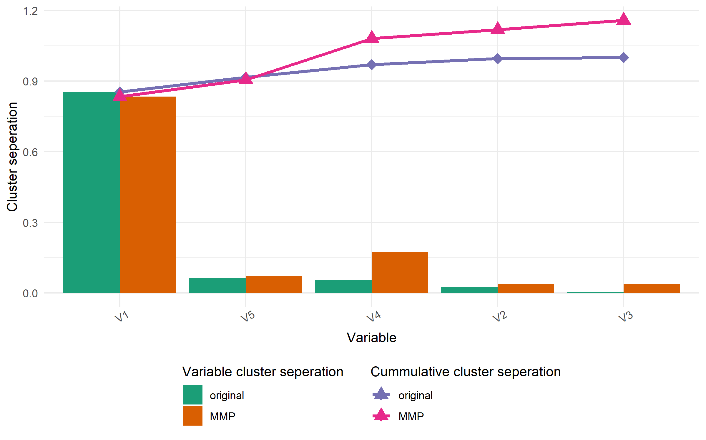
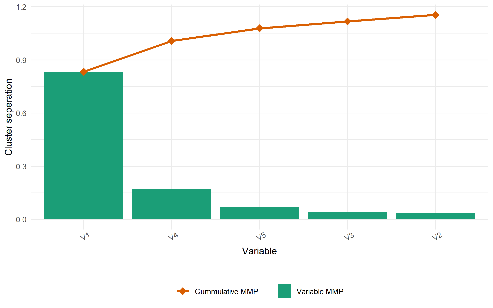
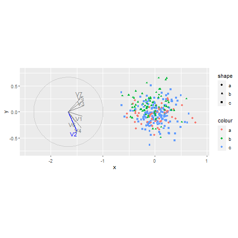
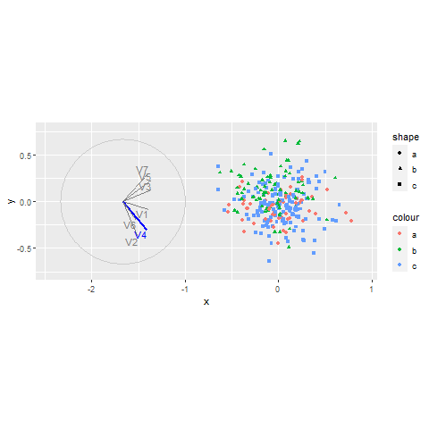
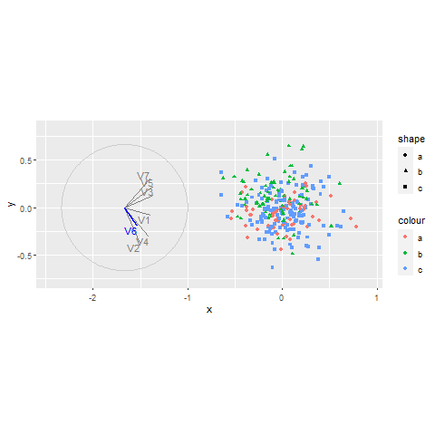
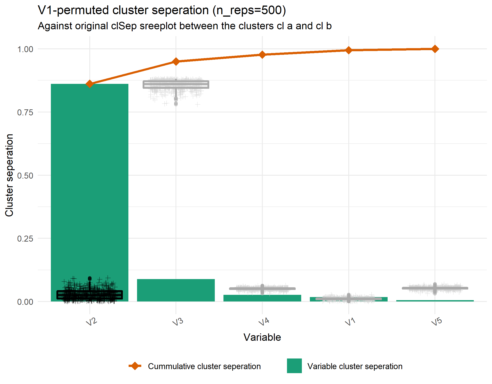
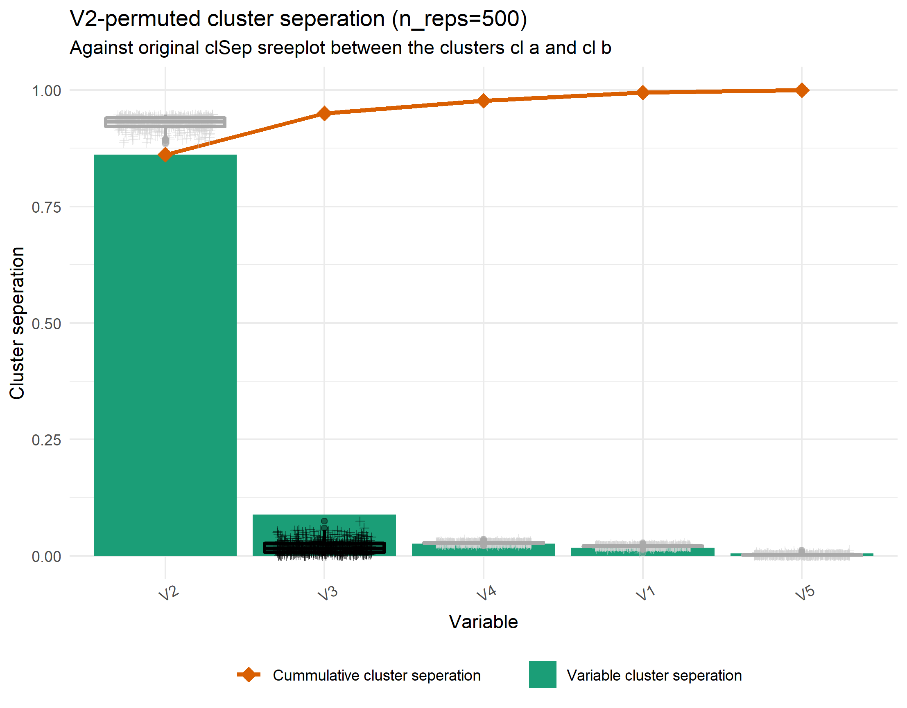
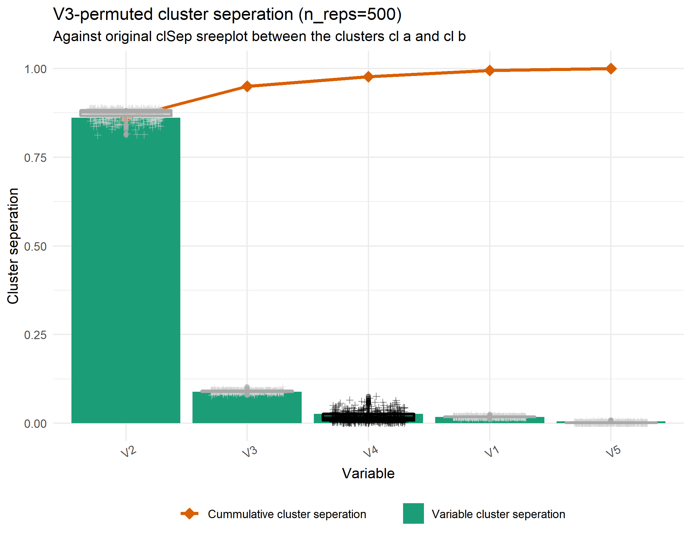
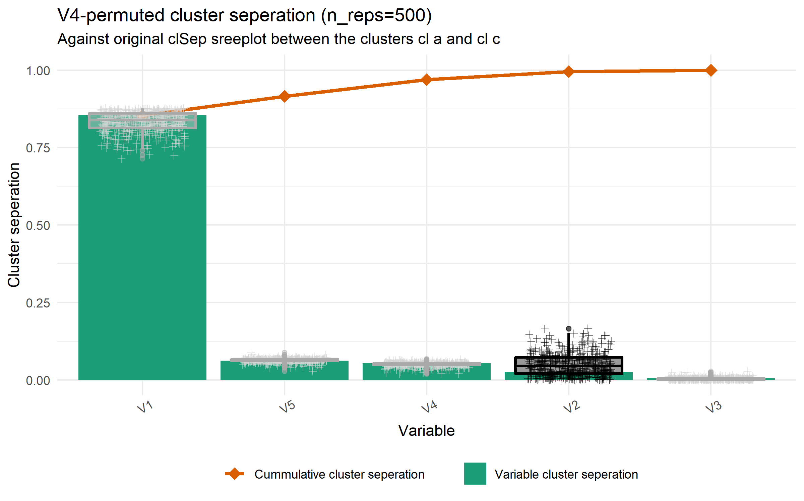
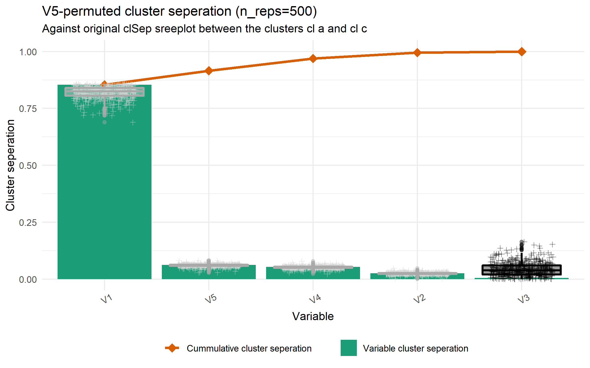

```{r setup_condensed, include=F}
## Setup
library("knitr")
knitr::opts_chunk$set(
  echo = F,
  message   = FALSE, warning = FALSE, error = FALSE,
  results   = "markup",                # Opts: "asis", "markup", "hold", "hide"
  fig.align = "center",              # Opts: "left", "right", "center", "default"
  fig.width = 8, fig.height = 5,
  out.width = "100%",
  fig.pos   = "h", out.extra   = "", # Figures forced closer to chunk location.
  collapse  = TRUE, cache = FALSE, cache.lazy = FALSE
)
```

```{r init}
## Initialize
require("spinifex")
require("tourr")
require("ggplot2")
require("tibble")
require("dplyr")
source("./R/ggproto_screeplot_pca.r")
source("./R/ggproto_screeplot_clSep.r")
source("./R/permutation_feature_importance.r")
source("./R/sim_pDim_kCl.r") ## cluster levels stored in attribute "cl_lvl". Try attr(mySim, "cl_lvl")
set.seed(20200725)
theme_set(theme_minimal())
palette(RColorBrewer::brewer.pal(8, "Dark2"))
DO_REFRESH_FIGURES <- TRUE ## Causes sizable run time.


mns <- list(c(10, 3, rep(0, 3)), c(2, 1, rep(0, 3)))
covs <- list(diag(5),
             diag(5))

dat  <- sim_pDim_kCl(means = mns, sigmas = covs)
clas <- attr(dat, "cl_lvl")
clas <- factor(clas, levels = unique(clas))
lvls <- levels(clas)
p    <- ncol(dat)
k_cl <- length(unique(clas))

## for the 300 series, even number sims are hard, with; not that we may want to remove the modal complex shape and built the difficulty into the difference of the covariance matrices.
# hard <- function(){
#   p <<- sample(7:9, 1); p_signal <<- sample(3:5, 1); cl <<- sample(3:4, 1);
#   vc_vect <<- seq(-.1, 0.8, by = 0.1); mn_vect <<- seq(2, 2.5, .1);
#   n_cl_complexshape <<- sample(1:2, 1)
# }
```

# Simulation from sim_pDim_kCl()

## View simulation

```{r View}
ls_cl_clmns  <- NULL
ls_cl_cov    <- NULL
ls_cl_ggcorr <- NULL
ls_header    <- NULL
for (i in 1:k_cl){
  sub <- dat[clas == lvls[i], ]
  ls_header[[i]] <- paste0("Cluster #", i, ", level: ", lvls[i])
  ls_cl_clmns[[i]] <- colMeans(sub)
  ls_cl_cov[[i]] <- cov(sub)
  ls_cl_ggcorr[[i]] <- GGally::ggcorr(sub, label = TRUE, label_alpha = TRUE)
}
```

### `r ls_header[[1]]`

__column means:__
```{r} 
ls_cl_clmns[[1]]
```

__column ggcorr:__
```{r} 
ls_cl_ggcorr[[1]]
```

### `r ls_header[[2]]`

__column means:__
```{r} 
ls_cl_clmns[[2]]
```

__column ggcorr:__
```{r} 
ls_cl_ggcorr[[2]]
```

### Cluster differneces; cluster 2 - cluster 1

__column means:__
```{r} 
ls_cl_clmns[[2]] - ls_cl_clmns[[1]]
```

__column ggcorr:__
```{r} 
GGally::ggcorr(data = NULL,
               cor_matrix = ls_cl_cov[[2]] - ls_cl_cov[[1]],
               label = TRUE, label_alpha = TRUE)
```

## LDA
```{r LDA}
MASS::lda(dat, grouping = clas)
```


## PCA
```{r PCA}
prcomp(dat)
ggplot() + ggproto_screeplot_pca(dat)
```

## clSep; orig, orig vs MMP, MMp

__Original variable cluster seperation:__
```{r clSepScreeplot}
ggplot() + ggproto_screeplot_clSep(dat, clas) + theme_minimal()
```

__Original vs MMP cluster seperation:__
```{r origxMMP}
if (DO_REFRESH_FIGURES == TRUE) {
  .gg <- ggplot() + ggproto_origxMMP_clSep(data = dat, class = clas)
  ggsave(filename = paste0("origxMMP_clSep.png"),
         plot = .gg,
         path = "./output_sim_clSep/")
}
```


__MMP cluster seperation:__
```{r MMP}
if (DO_REFRESH_FIGURES == TRUE) {
  .gg <- ggplot2::ggplot() + ggproto_MMP_clSep(data = dat, class = clas)
  ggsave(filename = paste0("MMP_clSep.png"),
         plot = .gg,
         path = "./output_sim_clSep/")
}
```



<!-- # User study simulation 302 -->
<!-- This was a 300 series simulations done at the end of the generation 1 user study shiny app. -->
<!-- the odd numbered simulation are "easy" with 1 noise variables, while the even numbered simulations are "hard with 3-5 signal variables, and multi-modal complexity. Note that data sets in the wild may be more likely to have complex covariance matrices rather than this sort of multi modal structures in them. -->

<!-- ## MMP cluster seperation -->
<!-- ```{r sim302clSep} -->
<!-- ### Initialization for sim 302,  -->
<!-- dat  <- readRDS("./apps/data/simulation_data302.rds") -->
<!-- clas <- attributes(dat)$cl_lvl -->
<!-- if (DO_REFRESH_FIGURES == TRUE) { -->
<!--   .gg <- ggplot() + ggproto_MMP_clSep(dat, clas) -->
<!--   ggsave(filename = paste0("sim301_MMP_clSep.png"), -->
<!--          plot = .gg, -->
<!--          path = "./output_sim_clSep/") -->
<!-- } -->
<!-- ``` -->
<!--  -->

<!-- ## PCA -->

<!-- ```{r simPcaPairs} -->
<!-- if (DO_REFRESH_FIGURES == TRUE) { -->
<!--   ## Series spans from 301:312 -->
<!--   dat_std      <- tourr::rescale(as.matrix(dat)) -->
<!--   dat_pca_rot  <- prcomp(dat)$rotation -->
<!--   proj_dat_pca <- as.data.frame(dat_std %*% dat_pca_rot) -->

<!--   .gg <- GGally::ggpairs(proj_dat_pca[, 1:4],  -->
<!--                          title = "ggpairs of PC1:4 for simulation_data301", -->
<!--                          ggplot2::aes(colour = dat_clusters)) -->

<!--   ggplot2::ggsave(filename = "ggpairs_pca_sim302.png", -->
<!--                   plot = .gg, -->
<!--                   path = "./output_sim_clSep/") -->
<!-- } -->
<!-- ``` -->
<!--  -->

<!-- Seems sufficent to be complex enough not to be seen as a pair of components within the first 4 Principal Components. Now to see if we can see anything in radial tours of all variables. We view cl Sep to explore which variables should contain contributions. -->


<!-- ## Radial tour gifs for each manip var -->
<!--  -->
<!--  -->
<!--  -->
<!--  -->
<!--  -->
<!--  -->
<!--  -->

# Apendix

## ClSep of Single-variable permutations (sim_pDim_kCl)

```{r permFeatImp}
if (DO_REFRESH_FIGURES == TRUE) {
  for (i in 1:p) {
    .gg <- ggplot() + ggproto_rep_permute_var_clSep(data = dat, class = clas, permute_rank_num = i)
    ggsave(filename = paste0("permute_clSep", i, ".png"),
           plot = .gg,
           path = "./output_sim_clSep/")
  }
}
```






