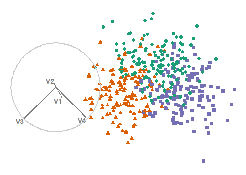
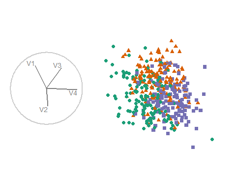
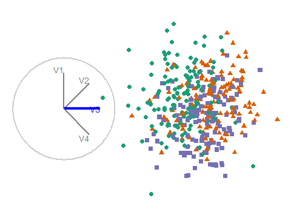

```{r setup_pres, include = FALSE}
knitr::opts_chunk$set(eval      = TRUE,   # R code 
                      echo      = FALSE,  # code text
                      include   = TRUE,   # plots
                      results   = 'asis', # text 'markup' 'asis' 'hold' 'hide'
                      fig.align = "center",
                      collapse  = TRUE,
                      message   = F, warning = F, error = F, 
                      cache     = F, cache.lazy = F
)
library(magrittr)
library(knitr)
library(kableExtra)
```

## .small[Nicholas Spyrison -- multivariate data vis user study]

```{r, include = TRUE,  fig.show = "hold", out.width = 330, fig.align = "default"}



#knitr::include_url("https://ebsmonash.shinyapps.io/spinifex_study/")
```

__PCA__ .col[-- Choose PC#[1, 4] for X, Y axis. not animated.]

__Grand tour__ .col[-- No input selections. 15 second loop @ 5 fps.]

__Radial__ .col[-- Input: select which variable to rotate radially. 18 sec loop, ~6 sec till variable fully in plane.]

[ebsmonash.shinyapps.io/spinifex_study/](https://ebsmonash.shinyapps.io/spinifex_study/)
