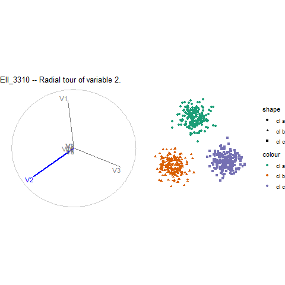
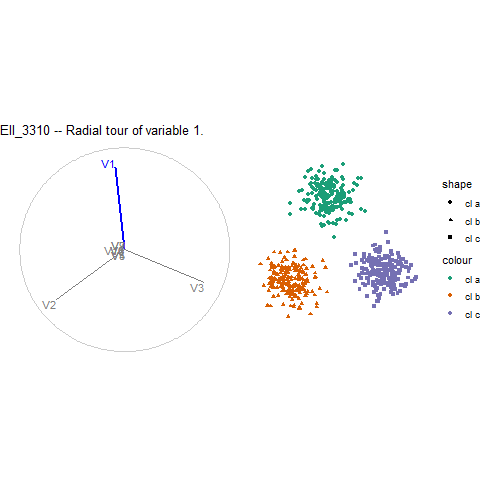
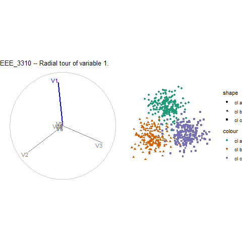
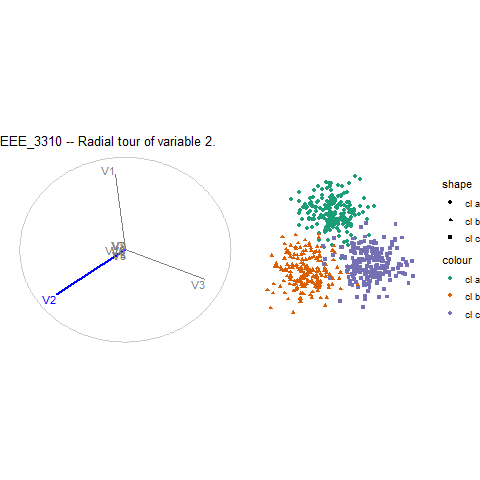
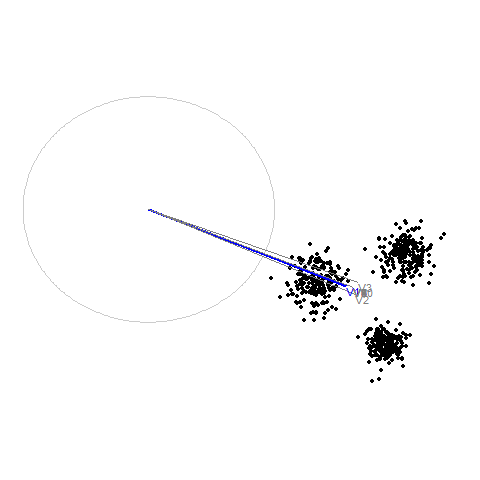
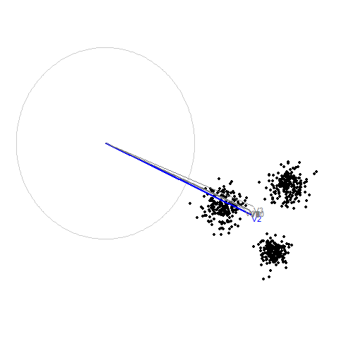

```{r setup_condensed, include=F}
## Setup
require("knitr")
require("spinifex")
require("tourr")
require("ggplot2")
require("tibble")
require("dplyr")
require("here")
knitr::opts_chunk$set(
  echo      = FALSE,
  include   = TRUE,
  message   = FALSE, warning = FALSE, error = FALSE,
  results   = "markup",              ## Opts: "asis", "markup", "hold", "hide"
  fig.align = "center",              ## Opts: "left", "right", "center", "default"
  fig.width = 8, fig.height = 5,
  out.width = "100%",
  fig.pos   = "h", out.extra = "", ## Figures forced closer to chunk location.
  cache = FALSE, cache.lazy = FALSE
)

## For console
source(here("./R/ggproto_screeplot_pca.r"))
source(here("./R/ggproto_screeplot_clSep.r"))
source(here("./R/MMP_clSep.r"))
source(here("./R/geom_lda_points.r"))
source(here("./R/geom_lda_points.r"))
source(here("./R/ggpcapairs.r"))

## Global init, and theme
top_n_manual_tours <- 2 ## keeps run time and length of content resonable.
permutation_reps <- 100
set.seed(20200903)
theme_set(theme_minimal())
palette(RColorBrewer::brewer.pal(8, "Dark2"))

## Load rmvnorm sims
if(F) ## For generation see this file:
  file.edit(here("./catalogue/sim_mvnorm.r"))
## Load data
obj_nms <- c("EII_3310", "EEE_3310", "EVV_3310")
i_s <- 1:length(obj_nms)
for(i in i_s){
  load(file = here(paste0("./catalogue/simulations/", 
                          obj_nms[i], ".rda")))
}
## Context -- simulation information
sim1 <- get(obj_nms[1])
p    <- ncol(sim1)
k_cl <- length(unique(sim1[, 1]))
```

# Simulations

Note that `cor_sz = .5, mn_sz = 5, cor_var_sz = 3.3`.

```{r}
model <- c("EII", "VII", "EEE", "EVV", "VVV")
k_cl  <- c(3L)#, 3L, 3L, 3L)
p_sig <- c(3L)#, 5L, 7L, 10L)
p_tot <- c(10L)#, 10L, 10L, 10L)
EII <- paste0("EII_", k_cl, p_sig, p_tot)
VII <- paste0("VII_", k_cl, p_sig, p_tot)
EEE <- paste0("EEE_", k_cl, p_sig, p_tot)
EVV <- paste0("EVV_", k_cl, p_sig, p_tot)
VVV <- paste0("VVV_", k_cl, p_sig, p_tot)

data.frame(`k clusters` = k_cl,
           `Signal variables` = p_sig,
           `Total dimensions` = p_tot,
           `Model EII name` = EII,
           `Model VII name` = VII,
           `Model EEE name` = EEE,
           `Model EVV name` = EVV,
           `Model VVV name` = VVV,
           `Intrinsic data dimensionality, idd` = p_sig - 1,
           check.names = FALSE) %>% 
  knitr::kable(format = "html", label = "Simulations from models") %>% 
  kableExtra::kable_styling("striped")
```


__Assumptions__

1. All clusters recieve the same number of observations, regardless of volume (observation density is variable).
2. Clusters don't overlap.
3. The cluster seperation task and measures only involve the seperation of 2 clusters.

__Complications__

1. When signal variables > 3; cov3, the covariance matrix with negitive off diagonal elements is not positive definite. To make it positive definite the covariances get washed down very quickly.
2. When k clusters > 3. which covariance should they recieve.
    - Recycle cov1:cov3?
    - Randomly assigned cov1:cov3?


# Models EII, EEE, and EVV

## Variable space
```{r}
for(i in i_s) {
  ## Initialize
  sim_nm   <- obj_nms[i]
  model_nm <- substr(sim_nm, 1, 3)
  dat  <- get(sim_nm)
  clas <- attr(dat, "cl_lvl")
  
  print(GGally::ggpairs(dat[, 1:3], aes(color = as.factor(clas))) +
          ggplot2::scale_color_manual(values = palette()[1:k_cl]) +
          ggplot2::scale_fill_manual( values = palette()[1:k_cl]) +
          ggtitle(paste0(sim_nm, " -- SPLOM of first 3 varaiables")))
}
```

## Principal component space
```{r pca}
for(i in i_s) {
  ## Initialize
  sim_nm   <- obj_nms[i]
  model_nm <- substr(sim_nm, 1, 3)
  dat  <- get(sim_nm)
  clas <- attr(dat, "cl_lvl")
  
  ## PCA
  knitr::kable(round(prcomp(dat)$rotation, 2))
  print(ggpcapairs(x = dat, class = clas, top_n = 3) +
          ggplot2::scale_color_manual(values = palette()[1:k_cl]) +
          ggplot2::scale_fill_manual( values = palette()[1:k_cl]) +
          ggtitle(paste0(sim_nm, " -- SPLOM of first 3 principal components")))
  
  #print(ggplot() + ggproto_screeplot_pca(dat))
}
```

## MMP cluster seperation
```{r}
for(i in i_s){
  ## Initialize
  sim_nm   <- obj_nms[i]
  model_nm <- substr(sim_nm, 1, 3)
  dat  <- get(sim_nm)
  clas <- attr(dat, "cl_lvl")

  ## MMP ClSep
  print(ggplot() + ggproto_MMP_clSep(dat, clas, n_reps = permutation_reps) +
          ggtitle(paste0(sim_nm, " -- MMP cluster seperation")))
}
```

## Manual tours
```{r manual_tours}
if(F){
  
  #### TO CREATE RADIAL .GIFs RUN THE BELOW. ####
  fp <- here("./catalogue/images/")
  for(i in i_s) {
    ## Initialize
    sim_nm   <- obj_nms[i]
    model_nm <- substr(sim_nm, 1, 3)
    dat  <- get(sim_nm)
    clas <- as.factor(attr(dat, "cl_lvl"))
    
    ## Manual tours
    bas <- basis_lda(dat, clas)
    mmp_clsep <- df_scree_MMP_clSep(dat, clas, n_reps = permutation_reps)
    tour_manip_nums <- mmp_clsep$data_colnum[1:top_n_manual_tours]
    for (j in 1:length(tour_manip_nums)){
      mv <- tour_manip_nums[j]
      title <- paste0(sim_nm, " -- Radial tour of variable ", mv, ".")
      
      play_manual_tour(basis = pca_bas, data = dat, manip_var = mv,
                       fps = 9L, axes = "left", 
                       render_type = render_gganimate,
                       aes_args = list(color = clas, shape = clas),
                       ggproto = list(theme_spinifex(),
                                      ggtitle(title)),
                       gif_filename = 
                         paste0("radialTour_", sim_nm,"_mvar", 
                                tour_manip_nums[j], ".gif"),
                       gif_path = fp
      )
    } ## End of for radial tour creation loop
    print(paste0("Saved top 2 radial tours for ", sim_nm, ". ",
                 i, " of ", max(i_s), " models done, or ",
                 round(100 * i / max(i_s), 2), " %."))
  } ## End of for groups loop
  #### RUN THROUGH HERE TO REFRESH radial tours. ####
  
} ## End of if(F), don't run.
```

All manual tours start from LDA initalized basis.










## Linear discriminant space
```{r lda}
for(i in i_s) {
  ## Initialize
  sim_nm   <- obj_nms[i]
  model_nm <- substr(sim_nm, 1, 3)
  dat  <- get(sim_nm)
  clas <- attr(dat, "cl_lvl")
  
  ## LDA
  MASS::lda(dat, grouping = clas)
  if(length(unique(clas)) > 2){
    print(ggplot() + geom_lda_points(dat, clas) + 
            ggtitle(paste0(sim_nm, " -- first 2 LD components"))) 
  } else warning("LDA not called, fewer than 2 classes.")
}
```


# {mclust} paper reference

Scrucca, Luca, Michael Fop, T. Brendan Murphy, and Adrian E. Raftery. "Mclust 5: Clustering, Classification and Density Estimation Using Gaussian Finite Mixture Models." The R Journal 8, no. 1 (August 2016): 289-317.

## mclust paper, Table 3 


## mclust paper, Figure 2


