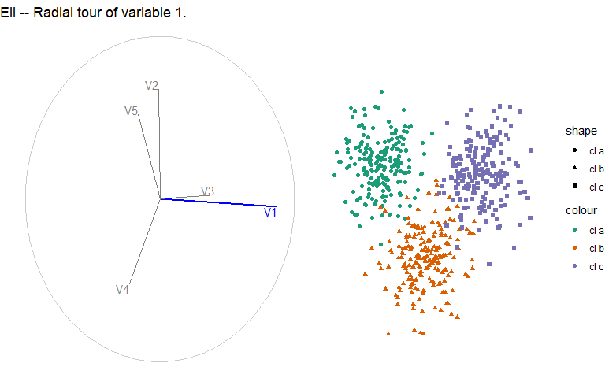
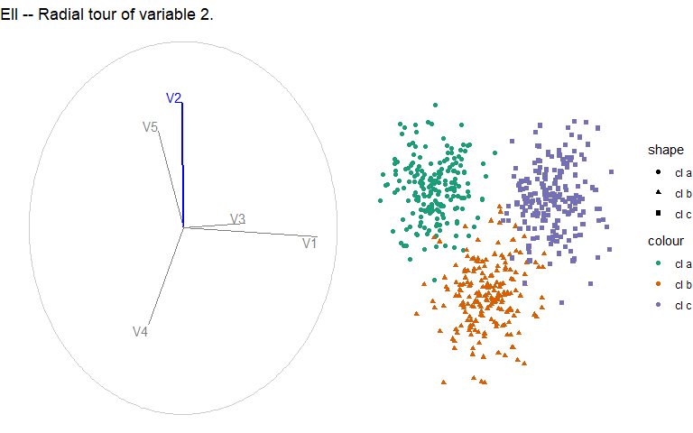
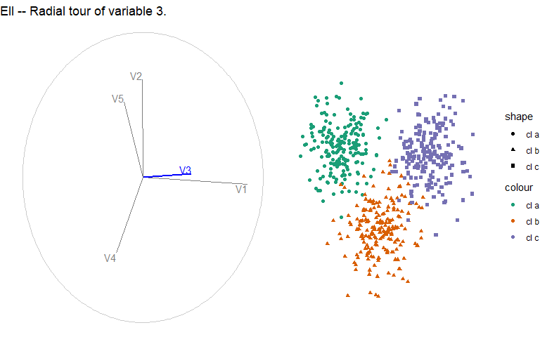
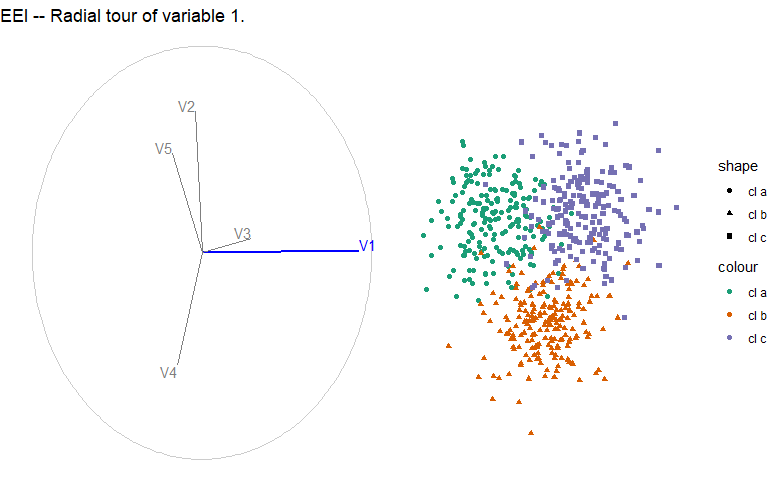
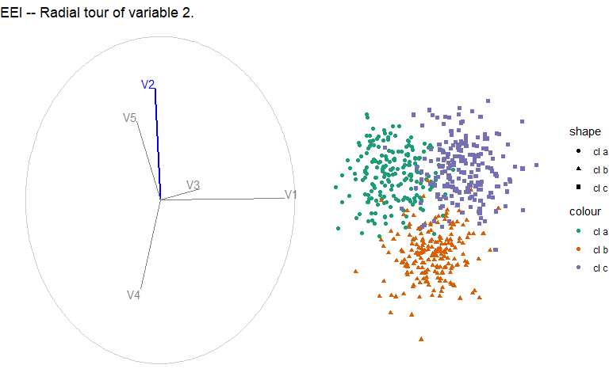

```{r setup, include=F}
DO_RERUN_RADIAL_TOURS <- TRUE

require(ggplot2)
require(spinifex)
require(here)
source(here("./R/sim_pDim_kCl.r"))
theme_set(theme_minimal())
palette(RColorBrewer::brewer.pal(8, "Dark2"))
set.seed(20200917)

knitr::opts_chunk$set(
  echo      = FALSE,
  include   = TRUE,
  message   = FALSE, warning = FALSE, error = FALSE,
  results   = "markup",              ## Opts: "asis", "markup", "hold", "hide"
  fig.align = "center",              ## Opts: "left", "right", "center", "default"
  fig.width = 8, fig.height = 5,
  out.width = "100%",
  fig.pos   = "h", out.extra = "", ## Figures forced closer to chunk location.
  cache = FALSE, cache.lazy = FALSE
)
```

```{r, init}
models <- c("EII", "EEI", "EVV")
k_cl <- 3
mns  <- list(c(1,0,0), c(0,1,0), c(0,0,1))
diag <- cov1 <- cov2 <- cov3 <- .05 * diag(3)
cov1[1, 1] <- cov2[2, 2] <- cov3[3, 3] <- 5

covs_EII <- rep(list(diag), 3)
covs_EEI <- rep(list(cov1), 3)
covs_EVV <- rep(list(cov1, cov2, cov3))

EII <- sim_pDim_kCl(means = mns, sigmas = covs_EII,
                    cl_points = rep(list(200), k_cl), do_shuffle = FALSE)
EEI <- sim_pDim_kCl(means = mns, sigmas = covs_EEI,
                    cl_points = rep(list(200), k_cl), do_shuffle = FALSE)
EVV <- sim_pDim_kCl(means = mns, sigmas = covs_EVV,
                    cl_points = rep(list(200), k_cl), do_shuffle = FALSE)
clas <- attr(EII, "cl_lvl")
```

# Principal component space, scaled

```{r, scaledPcSpace}
## SCALED PCA GGPAIRS
pca_EII <- prcomp(EII, scale = TRUE)$x
pca_EEI <- prcomp(EEI, scale = TRUE)$x
pca_EVV <- prcomp(EVV, scale = TRUE)$x
titles <- paste0(models, " -- Principal component space, scaled")
GGally::ggpairs(as.data.frame(pca_EEI), aes(color = clas, shape = clas)) +
  ggtitle(titles[1]) +
  ggplot2::scale_color_manual(values = palette()[1:k_cl]) +
  ggplot2::scale_fill_manual( values = palette()[1:k_cl])
GGally::ggpairs(as.data.frame(pca_EEI), aes(color = clas, shape = clas)) +
  ggtitle(titles[2]) +
  ggplot2::scale_color_manual(values = palette()[1:k_cl]) +
  ggplot2::scale_fill_manual( values = palette()[1:k_cl])
GGally::ggpairs(as.data.frame(pca_EEI), aes(color = clas, shape = clas)) +
  ggtitle(titles[3]) +
  ggplot2::scale_color_manual(values = palette()[1:k_cl]) +
  ggplot2::scale_fill_manual( values = palette()[1:k_cl])
```

# Radial tours

Starting basis initalized to PC1:2 of each model.

```{r}
if(DO_RERUN_RADIAL_TOURS == TRUE){
  ## RADIAL TOURS of top 2 vars
  fp <- here("./catalogue/images/")
  for(i in 1:3){ ## Loop over models
    dat <- get(models[i])
    bas <- basis_pca(dat)
    titles <- paste0(models[i], " -- Radial tour of variable ", 1:3, ".")
    for(j in 1:3){ ## Loop over manip_vars
      play_manual_tour(basis = bas, data = dat, manip_var = j,
                       fps = 9L, axes = "left",
                       render_type = render_gganimate,
                       aes_args = list(color = clas, shape = clas),
                       ggproto = list(theme_spinifex(), ggtitle(titles[j])),
                       gif_filename = paste0("radialTour_basic_", models[i],"_mvar",j, ".gif"),
                       gif_path = here("./catalogue/images/")
      )
    }
  }
}
```

## EII





## EEI





## EVV


