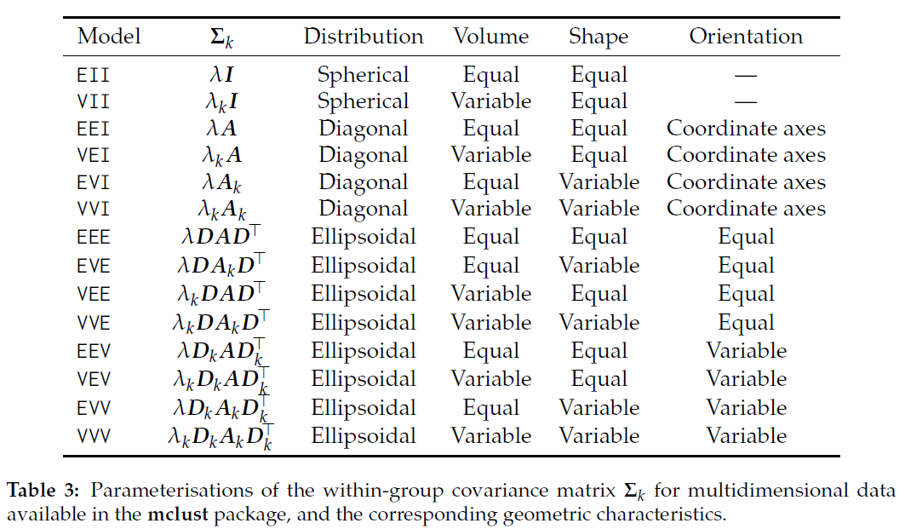

```{r setup, include=F}
DO_RERUN_RADIAL_TOURS <- F

require(ggplot2)
require(spinifex)
require(here)
source(here("./R/sim_pDim_kCl.r"))
theme_set(theme_minimal())
palette(RColorBrewer::brewer.pal(8, "Dark2"))
set.seed(20200917)

knitr::opts_chunk$set(
  echo      = FALSE,
  include   = TRUE,
  message   = FALSE, warning = FALSE, error = FALSE,
  results   = "markup",            ## Opts: "asis", "markup", "hold", "hide"
  fig.align = "center",            ## Opts: "left", "right", "center", "default"
  fig.width = 8, fig.height = 5,
  out.width = "100%",
  fig.pos   = "h", out.extra = "", ## Figures forced closer to chunk location.
  cache = FALSE, cache.lazy = FALSE
)
```

```{r, initialize}
## SETUP MODELS, MEANS
models <- c("EII", "EEI", "EEV")
p      <- 5
k_cl   <- 3
mns <- ## V3 NEEDS SMALL VARIATION TO REMOVE A DEGREE OF FREEDOM FROM PCA ROTATION 
  list(c(0,1, 0,.5,1), c(1,0, .5,1,0), c(2,1, 1,0,.5))

## COVARIANCES
sd   <- .07 * 3 ## .07 THIS IS ROUGHLY ~ MCLUST5 paper with unit means.
diag <- cov1 <- cov2 <- cov3 <- sd * diag(p) ## CIRCLE DIAG, INIT COV1:3
cov1[1, 1] <- cov2[2, 2] <- cov3[3, 3] <- 3.5 * sd
## ASSIGN COVS BY MODEL
covs_EII <- rep(list(diag), k_cl)
covs_EEI <- rep(list(cov1), k_cl)
covs_EEV <- rep(list(cov1, cov2, cov3))

## LOCAL FUNCTIONS
this_sim <- function(sigmas, ...){
  sim_pDim_kCl(means = mns, sigmas = sigmas,
               cl_points = rep(list(200), k_cl), do_shuffle = FALSE)
}

theme_pairs <- function(){
  list(theme_minimal(),
       scale_color_manual(values = palette()[1:k_cl]),
       scale_fill_manual( values = palette()[1:k_cl]))
}

this_ggpairs <- function(x, title){
  GGally::ggpairs(as.data.frame(x), aes(color = clas, shape = clas)) +
    ggtitle(title) + theme_pairs()
}

this_pca_ggpairs <- function(pca, title){
  GGally::ggpairs(as.data.frame(pca), aes(color = clas, shape = clas)) +
    ggtitle(title) + theme_pairs()
}

## GENERATE SIMS
EII <- this_sim(covs_EII)
EEI <- this_sim(covs_EEI)
EEV <- this_sim(covs_EEV)
clas <- attr(EII, "cl_lvl")

## SCALED PCA GGPAIRS
pca_EII <- prcomp(EII, scale = TRUE)$x
pca_EEI <- prcomp(EEI, scale = TRUE)$x
pca_EEV <- prcomp(EEV, scale = TRUE)$x
```

Each simulation is 600 observations of 5 varaibles. There are 3 clusters (200 observations each). The standard deviation used is about twice that used in the mclust figure (harder to see cluster seperation).

<!-- # Variable space -->

<!-- ```{r variableSpace} -->
<!-- titles <- paste0(models, " -- Variable space") -->
<!-- this_ggpairs(EII, titles[1]) -->
<!-- this_ggpairs(EEI, titles[2]) -->
<!-- this_ggpairs(EEV, titles[3]) -->
<!-- ``` -->

# Principal component space, scaled

```{r, scaledPcSpace}
## CALL PCA GGPAIRS (SCALED)
titles <- paste0(models, " -- Principal component space, scaled")
this_pca_ggpairs(pca_EII, titles[1])
this_pca_ggpairs(pca_EEI, titles[2])
this_pca_ggpairs(pca_EEV, titles[3])
```

# Radial tours

The starting basis initialized to PC1:2 of each model. Radial tours created for the top 3 variables.

```{r}
if(DO_RERUN_RADIAL_TOURS == TRUE){
  ## RADIAL TOURS of top 2 vars
  fp <- here("./catalogue/images/")
  i_s <- 1:length(models)
  for(i in i_s){ ## Loop over models; 1:3
    dat <- get(models[i])
    bas <- basis_pca(dat)
    titles <- paste0(models[i], " -- Radial tour of variable ", 1:3, ".")
    for(j in 1:3){ ## Loop over manip_vars; 1:3
      play_manual_tour(basis = bas, data = dat, manip_var = j,
                       fps = 9L, axes = "left",
                       render_type = render_gganimate,
                       aes_args = list(color = clas, shape = clas),
                       ggproto = list(theme_spinifex(), ggtitle(titles[j])),
                       gif_filename = paste0("radialTour_basic_", models[i], 
                                             "_mvar",j, ".gif"),
                       gif_path = here("./catalogue/images/")
      )
    }
    print(paste0("Done with radial tours for model: ", models[i], ". ",
                 "Model", i, " of ", max(i_s), "."))
  }
}
```

## EII


## EEI


## EEV


# {mclust} paper reference

Scrucca, Luca, Michael Fop, T. Brendan Murphy, and Adrian E. Raftery. "Mclust 5: Clustering, Classification and Density Estimation Using Gaussian Finite Mixture Models." The R Journal 8, no. 1 (August 2016): 289-317.

## mclust paper, Table 3 


## mclust paper, Figure 2

