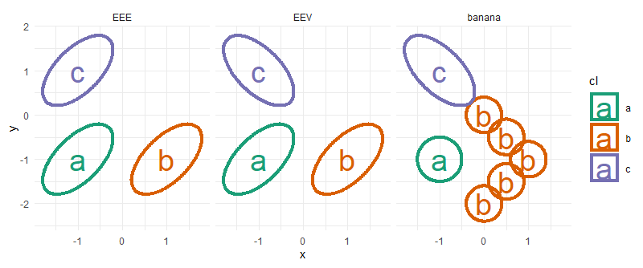
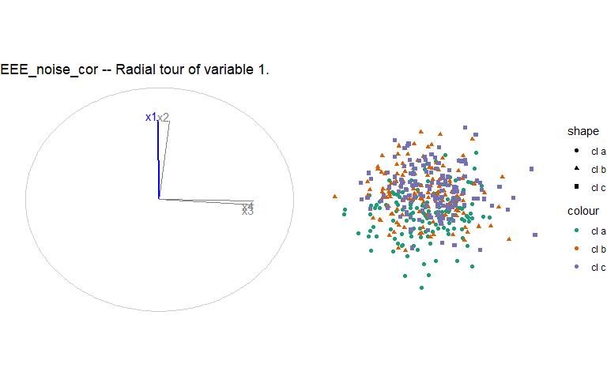
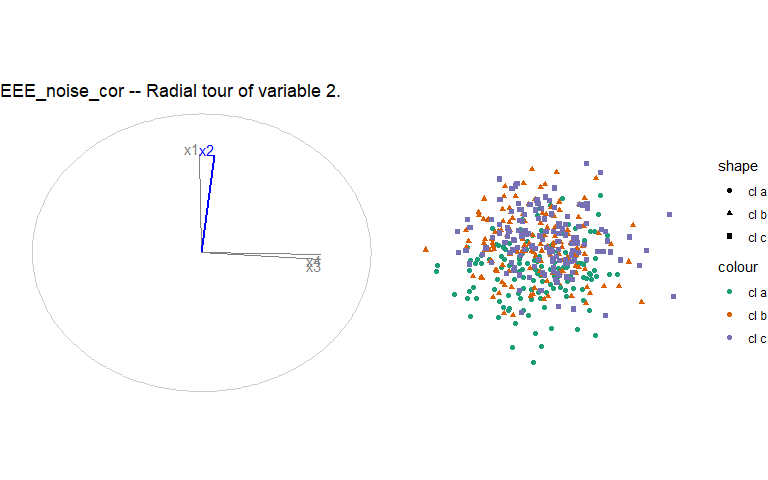
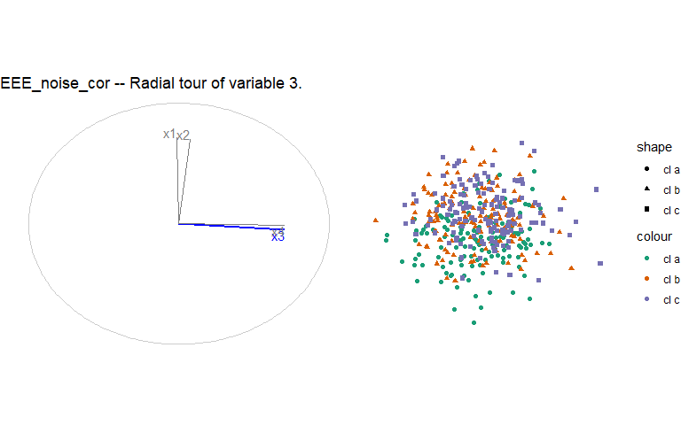
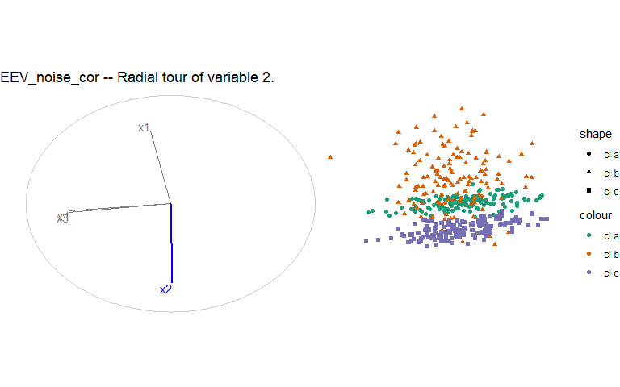
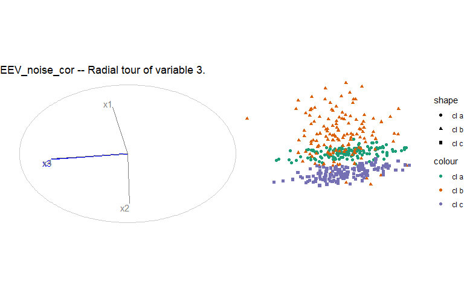
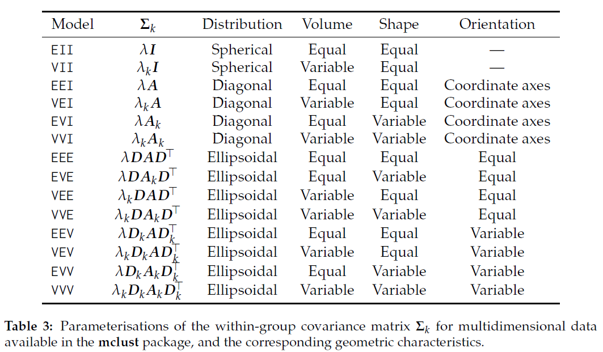
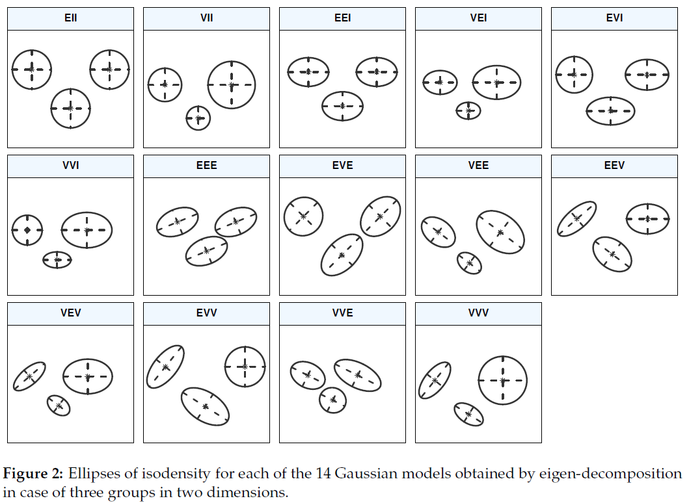

```{r setup, include=F}
DO_RERUN_RADIAL_TOURS <- F

require(here)
source(here("R/sim_tidyverse.r"))
source(here("R/boomerang.r"))

theme_set(theme_minimal())
palette(RColorBrewer::brewer.pal(8, "Dark2"))
set.seed(20200923)

knitr::opts_chunk$set(
  echo      = FALSE,
  include   = TRUE,
  message   = FALSE, warning = FALSE, error = FALSE,
  results   = "markup",            ## Opts: "asis", "markup", "hold", "hide"
  fig.align = "center",            ## Opts: "left", "right", "center", "default"
  fig.width = 8, fig.height = 5,
  out.width = "100%",
  fig.pos   = "h", out.extra = "", ## Figures forced closer to chunk location.
  cache = FALSE, cache.lazy = FALSE
)
```

```{r, initialize}
## SETUP MODELS, MEANS
models <- paste0(c("EEE", "EEV", "banana"), "_noise_cor")
p      <- 4
k_cl   <- 3
cl_obs <- 140 ## banana() expects evenly divisable by 5
mns <- ##___2 signal dim  | 2 noise dim
  list("cl a" = c(-1, -1,   0, 0),
       "cl b" = c( 1, -1,   0, 0),
       "cl c" = c(-1,  1,   0, 0))

## COVARIANCES
sd <- 1 ## .07 IS ROUGHLY ~ MCLUST5 paper with unit means.
#### DEFINE COMMON COVARIANCES
cov_circ <- matrix(c(sd,  0,   0,   0,
                     0,   sd,  0,   0,
                     0,   0,   sd,  0,
                     0,   0,   0,   sd),
                   ncol = 4, byrow = TRUE)
cov_elipse_pos <- matrix(c(sd,  .9,  0,   0,
                           .9,  sd,  0,   0,
                           0,   0,   sd,  0,
                           0,   0,   0,   sd),
                         ncol = 4, byrow = TRUE)
cov_elipse_neg <- matrix(c(sd,  -.9, 0,   0,
                           -.9, sd,  0,   0,
                           0,   0,  sd,   0,
                           0,   0,   0,   sd), 
                         ncol = 4, byrow = TRUE)
cov_circ_noise_cor <- matrix(c(sd,  0,   0,   0,
                     0,   sd,  0,   0,
                     0,   0,   sd,  .8,
                     0,   0,   .8,   sd),
                   ncol = 4, byrow = TRUE)
cov_elipse_pos_noise_cor <- matrix(c(sd,  .9,  0,   0,
                                     .9,  sd,  0,   0,
                                     0,   0,   sd,  .8,
                                     0,   0,   .8,  sd),
                                   ncol = 4, byrow = TRUE)
cov_elipse_neg_noise_cor <- matrix(c(sd,  -.9, 0,   0,
                                     -.9, sd,  0,   0,
                                     0,   0,   sd,  .8,
                                     0,   0,   .8,  sd),
                                   ncol = 4, byrow = TRUE)
#### ASSIGN LISTS OF 3 COMMON COVARRIANCES TO EACH MODEL
assign(paste0("covs_", models[1]), 
       list("cl a" = cov_elipse_pos_noise_cor,
            "cl b" = cov_elipse_pos_noise_cor,
            "cl c" = cov_elipse_pos_noise_cor))
assign(paste0("covs_", models[2]), 
       list("cl a" = cov_elipse_pos_noise_cor,
            "cl b" = cov_elipse_neg_noise_cor,
            "cl c" = cov_elipse_pos_noise_cor))
assign(paste0("covs_", models[3]), 
       list("cl a" = .2 *  cov_circ_noise_cor,
            "cl b" = .05 * cov_circ_noise_cor, ## Apply banana() to cl_b 
            "cl c" = cov_elipse_neg_noise_cor))

## LOCAL FUNCTIONS
this_sim <- function(cov_ls){ ## Assumes same means, mns and obs per cl scalar, cl_obs
  sim_tidyverse(mns_ls = mns, cov_ls = cov_ls, 
                obs_per_cl = cl_obs)
}

this_pcs <- function(data){ ## Assumes cluster is in first var 
  ## Di uses prcomp(scale = FALCE), but previously applied stdd() on vars.
  df <- data.frame(cl = data$cl,
                   prcomp(data[, 2:(p+1)], scale = FALSE)$x)
  as_tibble(df)
}
  
theme_pairs <- function(){
  list(theme_minimal(),
       scale_color_manual(values = palette()[1:k_cl]),
       scale_fill_manual( values = palette()[1:k_cl]))
}

this_ggpairs <- function(x, title){ ## Assumes class vector 'clas'
  GGally::ggpairs(as.data.frame(x), aes(color = clas, shape = clas)) +
    ggtitle(title) + theme_pairs()
}

this_pca_ggpairs <- function(pcs, title){ ## Assumes class vector 'clas'
  GGally::ggpairs(as.data.frame(pcs), aes(color = clas, shape = clas)) +
    ggtitle(title) + theme_pairs()
}

## ASSIGN GENERATED SIMS
assign(models[1], this_sim(get(paste0("covs_", models[1]))))
assign(models[2], this_sim(get(paste0("covs_", models[2]))))
assign(models[3], this_sim(get(paste0("covs_", models[3])))) 
## Apply banana() to cl b.
VVV_banana_noise_cor[VVV_banana_noise_cor$cl == "cl b", ] <-
  banana(VVV_banana_noise_cor[VVV_banana_noise_cor$cl == "cl b", ])

## ASSIGN PCS
assign(paste0("pcs_", models[1]), this_pcs(get(models[1])))
assign(paste0("pcs_", models[2]), this_pcs(get(models[2])))
assign(paste0("pcs_", models[3]), this_pcs(get(models[3])))
```

# Simulation design

Each simulation is `r k_cl * cl_obs` observations of `r p` varaibles (`r k_cl` clusters, with `r cl_obs` observations each). This document focus on 4 simulation models, namely, EEE EEV, and banana. These models have the simulation factor specified in the title and is accompanied by 2 other documents which vary the simulation factor.




```{r simDesign}
design <- data.frame(
  `Simulation factor` = c("baseline", "correlated noise dimensions ", 
                          "mean differences in combination of variables"), 
  `EEE family` = c("EEE", "EEE_noiseCor", "EEE_mnComb"), 
  `EEV family` = c("EEV", "EEV_noiseCor", "EEV_mnComb"),
  `banana family` = 
    c("banana", "banana_noiseCor", "banana_mnComb"),
  check.names = FALSE
)
knitr::kable(design, caption = "Simulation models by simulation factor")
```


# Variable space

```{r variableSpace}
titles <- paste0(models, " -- Variable space")
this_ggpairs(get(models[1]), titles[1])
this_ggpairs(get(models[2]), titles[2])
this_ggpairs(get(models[3]), titles[3])
this_ggpairs(get(models[4]), titles[4])
```

# Principal component space

```{r, scaledPcSpace}
## CALL PCA GGPAIRS (SCALED)
titles <- paste0(models, " -- Principal component space")
this_pca_ggpairs(get(paste0("pcs_", models[1])), titles[1])
this_pca_ggpairs(get(paste0("pcs_", models[2])), titles[2])
this_pca_ggpairs(get(paste0("pcs_", models[3])), titles[3])
this_pca_ggpairs(get(paste0("pcs_", models[4])), titles[4])
```

# Radial tours

The starting basis initialized to PC1:2 of each model. Radial tours created for the top 3 variables.

```{r}
if(DO_RERUN_RADIAL_TOURS == TRUE){
  ## RADIAL TOURS of top 2 vars
  fp <- here("catalogue/images/")
  i_s <- 1:length(models)
  for(i in i_s){ ## Loop over models; 1:3
    dat <- get(models[i])[2:5]
    bas <- basis_pca(dat)
    titles <- paste0(models[i], " -- Radial tour of variable ", 1:3, ".")
    for(j in 1:3){ ## Loop over manip_vars; 1:3
      fn <- paste0("radialTour_tidyverse_", models[i],
                   "_mvar", j, ".gif")
      play_manual_tour(basis = bas, data = dat, manip_var = j,
                       fps = 9L, axes = "left",
                       render_type = render_gganimate,
                       aes_args = list(color = clas, shape = clas),
                       ggproto = list(theme_spinifex(), ggtitle(titles[j])),
                       gif_filename = fn,
                       gif_path = fp
      )
    }
    # cat(paste0("Done with radial tours for model: ", models[i], ". ",
    #              "Model ", i, " of ", max(i_s), ". \n"))
  }
}
```

## `r models[1]`





## `r models[2]`





## `r models[3]`


# Checking variance-covariance matrices

Let's check if our component variance-covariance matrices are non-singular and postive semi-definate.

```{r covCheck}
if(F)
  browseURL("https://stats.stackexchange.com/questions/30465/what-does-a-non-positive-definite-covariance-matrix-tell-me-about-my-data")
require("lqmm"); require("matrixcalc");
covs_ls <- list(
  "cov_circ" = cov_circ,
  "cov_elipse_pos" = cov_elipse_pos,
  "cov_elipse_neg" = cov_elipse_neg,
  "cov_circ_noise_cor" = cov_circ_noise_cor,
  "cov_elipse_pos_noise_cor" = cov_elipse_pos_noise_cor,
  "cov_elipse_neg_noise_cor" = cov_elipse_neg_noise_cor
)

for(i in 1:length(covs_ls)){
  cov <- covs_ls[[i]]
  print(paste0("cov: ", names(covs_ls)[i]))
  print(paste0("is non-singular matrix: ", matrixcalc::is.non.singular.matrix(cov)))
  IS_psd <- matrixcalc::is.positive.semi.definite(cov)
  print(paste0("is positive semi-definite: ", IS_psd))
  if(IS_psd == FALSE){
    print("(if not psd,) make positive definite: ")
    print(lqmm::make.positive.definite(cov))
  }
}

```

# {mclust} paper reference, VSO models

Scrucca, Luca, Michael Fop, T. Brendan Murphy, and Adrian E. Raftery. "Mclust 5: Clustering, Classification and Density Estimation Using Gaussian Finite Mixture Models." The R Journal 8, no. 1 (August 2016): 289-317.

## mclust paper, Table 3 


## mclust paper, Figure 2

