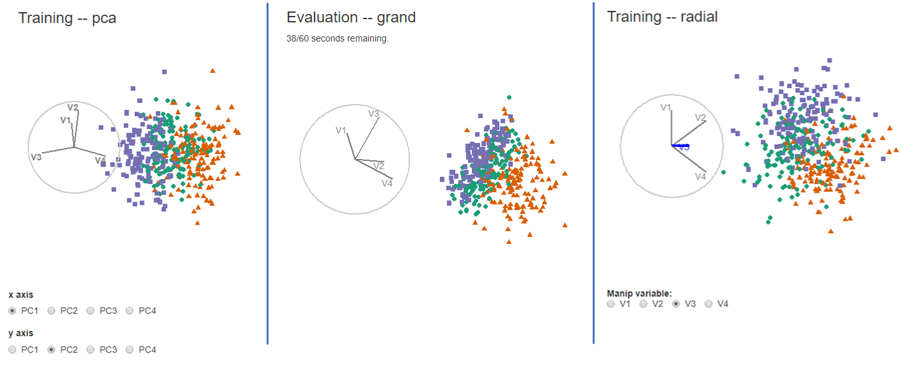

<!-- Do not add YAML header to child document. -->
 <!-- Do not setup, or directly knit child document; save changes and knit parent. -->
<!-- # Appendix {#sec:appendix} is listed in parent document -->


<!-- segue to extended analysis -->
This section covers extended analysis. First, it illustrations of the different visuals are provided. Then, the participant demographics are covered. Lastly, a parallel modeling analysis on log response time is conducted.


## Illustrations of visual methods

Below illustrates the three visual methods evaluated in the user study. Data was collected from a __shiny__ application, and pre-rendered `gif` files were displayed based on the selected inputs

```{r out.width="100%", fig.env = "figure*", fig.cap = "Examples of the application displays for PCA, grand tour, and radial tour."}

```

## Survey participant demographics {#sec:demographics}

The target population is relatively well-educated people, as linear projections may prove difficult for generalized consumption. Hence Prolific.co participants are restricted to those with an undergraduate degree (58,700 of the 150,400 users at the study time). From this cohort, 108 performed a complete study. Of these participants, 84 submitted the post-study survey, represented in the following heatmap. All participants were compensated for their time at \pounds 7.50 per hour, with a mean time of about 16 minutes. Figure \@ref(fig:figSurveyDemographics) shows a heat map of the demographics for these 84 participants.

```{r, figSurveyDemographics, out.width="100%", fig.env = "figure*", fig.cap = "Heatmaps of survey participant demographics; counts of age group by completed education as faceted across preferred pronoun. Our sample tended to be between 18 and 35 years of age with an undergraduate or graduate degree."}
if(F) ## Creation and saving figure at:
  file.edit("./paper/R/fig_population_demographics.r")
knitr::include_graphics("./figures/figSurveyDemographics.pdf")
```


## Response time {#sec:responsetime}

<!-- Time as secondary interest, Y2 -->
As a secondary explanatory variable, response time is considered. Response time is first log-transformed to remove its right skew. The same modeling procedure is repeated for this response. 1) Compare the performance of a battery of all additive and multiplicative models. Table \@ref(tab:timeCompTbl) shows the higher level performance of these models over increasing model complexity. 2) Select the model with the same effect terms, $\alpha \times \beta + \gamma + \delta$, with relatively high conditional $R^2$ without becoming overly complex from variable interactions. The coefficients of this model are displayed in Table \@ref(tab:timeCoefTbl).


<!-- Y2 model comparisons, continue to use ABcd -->
```{r timeCompTbl, fig.cap = "Use the caption arg in kable(), not this."}
## 1) Eval parameters
kableExtra::kbl(
  model_comp_tbl_ls[[2]], "latex", 
  align = c("l", rep("l", 2), rep("c", 5)),
  booktabs = TRUE, linesep = "",  escape = FALSE, ## Allow cell_spec formatting
  table.envir = "table*", ## Wide tables; from `*`
  caption = "Model performance regressing on log response time [seconds], $\\widehat{Y_2}$ random effect models. Conditional $R^2$ includes the random effects, while marginal does not. The model $\\alpha \\times \\beta + \\gamma + \\delta$ model is selected to examine further as it has relatively high marginal $R^2$ while having much less complexity than the complete interaction model.") %>%
  kableExtra::kable_classic(font_size = kable_font_size) # bootstrap_options = "striped",
```

<!-- Y2 coeffiecients -->
```{r timeCoefTbl, fig.cap = "Use the caption arg in kable(), not this."}
kableExtra::kbl(
  coef_ls[[2]], booktabs = TRUE, linesep = "", format = "latex", digits = 5,
  table.envir = "table*", ## Wide tables; from `*`
  caption = "Model coefficients for log response time [seconds] $\\widehat{Y_2} = \\alpha \\times \\beta + \\gamma + \\delta$, with factor = pca, location = 0/100\\%, shape = EEE, and dim = 4 held as baselines. Location = 50/50\\% is the fixed term with the strongest evidence and takes less time. In contrast, the interaction term location = 50/50\\%:shape = EEV has the most evidence and takes much longer on average.") %>%
  kableExtra::pack_rows("Factor", 2, 3) %>%
  kableExtra::pack_rows("Fixed effects", 4, 8) %>%
  kableExtra::pack_rows("Interactions", 9, 12) %>%
  kableExtra::kable_classic(font_size = kable_font_size) # bootstrap_options = "striped",
```


<!-- ===== Removed, random effect range analysis ======= -->
<!-- ## Random effect ranges {-} -->


<!-- <!-- Random effect terms specify source of the error -->
<!-- The random effect terms further clarify the source of the error. Below is a comparison the effect ranges attributed to the participant and to the simulations next to their marginal effect on the response, a sort of upper bound of the error they could explain. This was performed for the models regressing accuracy and then log response time. -->

<!-- <!-- Random effects vs Mean Mark CI by participant and sim -->
<!-- The residual plots have no noticeable nonlinear trends and contain striped patterns as an artifact from regressing on discrete variables. Figure \@ref(fig:figEffectRange) illustrates (T) the effect size of the random terms participant and simulation, or more accurately, the 95\% CI from Gelman simulation of their posterior distribution. The effect size of the participant is much larger than simulation. The most extreme participants are statistically significant at $\alpha = .95$, while none of the simulation effects significantly deviate from the null of having no effect size on the marks. In comparison, (B) 95\% confidence intervals participation and simulation mean accuracy, respectively. -->

<!-- Residual plots have no noticeable nonlinear trends and contain striped patterns as an artifact from regressing on discrete variables. Figure \@ref(fig:figEffectRange) illustrates (T) the effect size of the random terms participant and simulation, or more accurately, the 95\% CI from Gelman simulation of their posterior distribution. The effect size of the participant is much larger than simulation. The most extreme participants are statistically significant at $\alpha = .95$, while none of the simulation effects significantly deviate from the null of having no effect size on the marks. In comparison, (B) 95\% confidence intervals participation and simulation mean accuracy, respectively. -->

<!-- ```{r figEffectRange, out.width="100%", fig.show="asis", fig.cap="Accuracy model: (T) Estimated effect ranges of the random effect terms participant and data simulation of the accuracy model, $\\widehat{Y_1} = \\alpha \\times \\beta + \\gamma + \\delta$. Confidence intervals are created with Gelman simulation on the effect posterior distributions. The effect size of the participant is relatively large, with several significant extrema. None of the simulations deviate significantly. (B) The ordered distributions of the CI of mean marks follow the same general pattern and give the additional context of how much variation is in the data, an upper limit to the effect range. The effect ranges capture about two-thirds of the range of the data without the model. All intervals for $\\alpha = .95$ confidence."} -->
<!-- if(F) ## Creation and saving figure at: -->
<!--   file.edit("./apps_supplementary/v4_prolifico_100/_analysis.rmd") -->
<!-- knitr::include_graphics("./figures/figEffectRange.pdf") -->
<!-- ``` -->

<!-- Similarly, figure \@ref(fig:figTeffectRange) shows the Gelman simulations and marginal effects of the simulation and participants for the model with the same terms regressing on log response time. -->

<!-- ```{r figTeffectRange, out.width="100%", fig.show="asis", fig.cap = "Log response time model: (T) The effect ranges of Gelman resimulation on posterior distributions for the time model, $\\widehat{Y_2} = \\alpha \\times \\beta + \\gamma + \\delta$. These show the magnitude and distributions of particular participants and simulations. Simulation has a relatively small effect on response time. (B) Confidence intervals for mean log time by participant and simulation. The marginal density shows that the response times are left-skewed after log transformation. Interpreting back to linear time there is quite the spread of response times: $e^{1} = 2.7$, $e^{2.75} = 15.6$, $e^{3.75} = 42.5$ seconds. Of the simulations on the right, the bottom has a large variation in response time, relative to the effect ranges which means that the variation is explained in the terms of the model and not by the simulation itself."} -->
<!-- if(F) ## Creation and saving figure at: -->
<!--   file.edit("./apps_supplementary/v4_prolifico_100/_analysis.rmd") -->
<!-- knitr::include_graphics("./figures/figTeffectRange.pdf") -->
<!-- ``` -->

