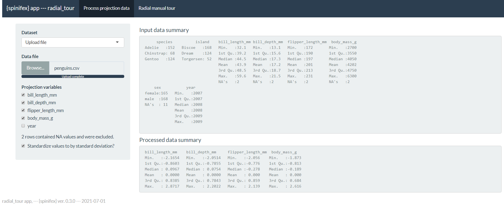

<!-- Do not add YAML header to child document. -->
<!-- # Appendix {#sec:appendix} listed in parent document -->
<!-- {-} means unnumbered section, alternatively {.unnumbered #section-id} -->
```{r chunkOpts, include=FALSE}
## Chunk options
knitr::opts_chunk$set(
  fig.align = "center",
  echo = FALSE,
  collapse = TRUE,
  message = FALSE,
  warning = FALSE,
  error = FALSE,
  cache = TRUE,
  cache.lazy = FALSE
)
```

## Survey participant demographics {-}

The target population is relatively educated people as such linear projections may be difficult for generalized consumption. Hence we restrict Prolific.co participants to those with an undergraduate degree (58,700 of the 150,400 users at the time of the study). We found our sample of 108 participants from this group. Of these participants, 84 submitted the post-study survey, who are represented in the heatmap. All participants were compensated for their time at \pounds 7.50 per hour, with a mean time of about 16 minutes.

```{r, figSurveyDemographics, echo = F, out.width = '100%', fig.cap = "Heatmaps of participant demographics, counts of age group by completed education as faceted across preferred pronoun. Our sample tended to be between 18 and 35 years of age with an undergraduate or graduate degree."}
if(F) ## Creation and saving figure at:
  file.edit("./paper/R/fig_population_demographics.r")
knitr::include_graphics("./figures/figSurveyDemographics.pdf")
```


## Random effect ranges {-}

<!-- Random effects vs Mean Mark CI by participant and sim -->
Residual plots have no noticeable non-linear trends and contain striped patterns as an artifact from regressing on discrete variables. Figure \@ref(fig:figEffectRange) illustrates (T) the effect size of the random terms participant and simulation, or more accurately, the 95\% CI from Gelman simulation of their posterior distribution. The effect size of the participant is much larger than simulation. The most extreme participants are statistically significant at $\alpha = .95$, while none of the simulation effects significantly deviate from the null of having no effect size on the marks. In comparison, (B) 95\% confidence intervals of the mean marks for participation and simulation respectively.

```{r figEffectRange, out.width="100%", fig.show='asis', fig.cap="(T) Estimated effect ranges of the random effect terms participant and data simulation of the accuracy model, $\\widehat{Y_1} = \\alpha * \\beta + \\gamma + \\delta$. Confidence intervals are created with Gelman simulation on the effect posterior distributions. The effect size of the participant is relatively large, with several significant extrema. None of the simulations deviate significantly. (B) The ordered distributions of the CI of mean marks follow the same general pattern and give the additional context of how much variation is in the data, an upper limit to the effect range. The effect ranges capture about two thirds of the range of the data without the model. All intervals for $\\alpha = .95$ confidence."}
if(F) ## Creation and saving figure at:
  file.edit("./apps_supplementary/v4_prolifico_100/_analysis.rmd")
knitr::include_graphics("./figures/figEffectRange.pdf")
```

```{r figTeffectRange, out.width="100%", fig.show='asis', fig.cap='(T) The effect ranges of Gelman resimulation on posterior distributions for the time model, $\\widehat{Y_2} = \\alpha * \\beta + \\gamma + \\delta$. These show the magnitude and distributions of particular participants and simulations. Simulation has a relatively small effect on response time. (B) Confidence intervals for mean log(time) by participant and simulation. The marginal density shows that the response times are left-skewed after log transformation. Interpreting back to linear time there is quite the spread of response times: $e^{1}=2.7$, $e^{2.75}=15.6$, $e^{3.75}=42.5$ seconds. Considering simulations, on the right, the bottom has a large variation in response time, relative to the effect ranges which means that the variation is explained in the terms of the model and not by the simulation itself.'}
if(F) ## Creation and saving figure at:
  file.edit("./apps_supplementary/v4_prolifico_100/_analysis.rmd")
knitr::include_graphics("./figures/figTeffectRange.pdf")
```


## Radial tour application details {-}

Below we describe the \pkg{shiny} app made available in the \pkg{spinifex} package which is then run locally. It streamlines the process to creating and interacting with radial tours, related to, but more interactive than the application used in the user study.

```{r radialTourAppPg1, out.width="100%", fig.show='asis', fig.cap='Process data tab, interactively loads or select data, check which variables to project, and optionally scale columns by standard deviation.'}
## Manual screen capture via: spinifex::run_app()

```

In the initial tab, users upload their own (.csv, .rds, or .rda) data or select from predefined data sets. The numeric columns appear as a list of variables to include in the projection. Below that, a line displays whether or not NA rows were removed. Scaling by standard deviation is included by default, as this is a common transformation used to explore linear projections of spaces. Alternatively, the user can perform their transformations before exporting and toggling this transformation off. Summaries of the raw data, and processed numeric data to project are displayed to better illustrate how the data was read and what will be projected.

```{r radialTourAppPg2, out.width="100%", fig.show='asis', fig.cap='Radial tour tab, interactively create radial tours, changing the variable of manipulation, and color or shape of the resulting manual tour. Here, the palmer penguins data is being explored, bill length was selected to manipulate as it is the only variable separating the green cluster from the orange. By mapping shape to island of observation, we also notice that the species in green lives on all three islands, while the other specees live only on one of the islands.'}
## Manual screen capture via: spinifex::run_app()
knitr::include_graphics("./figures/app_pg2.png")
```

The second tab contains interaction for selecting the manipulation variable and non-numeric columns can be used to change the color and shape of the data points in the projection. The radial tour is then created in real-time animating as an interactive \pkg{plotly} .html widget.

Including such an application offers users a fast, intuitive introduction of what is going on and some of the features offered. for more help getting started on applying your tours see the help documentation or follow along with our  vignettes.


