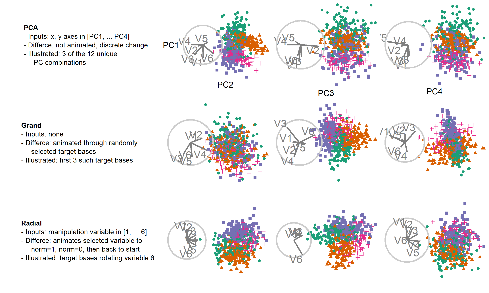
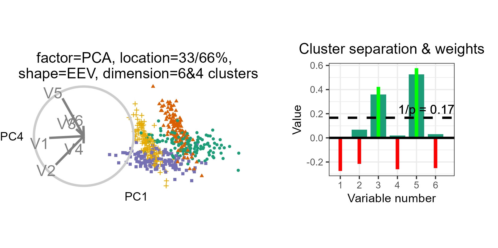
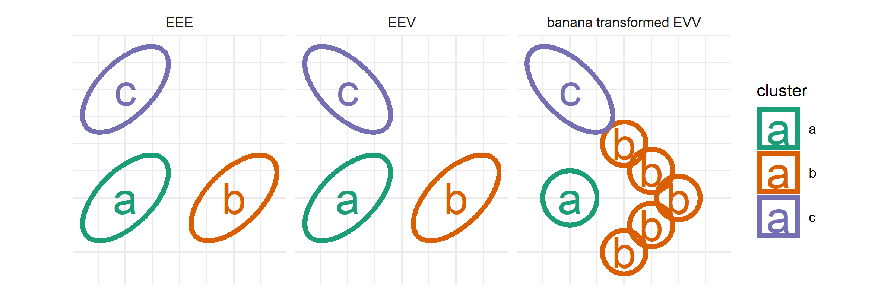
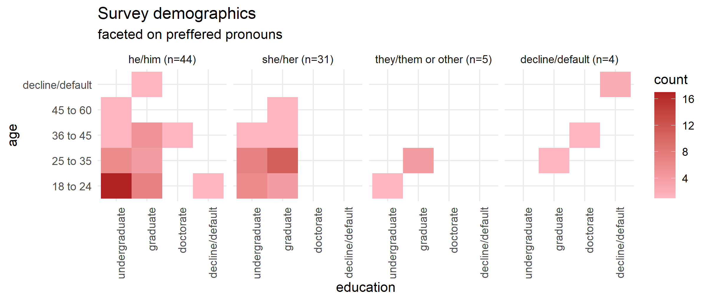
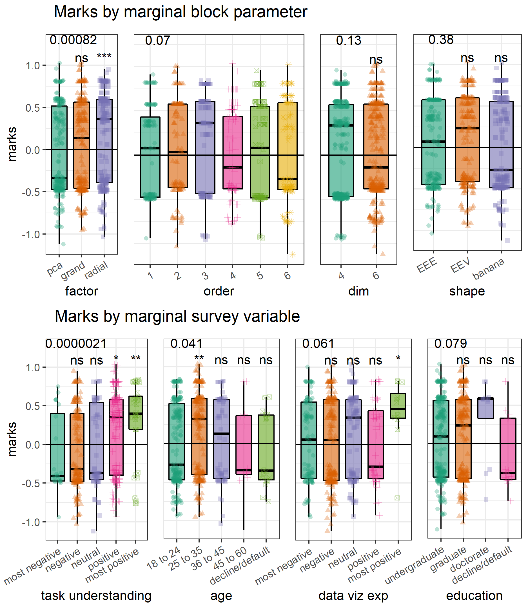
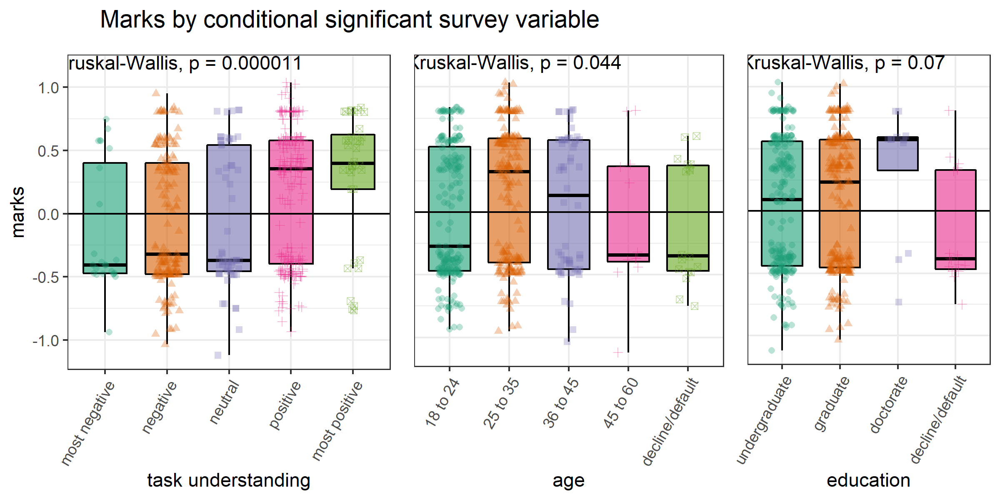
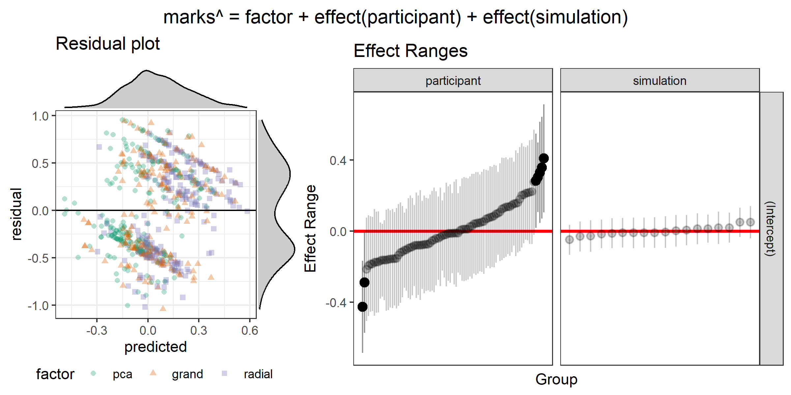

---
header-includes:
  - \usepackage{amsmath} ## LaTeX preamble
  - \usepackage{graphicx}
  - \usepackage{pdflscape}
  - \usepackage{lmodern} ## \pounds symbol
output: bookdown::pdf_document2
title: >
  The effect of user interaction for understanding variable contributions to structure in linear projections 
author:
  Nicholas Spyrison, Dianne Cook, Kimbal Marriott
abstract: >
  Viewing data in its original variable space is foundamental to the exploratory data analysis. For multivariate data this is an complex task. We perform a between-participant user study to evaluate 3 types of linear embeddings, namely, biplots of principal componts, grand tours, and radial tours. Crowdsourced participants (N = 108) were asked to identify which variable(s) explain the difference between a pair of clusters within the data as the factor of visualization is changed within participant. Principal componants and grand tour are the discrete and animated benchmarks to beat. We find radial tours score higher and respond slightly faster than alternatives. Visual factor is significantly more important than the other block parameterizations (location, shape, dimension) or learning effects from the order of evaluation. Demographics, prior experience, and parameter values vary in significance, while the size of their coeffecients all relatively small as compared with visual and the random effect of the participants.
keywords: multivariate data, exploratory data analysis, high dimensional data, data visualization, cluster analysis, dimension reduction, data science, user study, between users, linear projections, linear embeddings
bibliography: spyrison-cook-marriott.bib
editor_options: 
  chunk_output_type: console
---
\bibliography{spyrison-cook-marriott}
```{r setup_paper, include=FALSE}
# ---
# author:
  # - name: Nicholas Spyrison
  #   # affiliation: Monash University
  #   # address:
  #   # - Faculty of Information Technology
  #   # email:  nicholas.spyrison@monash.edu
  # - name: Dianne Cook
  #   # affiliation: Monash University
  #   # address:
  #   # - Department of Econometrics and Business Statistics
  #   # email:  dicook@monash.edu
  # - name: Kim Marriott
  #   # affiliation: Monash University
  #   # address:
  #   # - Faculty of Information Technology
  #   # email:  Kim.Marriott@monash.edu
# preamble: > %% LaTeX preamble, load packages
#   \usepackage{amsmath}
# link-citations: true
# fig_caption: yes
# toc: false
# 
# bibliography: spyrison-cook-marriott.bib
# output: rticles::ieee_article
# ---
# \bibliography{spyrison-cook-marriott}


#options(tinytex.verbose = TRUE) ## Keep additional intermediate content when compiling?

knitr::opts_chunk$set(
  fig.align = "center", 
  echo = FALSE,
  collapse = TRUE,
  message = FALSE,
  warning = FALSE,
  error = FALSE,
  cache = FALSE,
  cache.lazy = FALSE
)
require(spinifex)
require(ggplot2)
require(gridExtra)
require(dplyr)

# Hypothesis: 
# does the availability of the manual tour improve the ability of the analyst 
# to understand the importance of variables contributing to the structure?
# Other user studies to consider:
# DH Jeong 2009
# https://www.researchgate.net/profile/Brian_Fisher2/publication/220506453_IPCA_An_interactive_system_for_PCA-based_visual_analytics/links/59e395fa458515393d5b8f29/IPCA-An-interactive-system-for-PCA-based-visual-analytics.pdf 
# 
# a bit removed, for larger dimensions (100's):
# J Yang 2007  
# https://www.researchgate.net/profile/Matthew_Ward3/publication/6451414_Value_and_Relation_Display_Interactive_Visual_Exploration_of_Large_Data_Sets_with_Hundreds_of_Dimensions/links/00b495320b8f337d3a000000.pdf 
#
# Ben's Data Visceralization
# https://arxiv.org/pdf/2009.00059.pdf

#### inspiration; Other papers from kt, and kadek:
## It's a Wrap: 
## K. Chen et al.
## https://www.researchgate.net/profile/Kun_Ting_Chen2/publication/348620236_It's_a_Wrap_Toroidal_Wrapping_of_Network_Visualisations_Supports_Cluster_Understanding_Tasks/links/6007d5d5a6fdccdcb868b2ef/Its-a-Wrap-Toroidal-Wrapping-of-Network-Visualisations-Supports-Cluster-Understanding-Tasks.pdf
##
## Quantitative Data Visualisation on Virtual Globes,
## K. Satriadi et al. Chi2021
## https://www.researchgate.net/profile/Kadek_Satriadi/publication/348706131_Quantitative_Data_Visualisation_on_Virtual_Globes/links/600c1275a6fdccdcb873728a/Quantitative-Data-Visualisation-on-Virtual-Globes.pdf
```

<!-- Example figure -->
```{r figExamp, echo = F, out.width = '100%',fig.cap = "Example case. Person 'A' is assigned to group 2, where they will use factor 2 (grand tour) for the first period. They perform 3 block difficulties of task 1 on simulations of increasing difficulty. Then 3 block difficulties of task 2 on unique simulations sampled from the same distributions of increasing difficulty. After this, they proceed to period 2, where they are use factor 3 (manual tour) to perform 3 block difficulties of each task. Lastly, in the third period, they use factor 1 (PCA) to perform the tasks.", eval = F}
#knitr::include_graphics("./figures/experimental_design_personA.PNG")
```
<!-- Figure \@ref(fig:figExamp) is an example of referencing a the example figure. -->


# Introduction

<!-- Multivariate spaces and EDA -->
Multivariate data is ubiquitous. Yet exploratory data analysis (EDA) [@tukey_exploratory_1977] of such spaces becomes difficult, increasingly so as dimension increases. Numeric statistic summarization of data often doesn't explain the full complexity of the data or worse, can lead to missing obvious visual patterns [@anscombe_graphs_1973; @matejka_same_2017; @goodman_dirty_2008; @coleman_geometric_1986]. Data should be visually inspected in it's original variable-space before applying models or summarizations. This allows users to validate assumptions, identify outliers, and facilitates the identification of visual peculiarities.

<!-- Wickham [@wickham_visualizing_2015] introduces the terminologies of data-space. -->

<!-- Not Scatterplot matrices, PCP, want mapped to position -->
For these reasons, it is important to use visualizations of data spaces and extend the diversity of its application. However, visualizing data containing more than a handful of variables is not trivial. Scatterplot matrices or small multiples [@chambers_graphical_1983] looks at all permutation pairs of variables, but quickly becomes to vast a number of images to consider. On the other extreme, parallel coordinates plot [@ocagne_coordonnees_1885] and its radial variants, plot observations as lines varying across scaled variables as displayed in a line or circle. This scales well with dimensionality, while suffering from couple issues. The larger issue, being the loss of mapping multiple variables to graphic position, which is perhaps the most important visual cue for human perception [@munzner_visualization_2014]. The lesser being that they suffer from asymmetry, as their interpretation is dependent on variable ordering.

<!-- linear combinations of dimensions -->
Using a linear combinations of variables will allow us to keep position in 2 display axes while peering into information not contained in any one dimension. The idea of using a combination of variables may appear daunting at first, however we do it almost exclusively in the spatial dimensions. That is to say we are rarely completely aligned with rectangular objects at any one point in time. Consider a book or a filing cabinet any orientation that isn't fully a 2D rectangle, you are seeing as a linear combination of its variables, height, width, and depth. Generalizing this to arbitrary dimensionality we can project or embed a 2D profile of $p$-dimensional data. Its worth noting that the number of these embedded profiles, and consequently the time it takes to explore them, increase exponentially with the dimensionality of the data.

<!-- Exclude non-linear embeddings -->
Non-linear embeddings, the compliment of the linear embedding, have also been well received recently especially with the emergence of t-Distributed stochastic neighbor embedding [@van_der_maaten_visualizing_2008]. Such techniques distort the fully dimensionality on to a low, typically 2D plane. The issue with doing so is that unit of distance is not consistent with location in the embedded space, which severely hinders the interoperability of these embeddings. Additionally they often have hyperparameters that need tuning. Doing so results in completely different or contradicting embeddings. Suffice it to say we exclude their consideration for such broad application for multivariate EDA.

<!-- <!-- nonlinear projections precluded --> 
<!-- More recently there have been advances and fanfare in non-linear projections such as self-organizing maps [@kohonen_self-organizing_1990], and t-SNE [@maaten_visualizing_2008]. Because of the use of non-affine transformations, they offer arbitrary model spaces, without interoperability back to variable space. This precludes them as candidates for exploratory data analysis of the multivariate data in question. They can be useful for the rapid identification of possible candidates for outliers or classifications. However they can suffer from overfitting, and crucially cannot be interpreted in terms of the original variables.   -->

<!-- Exclude class supervised examples -->
Additionally there are many methods for supervised data, that is, with observation classes known a priori. Linear discriminant analysis [@fisher_use_1936], for instance, is an example of linear projection, which creates it's components based on the mean separation and covariance shape between known classes. Because we which to extrapolate to generalized EDA of multivariate space we will not use any such supervised techniques to initialize components in the study.

<!-- Motivation statement and overview of this study -->
In multivariate spaces, performance measures, and computational complexity are regularly compare to analogous algorithms and models. Human perception and inference from visuals is notably missing. We perform a within-participant, crowd sourced user study exploring the efficacy of 3 methods of linear embedding visualizations.

<!-- structure of the paper -->
Section \@ref(sec:background) discusses the visualization methods. Section \@ref(sec:userstudy) goes into the user study. The subsection \@ref(sec:task) digs into the task and its evaluation. The results of the study are in section \@ref(sec:results). Discussion is covered in section \@ref(sec:discussion). An accompanying tool is discussed in section \@ref(sec:spinifex).


# Background, visual methods {#sec:background}

## Linear projection notation

Consider a numeric data matrix with $n$ observations of $p$ variables,


\begin{gather*}
  \textbf{X}_{[n, p]} = (\textbf{x}_{1},~...~\textbf{x}_{p}) \\
  \textbf{x}_{i} = (x_{1i},~...~ x_{ni})~|~i \in [1, p] 
\end{gather*}

Let $Y_{[n, d]}$ be the $d$-dimensional projection or embedding of $\textbf{X}_{[n, p]}$ via matrix multiplication of a particular orthonormal basis matrix $\textbf{B}_{[p, d]}$.


\begin{gather*}
  \textbf{Y}_{[n, d]} = \textbf{X}_{[n, p]} \textbf{B}_{[p, d]}~|~\textbf{B}\text{ is orthonormal} \\
  \textbf{y}_{j} = (y_{1j},~...~ y_{nj})~|~j \in [i, d] 
\end{gather*}


A matrix is said to be orthonormal if and only if they are 1) orthogonal, that is all column pairs are independent, having a cross product of 0, and 2) normal, each columns has a norm - Eucledian distance - of 1.

<!-- note on interchangeably, probably better to make consistent afterward -->
<!-- A quick note on terminology we use the terms projection & embedding and variable & dimension interchangeably. -->

## Principal Component Analysis

Considering that we want to explore multivariate data space, while maintaining position mapping of points. Linear combinations of variables becomes an ideal candidate. Principal component analysis (PCA) [@pearson_liii._1901] creates new components that are linear combinations of the original variables. The creation of these variables is ordered by decreasing variation which is orthogonally constrained to all previous components. while the full dimensionality is in tact the benefit comes from the ordered nature of the components. For instance if nearly all of the variation in a data-space can be explained in the first half of its components than the complexity of viewing such a space is exponentially simplified.

## Grand Tours

<!-- tours intro -->
Later, Asimov [@asimov_grand_1985], coined data visualization _tour_, an animation of many linear projections across local changes in the basis. One of key features of the tour is the object permanence of the data points. That is to say by watching near by, orthogonally-interpolated frames one can track the relative changes of observations as variable contributions change.

<!-- Grand tour -->
Asimov originally purposed the _grand_ tour. To start, several target bases are randomly selected. These target bases are then orthogonally-interpolated between with a fixed target distance between interpolation frames. The data matrix is premultiplied to the array of interpolated bases and rendered into an animation. There is no user interaction in a grand tour and the target.

## Manual Tours

<!-- Manual tour -->
The _manual_ tour [@cook_manual_1997; @spyrison_spinifex_2020] defines its basis path by manipulating the basis contribution of a single selected variable. A manipulation dimension is appended onto the projection plane, with a full contribution given to the selected variable. The target bases are then selected based on rotating this newly created manipulation space. The target bases are then similarly orthogonally-interpolated, data projected, and rendered into an animation. In order for variables to remain independent of each other the contributions of the other variables must also change, _ie._ dimension space should maintain its structure. A key feature of the manual tour is that it affords users a way to control the variable contributions of the next target basis. This means that such manipulations can be selected and queued in advance or select on the spot for human-in-the-loop analysis[@karwowski_international_2006]. Due to the huge volume of $p$-space (an aspect of the curse of dimensionality [@bellman_dynamic_1957]) and the abstraction constrained interpolation of the basis navigating large changes in the basis can become cumbersome. It is advisable to first identify a basis of particular interest and then use a manual tour as a finer, local exploration tool to observe how the contributions of the selected variable does or does not contribute to the feature of interest.

<!-- radial tour variant -->
In order to simplify the task and keep its duration realistic we consider a variant of the manual tour, called a _radial_ tour. In a radial tour the selected variable is allowed to change its magnitude of contribution, but not it's angle; it must move along the direction of its original radius.

\begin{landscape}
```{r figFactor, echo = F, out.width = '100%',fig.cap = "Example of the different visual factors. All use the same sort of biplot display to view linear projections of multivariate data. They differ in which bases are viewed which is influenced by the different factor inputs and whether or not are animated to convey the coninuity of data points from 1 frame to the next."}
if(F)
  file.edit("./paper/R/fig_factor.r")

```
\end{landscape}

# User study {#sec:userstudy}


## Hypothesis {#sec:hypothesis}

<!-- hypothesis statement -->
_Does the animated removal of single variables via the radial tour improve the ability of the analyst to understand the importance of variables contribution to the separation of clusters?_

<!-- rational for standards of comparison -->
PCA will be used as a baseline for compared as it is the most common linear embedding. The grand tour will act as a secondary control that will help evaluate the benefit of animation, where the object permanence of the data points, but without the ability influence it's path. Lastly the radial tour should perform best as it benefits both from animation and being able to select an individual variable to change the contribution of. 


## Task and evaluation {#sec:task}

<!-- geom, clusters, explicit task -->
The display was a 2D scatterplot with observations supervised. Cluster membership was mapped to shape and color. There were either 3 or 4 clusters each with the number of observations within each cluster. Participants were asked to 'check any/all variables that contribute more than average to the cluster separation green circles and orange triangles', which was further explained in the explanatory video as 'mark and and all variable that carry more than their fair share of the weight, or 1 quarter in the case of 4 variables'.

<!-- Instruction and video -->
The instructions iterated several times in the video was: 1) Use the input controls to find a frame that contains separation between the clusters of green circles and orange triangles, 2) look at the orientation of the variable contributions in the gray circle, a visual depiction of basis, and 3) select all variables that contribute more than average in the direction of the separation in the scatterplot. Regardless of factor and block values participants were limited to 60 seconds for each evaluation of this task.

<!-- evaluating measure -->
The evaluation measure of this task was designed to have a few of features: 1) the sum of squares of the individual variable marks should be 1, and 2) symmetric about 0. With these in mind we define the following measure for evaluating the task:

Let a dataset $\textbf{X}$ be a simulation containing clusters of observations of different distributions. Let $\textbf{X}_k$ be the subset of observations in cluster $k$ containing the $p$ variables.

\begin{align*}
  &\textbf{X}_{[n,~p]} = (x_1,~...~x_p) \\
  &\textbf{X}_{[n_k,~p]k} = (x_1,~...~x_p)
    ~|~ n_k \in [1, n], \text{ is an observation subset of } \textbf{X}
\end{align*}

where

\begin{align*}
  x_{i, j, k} \text{ is scalar; the observation } i \in (1,~...~n),
    \text{ of variable } j \in (1,~...~p), \text{ of cluster } k \in (1,~...~K)
\end{align*}


We define weights, $W$ to be a vector explaining the variable-wise difference between 2 clusters. Namely the difference of each variable between clusters, as a proportion of the total difference, less $1/p$ the amount of different each variable would hold if it were uniformly distributed.

\begin{align*}
  W &=\frac
  {(\overline{X_{j=1, k=1}} - \overline{X_{j=1, k=2}}, ~...~
    (\overline{X_{j=p, k=1}} - \overline{X_{j=p, k=2}})}
  {\sum_{j=1}^{p}(|\overline{X_{j,k=1}} - \overline{X_{j,k=2}}|)}
  - \frac{1}{p} \\
  &= (w_1,~...~ w_p)
\end{align*}


<!-- bring in participant responses  -->
Participant responses, $R$ are a vector of logical values, whether or not participant thinks the variable separates the two clusters more than if the difference uniformly distributed. Then $M$ is a vector of variable marks.

\begin{align*}
  M &= I(r_j) * sign(w_j) * \sqrt{|w_j|} \\
  &= (m_1, ~...~ m_p)
\end{align*}


where $I$ is the indicator function. Then the total marks for this task is the sum of this marks vector.

```{r, figBiplotScoring, echo = F, out.width = '100%', fig.cap = "(L), PCA biplot of the components showing the most cluster separation with (R) Illustration of how much of the cluster separation is for each variable (wide bar) and the weight of the marks given if a variable is selected (red/green line). The horizontal dashed line is 1 / dimensionality, the ammount of separation each variable would have if evenly detributed. The weights equal the signed square of the differce between each variable value and the dashed line."}

```

<!--Period order: Training, eval, eval -->
Each of the 3 periods introduced a new factor, where participants were first able to explore an untimed task with data under the simplest parameterization. The training allows the participant to become familiar with the inputs and visual specific to the factor. Upon clicking a button to proceed text containing the correct answer displays with visual still intact to explore further. After the training, participant performed 2 evaluation trials. After 60 second the display was removed, though in application, few participants elapsed this time. These evaluation trials where performed under different parameterizations as explained in section \@ref(sec:blocks).

## Factor application {#sec:factors}

<!-- Background for methodology, application here -->
Section \@ref(sec:background) gives the sources and a description of the visual factors PCA, grand tours, and radial manual tours. Below we cover the aesthetic standardization, as well the unique input and display within each factor.

<!-- aesthetic standardization -->
The visualization methods were standardized wherever possible. each factor was shown as a biplot, with variable contributions displayed on a unit circle. All aesthetic values (colors, shapes, sizes, absence of legend, and absence axis titles) were held consistent. Variable contributions where always shown left of the scatterplot embeddings with their aesthetic values consistent as well. What did vary between factors were their inputs which caused a discrete jump to another pair or principal components, were absent for the grand tour with target bases to animate through selected at random, or for radial tour which variable should have its contribution animated. Key frames have of each factor have been illustrated above in Figure \@ref(fig:figFactor) 

<!-- PCA -->
PCA inputs allowed for users to select between the top 4 principal components for both the x and y axis regardless of the data dimensionality (either 4 or 6). <!-- Grand tours -->There were no user input for grand tour, users were instead shown a 15 second animation of the same randomly selected path. Users were able to view the same clip up to 4 times within the time limit. <!-- Radial tours -->Radial tours were also displayed at 5 frames per second with in interpolation step size of 0.1 radians. Users where able to swap between the 4 or 6 variables, upon which the display would change the the start of radially increasing the contribution of the selected variable till it was full, zeroed and then back to the initial. The complete animation of any 1 variable takes about 20 seconds, and is almost fully in the projection frame at around 6 second. The starting basis of each is initialized to a half-clock design, where the 4 or 6 variables were evenly distributed in half of the circle which is then orthonormalized. This is done to give no variable preference while minimizing variable interactions, as variables opposite of the manipulation variable must lose contribution as the other is rotated to full contribution (and vice versa).


## Blocks and parameterization {#sec:blocks}

<!-- volume of parameter space -->
The volume the parameter-space increase more than exponentially with the dimensionality of the data. Care must be taken to select realistic parameter values. We vary the values for 3 aspects of the simulated data including 1) The dimensionality of the data. 2) the shapes of the clusters, by changing the variance-covariance of the clusters. 3) The location of the difference between clusters, by mixing a signal and a noise variable at different ratio.

<!-- Dimensionality -->
We test 2 levels of dimensionality, 4 dimensions containing 3 clusters and 6 dimensions with 4 clusters. Each cluster samples 140 observations. Each dimension is originally distributed as $\mathcal{N}(2 * I(signal), 1)~|~\text{covariance}~\Sigma$ (before signal mixing and standardizing by standard deviation). Signal variables have correlation 0.9 when they have equal orientation and -0.9 when their orientations vary. Noise variables were restricted to 0 correlation. The training always uses 4 dimensions, while the 2 evaluations always contain 4 and 6 dimensions in order of increasing difficulty.

<!-- Shape, vc matrix -->
For choosing the shape of the clusters we follow the convention given in by the mclust [@scrucca_mclust_2016] who name and categorize 14 variants of distributions of data containing for 3-clustered. The name of the shaped is mapped to the initial for a model's volume, shape, and orientation. We use the EEE, EEV, and EVV, which is further modified by moving 4 fifths of the data out in an "V" or banana-like shape. Figure \@ref(fig:figModelFamilies) shows the principal component bi-plot of the 3 three model variants applied here. The training always uses 4 dimensions, while the 2 evaluations always contain 4 and 6 dimensions in order of increasing difficulty. The training data sets use the EEE model. The evaluation periods use EEE, EEV, and EVV-banana respectively in increasing order of difficulty.

```{r figModelFamilies, echo = F, out.width = '100%', fig.cap = "Ellipses of isodensity, for each of the variance-covariance model families viewed as. Family labels are are the abbreviation for the clusters volume, shape, and orientation respectively, which are either equal or variable. We futher change the EVV model by shifting fifths of the data in bannana or chevron arrow shape."}

```

<!-- Location mixing -->
The separation of any two target clusters is currently contained fully within 1 variable at this point. We mix this variable with a noise variable such that the difference in the clusters is mixed at the following respective percentages 100/0% (not mixed), 66/33%, 50/50% (evenly mixed). The training always uses 4 dimensions, while the 2 evaluations always contain 4 and 6 dimensions in order of increasing difficulty. The training data does not mix separation. Location mixing within an evaluation period is held constant and rotated through the 6 permutations of their order. Randomizing the order of the location mixing is controlled by iterating once after each of the 6 factor order permutations are evaluated. This is illustrated in Figure \@ref(fig:figParmeterizationExample).

```{r , echo = F, out.width = '100%', fig.cap = "Illustration of how a hypothetical participant 63 is assigned factor and block parameterizations. Each of the 6 factor order permuations are exausted before going to the next location order permutation."}
knitr::include_graphics("./figures/figParmeterizationExample.png")
```

<!-- Eval evaluation -->
With this setup we test the parameter space $p \in (4,~ 6),~shape \in(EEE,~ EEV,~ EVV-banana),~location ~\in~ (100/0\%,~ 66/33\%,~ 50/50\%)$ in order to evaluate the graphic display across the $factors~\in~(PCA,~grand,~radial)$. As we iterate though the possible permutations of these factors (6) and location (6) we perform an even evaluation of the full parameter space every 36 participants. While piloting these parameters we estimate that 3 even evaluations will be more than sufficient identify difference between the factors; we targeted for $N = 108$ participants for the study.

_TODO: XXX CONTINUE WRITING HERE_

## Post study survey {#sec:survey}

<!-- placement and Likert scale -->
After the evaluation section of the study, participants were given a short survey containing questions gauging demographics, experience, and subjective evaluation of each factor on a 5-point Likert scale. The questions and possible responses are as follows:

__Demographic:__
- What are your preferred pronouns? [decline to answer, he/him, she/her, they/them or other]
- Which age group do you belong to? [decline to answer, 18 to 24, 25 to 35, 36 to 45, 45 to 60, 60 and up]
- What is your highest completed education? [decline to answer, Undergraduate degree (BA/BSc/other), Graduate degree (MA/MSc/MPhil/other), Doctorate degree (PhD/other); prolific.co participants were filtered to those stating they had an least an undergraduate degree]

__Within participant bias:__ \\
Likert scale [1-5], least agreement to most agreement.

- I understand the how to perform the task.
- I am experienced with data visualization.
- I am educated in multivariate statistical analysis.

__Subjective by factor:__

- I was already familiar with visualization.
- I found this visualization easy to use.
- I felt confident in my answers with this visualization.
- I liked using this visualization.
<!-- see Tory 2006 for example of ease/confidence/likeability -->

The code, response files, their analyses, and study application are made publicly available at on GitHub at [github.com/nspyrison/spinifex_study](https://github.com/nspyrison/spinifex_study).

## Sampling population {#sec:population}

We recruited $N = 108$ via prolifico [@palan_prolific_2018]. We make the assumption that interpretation of biplot displays used will not be commonly used for wide audience and apply a single filter; that participants have completed at least an undergraduate degree (some 58,700 of the 150,400 users at the time). Participants were compensated for their time at \pounds 7.50 per hour, whereas the mean duration of survey was about 16 minutes. We can't preclude previous knowledge or experience with the factors, but instead try to control for this in the user study. Figure \@ref(fig:figSurveyDemographics) shows distributions of age and preferred pronouns of the participants that completed the post-study survey who are relatively young and well educated.

```{r, figSurveyDemographics, echo = F, out.width = '100%', fig.cap = "FIGURE CAPTION NEEDED. TODO XXX"}
if(F) ## Creation and saving figure at:
  file.edit("./paper/R/fig_population_demographics.r")

```

## Evenness of block evaluation

From pilot studies through a sample of convenience (primarily PhD students) we predict that we wanted 3 even block evaluations to support differences in our factor and block parameterizations. Given that factor and location each have 6 permutations we targeted $N = 108 = 3 * (6 * 6)$ evaluations before data was collected. In data collection we experience a number of adverse conditions, primarily: limited control of application server network configuration, throughput thresholds on data read/write API, and repeat attempts from users when experiencing disconnects. To mitigate this we over collect survey trials, exclude all partial trials, and remove the oldest attempts (mostly likely to experience adverse network conditions) from over evaluated permutations until we have our desired 3 even evaluations under each permutation.


# Results {#sec:results}

To recap, the primary response variable are marks as defined in section \@ref(sec:task), while time till last response will be used as a secondary response variable. We have 2 primary data sets; the user study evaluations and post study survey. The former is contains the 108 trials with explanatory variables: _factor_, _location_ of the cluster separation signal, _shape_ of variance-covariance matrix, _dim_-ensionality of the data, and _order_ of evaluation within the participant. Block parameterization and randomization was discussed in section \@ref(#sec:blocks). The survey was completed for 84 of these 108 trials and contains demographic information (*pronoun*, _age_, and _education_), explanatory variables (*task understanding*, *visualization experience*, and *analysis experience*), and subjective measures for each of the factors (*preference*, *familiarity*, *ease of use*, and *confidence*). The survey was covered in more detail in \@ref(sec:survey).

Below we look at the marginal performance of the block parameters and survey responses. After that we build a battery of regression models to explore the variables and their interactions. Lastly we look at the subjective measures between the factors.


## Marginal block parameters

Consider the 108 trials and their associate block parameterizations, We apply the Kruskal-Wallis H test (or one-way anova), a non-parametric method for testing if the x-levels are from the same distribution.

TODO: XXX write up here.

_Will have to figure out a more elegant solution for this. consider: size of text, global test, two-way test. n=x within bars. May need to go manually run test and/or place values._

Figure \@ref(fig:figMarksByMarg) compares the effect of the study block parameters. Location is the inverse of what is expected, though perhaps mixing the signal diversifies the marks in that its easier to choose at least one of the correct answers of two dimensions with signal rather than the higher risk of selecting the only correct answer for all marks. EEV slightly outperforms EEE, perhaps the different shape helps distinguish the cluster or stick out from one another. Evaluation order does not have a monotonic increase. Every odd evaluation beats the next evaluation which have 4 and 6 dimensions respectively.

```{r figMarksByMarg, out.width="100%", fig.show='asis', fig.cap='TODO: Marginal effect of the block parameterizations. Factor supports the hypothesis that radial tours outperform the discrete benchmark, pca, and animated benchmark, grand tour, for this task. '}
if(F) ## Creation and saving figure at:
  file.edit("./apps_supplementary/v4_prolifico_100/_analysis.rmd")

```

## Marginal survey responses

We also test the demographic and experience question from the survey to see if they they effect marks. Figure \@ref(figMarksByMargSurvey) show the variables with strongest evidence to explain marks. Keep in mind that some of the x groups have low counts any likely may not reflect the true distribution of their demographic. Perhaps unsurprisingly, participants that rated their task comprehension higher, averaged higher marks. Age group was narrowly significant, with the lowest, highest, and default groups scoring low. The explanatory power of age is more likely more of a proxy for attention and thoroughness rather than a true effect of age. Education correlates with marks, though is narrowly not significant at $\alpha = .95$, it is also be slight correlated with age and understanding which explain marks better then education alone. Decline/default groups received lower marks unanimously across survey questions; care should be taken to ensure or evaluate the level of effort of participants.

```{r figMarksByMargSurvey, out.width="100%", fig.show='asis', fig.cap='TODO: Marginal effect of the survey variables. TODO: XXX COMPLETE CAPTION'}
if(F) ## Creation and saving figure at:
  file.edit("./apps_supplementary/v4_prolifico_100/_analysis.rmd")

```

## Random effects regression model

<!-- <!-- Explain fixed and random terms used --> -->
<!-- In order to explore how the parameterizations of study we fix regression models, regressing against the marks as defined in section \@ref(sec:task). The factors of our model with involve a number of (visual *factor*, *dim*ensionality of the data, variance-covariance *shape*, and noise/signal mixing *location*). We compare these against any potential learning effect by comparing against evaluation *order*. Lastly, all models include the a random effects term to account for the individual participants effect on the score, explaining the within-participant effect on the score. -->

To more thoroughly examine explanatory variables we regress against marks. All models have a random effect term on the participant, which captures the effect of the individual participant. After we look at models of the block parameters we extend to compare against survey variables. Last, we compare how adding a random effect for data and regressing against time till last response fares against benchmark models. The matrices for models with more than a few terms quickly become rank deficient; there is not enough information in the data to explain all of the effect terms. In which case the least impactful terms are dropped. 

<!-- Measures of model comparison -->
Evaluation of the models will include Akaike's Information Criterion (AIC), Bayesian information criterion (BIC). These are comparisons measures of models based on its maximized log-likelihood function and penalize over fitting models linearly with the number of fixed terms. Root mean square error (RMSE) is the standard deviation of the residuals is also included. For the above 3 measures, the lower the value the more accurate the model. We additionally include Nakagawa's R\^2 for mixed models[@nakagawa_coefficient_2017], which has conditional and marginal measures with respect to the random effect terms, and doesn't penalize overfitting.
<!-- Add ICC?? see ?performance::icc -->

<!-- Building a battery of models -->
In building a set of models to test we include all single term models, a model with all independent terms. We also include an interaction term of factor by location, allowing for the slope of each location to change across each level of the factor, which is feasible. For comparison an overly complex model with many interaction terms is included.

<!-- 1) Eval parameters -->
\begin{align*}
\textbf{Abbreviation:}&&    \textbf{Model:~~} & \\
\text{F: }&&    \widehat{marks} =& \beta_{0} + \Sigma_{f = 1}^3(\alpha_{f} \* \beta_{f}) +
  \text{effect}_{participant} + \epsilon \\
\text{L: }&&    \widehat{marks} =& \beta_{0} + \Sigma_{l = 1}^3(\alpha_{l} \* \beta_{l}) + \text{effect}_{participant} + \epsilon \\
\text{L: }&&     \widehat{marks} =& \beta_{0} + \Sigma_{l = 1}^3(\alpha_{l} \* \beta_{l}) + \text{effect}_{participant} + \epsilon \\
\text{S: }&&     \widehat{marks} =& \beta_{0} + \Sigma_{s = 1}^3(\alpha_{s} \* \beta_{s}) + \text{effect}_{participant} + \epsilon \\
\text{D: }&&     \widehat{marks} =& \beta_{0} + \Sigma_{d = 1}^2(\alpha_{d} \* \beta_{d}) \text{effect}_{participant} + \epsilon \\
\text{O: }&&     \widehat{marks} =& \beta_{0} + \Sigma_{o = 1}^6(\alpha_{o} \* \beta_{o}) + \text{effect}_{participant} + \epsilon \\
\text{F+L+S+D+O: }&&     \widehat{marks} =& \beta_{0} + \Sigma_{f = 1}^3(\alpha_{f} \* \beta_{f}) + \Sigma_{l = 1}^3(\alpha_{l} \* \beta_{l}) + \\
&& & \Sigma_{s = 1}^3(\alpha_{s} \* \beta_{s}) + \Sigma_{d = 1}^2(\alpha_{d} \* \beta_{d}) + \\
&& & \Sigma_{o = 1}^6(\alpha_{o} \* \beta_{o}) + \text{effect}_{participant} + \epsilon \\
\text{F\*L: }&&     \widehat{marks} =& \beta_{0} + \Sigma_{f = 1}^3(\Sigma_{l = 1}^3(\alpha_{f\*l} \* \beta_{f\*l})) + \\
&&  & \text{effect}_{participant} + \epsilon \\
\text{F\*L+S+D+O: }&&     \widehat{marks} =& \beta_{0} + \Sigma_{f = 1}^3(\Sigma_{l = 1}^3(\alpha_{f\*l} \* \beta_{f\*l})) + \\
&& & \Sigma_{s = 1}^3(\alpha_{s} \* \beta_{s}) + \Sigma_{d = 1}^2(\alpha_{d} \* \beta_{d}) + \\
&& & \Sigma_{o = 1}^6(\alpha_{o} \* \beta_{o}) + \text{effect}_{participant} + \epsilon \\
\text{F\*(L+S+D)+O: }&&     \widehat{marks} =& \beta_{0} + \Sigma_{f = 1}^3(\Sigma_{l = 1}^3(\alpha_{f\*l} \* \beta_{f\*l})) + \\
&& & \Sigma_{f = 1}^3(\Sigma_{s = 1}^3(\alpha_{f\*s} \* \beta_{f\*s}) + \\
&& & \Sigma_{d = 1}^2(\Sigma_{s = 1}^2(\alpha_{f\*d} \* \beta_{f\*d}) + \\
&& & \Sigma_{o = 1}^6(\alpha_{o} \* \beta_{o}) + \text{effect}_{participant} + \epsilon
\end{align*}

where

\begin{align*}
&\beta_0 \text{ is the sum of the intercept and the mean of the participant random effect} \\
&\epsilon \sim \mathcal{N}(0,~\sigma) \\
&\text{effect}_{participant} \sim \mathcal{N}(0,~\tau_{participant}) \\
&\text{factor}~f \in (\text{pca, grand, radial}) \\
&\text{location}~l \in (0/100,~33/66,~50/50) \text{ percent mixing of a noise and signal variable respectively} \\
&\text{shape}~s \in (\text{EEE, EEV, EVV banana}) \\
&\text{dim}~d \in (4,~6) \text{ variables, dimensions of the data with 3 \& 4 clusters respectively} \\
&\text{order}~o \in (1,~... ~6) \text{, order of evaluation within participant, as a factor rather than numeric variable}
\end{align*}


<!-- Look at survey variables survey -->
We want to see how survey variables fare in comparison. Holding the factor model as a comparison benchmark we fit another battery of similarly increasing complexity. Keep in mind that the scope has changed a bit from the 108 evaluations to only the 84 studies that have available survey data.


<!-- 2) Survey parameters -->
\begin{align*}
\textbf{Abbreviation:}&&    \textbf{Model:~~} & \\
\text{F:}&&   \widehat{marks} =& \beta_{0} + \Sigma_{f = 1}^3(\alpha_{f} \* \beta_{f}) + \text{effect}_{participant} + \epsilon \\
\text{F + else $|$ study:}&&   \widehat{marks} =& \beta_{0} + \Sigma_{f = 1}^3(\alpha_{f} \* \beta_{f}) + \Sigma_{l = 1}^3(\alpha_{l} \* \beta_{l}) + \Sigma_{s = 1}^3(\alpha_{s} \* \beta_{s}) + \Sigma_{d = 1}^2(\alpha_{d} \* \beta_{d}) + \\
&& & \Sigma_{o = 1}^6(\alpha_{o} \*  \beta_{o}) + \text{effect}_{participant} + \epsilon \\
\text{F + else $|$ survey:}&&   \widehat{marks} =& \beta_{0} + \Sigma_{f = 1}^3(\alpha_{f} \* \beta_{f}) + \Sigma_{p = 1}^4(\alpha_{p} \* \beta_{p}) + \Sigma_{1 = 1}^5(\alpha_{a} \* \beta_{a}) + \Sigma_{e = 1}^4(\alpha_{e} \* \beta_{e}) + \\
&& & \Sigma_{v = 1}^5(\alpha_{v} \* \beta_{v}) + \Sigma_{ae = 1}^5(\alpha_{ae} \* \beta_{ae}) + \text{effect}_{participant} + \epsilon \\
\text{F \* else $|$ study:}&&   \widehat{marks} =& \beta_{0} + \Sigma_{f = 1}^3(\alpha_{f} \* \beta_{f}) \* (\Sigma_{l = 1}^3(\alpha_{l} \* \beta_{l}) + \Sigma_{s = 1}^3(\alpha_{s} \* \beta_{s} + \Sigma_{d = 1}^2(\alpha_{d} \* \beta_{d}) + \\
&& & \Sigma_{o = 1}^6(\alpha_{o} \* \beta_{o})) + \text{effect}_{participant} + \epsilon \\
\text{F \* else $|$ survey:}&&   \widehat{marks} =& \beta_{0} + \Sigma_{f = 1}^3(\alpha_{f} \* \beta_{f}) \* (\Sigma_{p = 1}^4(\alpha_{p} \* \beta_{p}) + \Sigma_{1 = 1}^5(\alpha_{a} \* \beta_{a}) + \Sigma_{e = 1}^4(\alpha_{e} \* \beta_{e}) + \\
&& & \Sigma_{v = 1}^5(\alpha_{v} \* \beta_{v}) + \Sigma_{ae = 1}^5(\alpha_{ae} \* \beta_{ae})) + \text{effect}_{participant} + \epsilon \\
\text{F + else $|$ study\&survey:}&&   \widehat{marks} =& \beta_{0} + \Sigma_{f = 1}^3(\alpha_{f} \* \beta_{f}) + \Sigma_{l = 1}^3(\alpha_{l} \* \beta_{l}) + \Sigma_{s = 1}^3(\alpha_{s} \* \beta_{s} + \Sigma_{d = 1}^2(\alpha_{d} \* \beta_{d}) + \\
&& & \Sigma_{o = 1}^6(\alpha_{o} \* \beta_{o}) + (\Sigma_{p = 1}^4(\alpha_{p} \* \beta_{p}) + \Sigma_{1 = 1}^5(\alpha_{a} \* \beta_{a}) + \Sigma_{e = 1}^4(\alpha_{e} \* \beta_{e}) + \\
&& & \Sigma_{v = 1}^5(\alpha_{v} \* \beta_{v}) + \Sigma_{ae = 1}^5(\alpha_{ae} \* \beta_{ae}) + \text{effect}_{participant} + \epsilon \\
\text{F \* else $|$ study\&survey:}&&   \widehat{marks} =& \beta_{0} + \Sigma_{f = 1}^3(\alpha_{f} \* \beta_{f}) \* (\Sigma_{l = 1}^3(\alpha_{l} \* \beta_{l}) + \Sigma_{s = 1}^3(\alpha_{s} \* \beta_{s} + \Sigma_{d = 1}^2(\alpha_{d} \* \beta_{d}) + \\
&& & \Sigma_{o = 1}^6(\alpha_{o} \* \beta_{o}) + (\Sigma_{p = 1}^4(\alpha_{p} \* \beta_{p}) + \Sigma_{1 = 1}^5(\alpha_{a} \* \beta_{a}) + \Sigma_{e = 1}^4(\alpha_{e} \* \beta_{e}) + \\
&& & \Sigma_{v = 1}^5(\alpha_{v} \* \beta_{v}) + \Sigma_{ae = 1}^5(\alpha_{ae} \* \beta_{ae})) + \text{effect}_{participant} + \epsilon \\
\end{align*}

where

\begin{align*}
&\text{pronoun}~p \in (\text{he/him, she/her, they/them or other, default/decline}) \\
&text{age}~a \in (\text{18 to 24, 25 to 35, 36 to 45, 45 to 60, default/decline}) \\
&text{education}~e \in (\text{Undergraduate degree (BA/BSc/other), Graduate degree (MA/MSc/MPhil/other), Doctorate degree (PhD/other), default/decline}) \\
&text{task Understanding}~u \in (\text{Likert scale [1-5]: I understand the how to perform the task.}) \\
&text{data Visualization experience}~v \in (\text{Likert scale [1-5]: I am experienced with data visualization.}) \\
&\text{Analysis Experience}~ae \in (\text{Likert scale [1-5]: I am educated in multivariate statistical analysis.}) 
\end{align*}


<!-- Extend models, eval and survey -->
Among the above models, the simple factor model performs best in terms of AIC and BIC, and is thus included as a benchmark model of comparison going forward. In see the a particular simulation effect on the score an additional random effect term based on the simulation data is used. We also want to see how well the time till response can be explained by the single factor model; consider:

<!--  3) extending to RE(data), and regressing against time for eval and survey.  -->
\begin{align*}
\textbf{Abbreviation:}&&    \textbf{Model:~~} & \\
\text{marks=F+RE(participant):}&&   \widehat{marks} =& \beta_{0} + \Sigma_{f = 1}^3(\alpha_{} \* \beta_{f}) + \text{effect}_{participant} + \epsilon \\
\text{marks=F+RE(participant+simulation):}&&   \widehat{marks} =& \beta_{0} + \Sigma_{f = 1}^3(\alpha_{f} \* \beta_{f}) + \text{effect}_{participant} + \text{effect}_{simulation} + \epsilon \\
\text{time=F+RE(participant):}&&   \widehat{marks} =& \beta_{0} + \Sigma_{f = 1}^3(\alpha_{f} \* \beta_{f}) + \text{effect}_{participant} + \epsilon \\
\text{time=F+RE(participant+simulation):}&&   \widehat{marks} =& \beta_{0} + \Sigma_{f = 1}^3(\alpha_{f} \* \beta_{f}) + \text{effect}_{participant} + \text{effect}_{simulation} + \epsilon \\
\end{align*}

where

\begin{align*}
&\text{effect}_{simulation} \sim \mathcal{N}(0,~\pi_{simulation}) \\
&time \text{ is the duration of time on the page till the last response change} \\
\end{align*}


<!-- Tables don't render in landscape mode. -->
<!-- \begin{landscape} -->
```{r modelTable, fig.cap = "Use the caption arg in kable(), not this."}
model_comp_tbl_ls <- readRDS("./figures/model_comp_tbl_ls.rds")
## 1) Eval parameters
knitr::kable(model_comp_tbl_ls[[1]], align = c("l", rep("r", 7)),
             booktabs = TRUE, linesep = "", caption = "Model comparison of our random effects models regressing marks. Each model includs a random effect term of the participant, which explains the individuals influence on their marks. Complex models perform better in terms of R2 and RMSE, yet AIC and BIC penialize their large number of fixed effect in favor of the much simpler model containing only factor.") %>%
  kableExtra::column_spec(column = 1, width = "3.2cm") %>%
  kableExtra::column_spec(column = c(2:3, 6:7), width = "1.7cm") %>%
  kableExtra::column_spec(column = c(4:5, 8), width = "1.1cm")

## 2) Survey parameters
knitr::kable(model_comp_tbl_ls[[2]], align = c("l", rep("r", 7)),
             booktabs = TRUE, linesep = "", caption = "TODO: XXX CAP NEEDED") %>%
  kableExtra::column_spec(column = 1, width = "3.2cm") %>%
  kableExtra::column_spec(column = c(2:3, 6:7), width = "1.7cm") %>%
  kableExtra::column_spec(column = c(4:5, 8), width = "1.1cm")

## 3) extending to RE(data), and regressing against time for eval and survey.
knitr::kable(model_comp_tbl_ls[[3]], align = c("l", rep("r", 7)),
             booktabs = TRUE, linesep = "", caption = "We select the simple facet model as our benchmark and compare the random effects from participants with the random effects of simulated data. The random effect of the data is small compared to the random effect of the data. The random effect of the participant is good at prediciting the time users take, its conditional R2 is much larger than the marginal R2 of the factor fixed term.") %>%
  kableExtra::column_spec(column = 1, width = "3.2cm") %>%
  kableExtra::column_spec(column = c(2:3, 6:7), width = "1.7cm") %>%
  kableExtra::column_spec(column = c(4:5, 8), width = "1.1cm")
```
<!-- \end{landscape} -->

<!-- Residuals and random effects simulation -->
Residual plots had no noticeable non-linear trends and contain striped patterns as an artifact from regressing on discrete variables. Figure \@ref(fig:figModel) illustrates a typically residual plot (left), while the right compares 95\% confidence interval of the effect ranges for participant and simulation. The effect ranges are estimated from simulations of the posterior distribution. The effect size of participant is much larger than simulation. The most extreme participants are statistically significant at $\alpha$ = .95, while none of the simulation effects significantly deviate from the null of having no effect size on the marks.

```{r figModel, out.width="100%", fig.show='asis', fig.cap='Residual plot and estimated effect ranges for factor regressing on marks with random effects for both partitcipant and data simulation. The effect size of participant is relatively large, with several significant extrema (alpha = .95). None of the simulations deviate significantly.'}
if(F) ## Creation and saving figure at:
  file.edit("./apps_supplementary/v4_prolifico_100/_analysis.rmd")

```

## Subjective measures

TODO: XXX
-Some (see https://bookdown.org/Rmadillo/likert/) claim that boxplot and tests are inappropriate for Likert scale data. Convert to percentile stacked bar charts?

```{r figSubjectiveMeasures, out.width="100%", fig.show='asis', fig.cap='TODO: XXX caption needed. Convert to percentile stacked bar charts?'}
if(F) ## Creation and saving figure at:
  file.edit("./paper/R/fig_population_demographics.rmd")
knitr::include_graphics("./figures/figSubjectiveMeasures.png")
```

# Discussion {#sec:discussion}

# Accompanying tool: spinifex application {#sec:spinifex}

To accompany this study we have produced a more general use tool to perform such exploratory analysis of high dimensional data. The R package, `spinifex`, [@spyrison_spinifex_2020] R package  contains a free, open-source `shiny` [@chang_shiny_2020] application. The application allows users to explore their data with either interactive or predefined manual tours without the need for any coding. Limited implementations of grand, little, and local tours are also made available. Data can be imported in .csv and .rda format, and projections or animations can be saved as .png, .gif, and .csv formats where applicable. Run the following R code for help getting started.

```{r getting_started, eval = F}
install.packages("spinifex", dependencies = TRUE)
spinifex::run_app("intro")
spinifex::run_app("primary")
```

# Acknowledgments {#sec:acknowledgments}

This research was supported by an Australian Government Research Training Program (RTP) Scholarship. This article was created in R [@r_core_team_r:_2020], using `knitr` [@stodden_knitr:_2014] and `rmarkdown` [@xie_r_2018]. The source files for this article, application, data, and analysis can be found at [github.com/nspyrison/spinifex_study/](https://github.com/nspyrison/spinifex_study/). The source code for the `spinifex` package and accompanying shiny application can be found at [github.com/nspyrison/spinifex/](https://github.com/nspyrison/spinifex/).

# Bibliography {#sec:bib}


# Supplemental material
<!-- Loose collection of overly detailed content. -->

<!-- About factors: -->
## Factor parameterizations

<!-- simplified for crowdsourcing -->
differences in the application and parameterization applied in the user study. Due to physically distancing from COVID-19 what was originally intended to be run in person with study invigilator had to be simplified to be understood and usable in a crowdsourcing application. We opted for precomputed images and animations in order to simplify input interactions and improve user experience.

<!-- PCA -->
Display of the same component on both axes simultaneously was prohibited. This results in 12 combinations of valid inputs. Half of which are homomorphic visuals, in that they mirrored on the x = y line and show no new information.

<!-- Grand tours -->

<!-- Radial tours -->
Radial tours were also displayed at 5 frames per second with in interpolation step size of 0.1 radians. Users where able to swap between the 4 or 6 variables, upon which the display would change the the start of radially increasing the contribution of the selected variable till it was full, zeroed and then back to the initial. The complete animation of any 1 variable takes about 20 seconds, and is almost fully in the projection frame at around 6 second. The starting basis of each is initialized to a half-clock design, where the 4 or 6 variables were evenly distributed in half of the circle which is then orthonormalized. This is done to give no variable preference while minimizing variable interactions, as variables opposite of the manipulation variable must lose contribution as the other is rotated to full contribution (and vice versa).