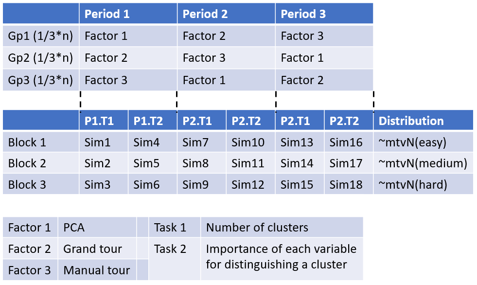

\bibliography{spyrison-cook-marriott}


```{r setup_paper, include=FALSE}
# ---
# author:
  # - name: Nicholas Spyrison
  #   # affiliation: Monash University
  #   # address:
  #   # - Faculty of Information Technology
  #   # email:  nicholas.spyrison@monash.edu
  # - name: Dianne Cook
  #   # affiliation: Monash University
  #   # address:
  #   # - Department of Econometrics and Business Statistics
  #   # email:  dicook@monash.edu
  # - name: Kim Marriott
  #   # affiliation: Monash University
  #   # address:
  #   # - Faculty of Information Technology
  #   # email:  Kim.Marriott@monash.edu
# preamble: >
#   % preamble packages
# link-citations: true
# fig_caption: yes
# toc: false
# 
# bibliography: spyrison-cook-marriott.bib
# output: rticles::ieee_article
# ---
# \bibliography{spyrison-cook-marriott}

knitr::opts_chunk$set(
  fig.align = "center", 
  echo = TRUE, 
  collapse = TRUE,
  message = FALSE, 
  warning = FALSE, 
  error = FALSE,
  cache = FALSE,
  cache.lazy = FALSE
)
library(spinifex)
library(ggplot2)
library(gridExtra)
library(dplyr)

# Hypothesis: 
# does the availability of the manual tour improve the ability of the analyst 
# to understand the importance of variables contributing to the structure?

# DH Jeong 2009
# https://www.researchgate.net/profile/Brian_Fisher2/publication/220506453_IPCA_An_interactive_system_for_PCA-based_visual_analytics/links/59e395fa458515393d5b8f29/IPCA-An-interactive-system-for-PCA-based-visual-analytics.pdf 
# 
# a bit removed, for larger dimensions (100's):
# 
# J Yang 2007  
# https://www.researchgate.net/profile/Matthew_Ward3/publication/6451414_Value_and_Relation_Display_Interactive_Visual_Exploration_of_Large_Data_Sets_with_Hundreds_of_Dimensions/links/00b495320b8f337d3a000000.pdf 
```


# Introduction

<!-- Mutivarite spaces and EDA  -->
Multivariate data is ubiquitus. Yet exploratory data [@tukey_exploratory_1977] analysis of such spaces becomes difficult, increasingly so as dimension increases. Numeric statistic summarization of data often doesn't explain the full complexity of the data or worse, can be downright deseptive [@anscombe_graphs_1973; @matejka_same_2017]. For these reasons it's important to use visualization of data spaces and extend the diversity of it's application. However, visualizing data containing more than a handful of variables is not trivial. 

<!-- scope of tasks -->
<!-- DEFINE SCOPE OF INTERSTED TASKS HERE?? -->
<!-- There are many several facets of interest in exploring multivariate spaces.  -->

<!-- PCA  -->
For over a century Principal component analysis (PCA) [@pearson_liii._1901] has been used to explore such spaces. PCA redefines the axes basis as linear combinations of the orginal variables into principal components ordered by decreasing variation explained. Viewing several of the first such componments is sufficent for macro summarization data from a single distribution, but doesn't reveal finer stuctural features or differing structure between classes. 

<!-- SPLOM -->
Alternatively, scatterplot matrices are common to explore scatterplots of all pairs of variables. This is performant for quickly exploring all variable distributions. Both of these techniques only allow for a relatively small amount of the posible phase space and thus data structure to be explored.

<!-- tours intro -->
Later, Asimov [@asimov_grand_1985], coined `tour`, an animation of many projections across small changes in the basis. Exploring mutivariate spaces this way offers a number of desireable features including more depth visual cues and extensible phase space exploration.

<!-- Grand tour -->
The various types of tours are disintuished by the method defining the path the basis animates. The originial, and widest know, is the `grand` tour [@asimov_grand_1985]. In a grand tour several target bases are identified by constrained random walk. These target bases are then interpolated into many interim frames to be viewed as a more coninuous animation.

<!-- Manual tour -->
The `manual` tour [@cook_manual_1997] defines its basis path by manipulating the basis contribution of a selected variable. Many such manipulations may be predefined and animated. Alternatively, these parameterized steps can allow human-in-the-loop [@karwowski_international_2006] interactive use.

<!-- Research gap -->
Exploring and understanding finer structural details is an undersurviced aspect of multivariate data analysis. This work contained below performs an within-participant exploratory study to shed light on techniques that may be most suited for such a task.

<!-- structure of the paper -->
Section \ref{sec:hypothesis} formalizes the hypothesis statement. Section \ref{sec:design} explains the experimental deign, with sections \ref{sec:factors} and \ref{sec:blocks} explaining the design factors and blocks. The results of the study are found in section \ref{sec:results}. An accompanying tool is discussed in section \ref{sec:spinifex}. Disscussion is covered in section \ref{sec:discussion}.

__Note: section refs not working in this format, specific to `rticles`?__

# Hypothesis {#sec:hypothesis}

<!-- PCA as control -->
Supporting and extending the applicability of data visualization is an important endeavor. There exist various linear projection techniques to explore multivariate data spaces. 


<!-- Grand as control phase space, no fine control. -->

<!-- hypothesis statement -->
Does the finer control afforded by the manual tour improve the ability of the analyst to understand the importance of variables contributing to the structure?


<!-- non linear projections;; TO hypothesis? -->
More recently there has been advances and fanfare in non-linear projections such as self-organizing maps, and T-SNE. Because of the use of non-affine transformations they offer arbitrary model spaces, with no clear interoperability back to variable space. This precludes them as canidates for exploratory data analysis of the multivariate data in question. They can be useful for rapid identification of possible outliers or classes. 


# Experimental design {#sec:design}

## Factors {#sec:factors}

We explored performance across three factors. The first factor is Principal Component Analysis (`PCA`). The second factor is an animated walk of interpolation frames between target bases, called a `grand tour`. The third factor allows for the manual control of the individual variable's contribution to the projection, performing a `manual tour`.

<!-- PCA as Standard for  -->


<!-- explian tours, asimov, grand, manual -->
User interface was kept the same whenever possible, but control interface did change slightly to accomadate differneces between factors. PCA had two side-by-side radio button selections that control which prinicipal components were displayed on the x- and y-axes. The manual tour had same axes selection, with the the addition of a drop-down bar and slider control. The drop-down selects the variable to manipulate the contribution of, while the slider controled the magnitude [0-1] of the contribution of that variable on the projection. Performing this manipulation does require the contributions of the other variables to change if they are to keep their orthogonal relationship.


## Block treatments {#sec:blocks}

Within each factor, participants performed 2 block treatments in a fixed order. The first block asked participants to identify the number of clusters present in the data. In this block, clusters were unsupervised, where all observations appeared as black circles and the basis variable map was omitted. This block also served as a control for assessing the general aptitude for this sort of high dimensional analysis as it was simpler. A second block asked participants to identify any/all variables that were very important and somewhat important for distinguishing a given cluster from the others. For instance, which variables are very important for distinguishing cluster `b`. This block was supervised by cluster; observations were assigned shape and (color-blind friendly) color according to their cluster. A basis variable map was provided demonstrating the magnitude and direction of the variable contribution for the given linear projection.

The first block is a ubiquitous task for unsupervised data but was included as more of a validation task rather than directly addressing the hypothesis.  
It was expected that the grand tour should excel in identifying the number of clusters. This is because the grand tour shows many bases across all variables viewed in quick succession. This makes for a more cohesive parallax-like movement between clusters, making them relatively easy to identify. In contrast, PCA offers the fewest bases with the most discrete changes. The manual tour explores one dimension at a time. This exploration views a smaller variable-space than the grand tour, providing fewer visual cues between clusters. 


## Repetition {#sec:reps}

Participants were randomly assigned to 1 of 3 even groups. Each group had a  different factor order containing all factors. Both blocks were performed in the same order. Each block had 3 repetitions performed on new simulations that were drawn from 3 parameterizations in increasing difficulty. Each participant went through the simulations in the same order, while the order of their factor varied. Fixing repetition order while varying factors should mitigate potential learning bais.  


## Groups {#sec:groups}

Each participant was randomly split into one of three even factor groups. The first group was given a biplot -- a scatterplot matrix coupled with a variable mapping back to original variable space. Users were allowed to freely choose which two components to view initialized to PC1 and PC2. The second group was given the same animation, the first 30 seconds of random walk (typically spanning 6 or 7 bases interpolated into 90 frames viewed at 3 frames per second) of a grand tour with the ability to freely control the location and speed of the animation. The third group was provided with the ability to control the magnitude of an individual variable contributes to the projection with a manual tour. Doing so performs a constrained rotation on the data object resulting in a change of the other variables to preserve orthogonality between dimensions. Participants could freely change which dimension to manipulate.


```{r design, echo = F, out.width = '100%',                                     fig.cap = "Experimental design setup. Participants are assigned to one of 3 even groups controlling the factor order. Within each factor, users perform 3 repetitions of block 1 and then block 2 before proceeding to the next factor. Simulations are used in a fixed order (while factor order changes). Simulations for the first repetition are unique samples drawn from the same distribution. Similarly, the second and third repetitions are drawn from their own more complex distributions."}


```

```{r designExample, echo = F, out.width = '100%',                             fig.cap = "Example case. Person `A` is assigned to group 2, where they will use factor 2 (`Grand tour`) for the first period. They perform 3 repetitions of block 1 on simulations of increasing difficulty. Then 3 repetitions of block 2 on unique simulations sampled from the same distributions of increasing difficulty. After this, they proceed to period 2, where they are use factor 3 (`Manual tour`) to perform 3 repetitions of each block. Lastly, in the third period they use factor 1 (`PCA`) to perform the tasks."}
knitr::include_graphics("./figures/experimental_design_personA.PNG")

```


## Participant population {#sec:population}

A sample of convenience was taken from postgraduate students in the department of econometrics and business statistics and the faculty of information technology at Monash University, based in Melbourne, Australia. Participants were required to have prior knowledge of multivariate data visualizations.


## Training {#sec:training}

__TODO__


## Data simulations {#sec:sim}

The data used for the study were sampled from 4 multivariate normal distributions. The distributions were parameterized with the number of clusters, the number of noise variables, and the number of variables. Each simulation contained either 3 or 4 clusters, with each cluster containing a random number of observations between 30 and 150. Each simulation contained 3 or 4 noise variables, which were distributed as $~ \mathcal{N}(0, \sigma^2)$. Non-noise variables were distributed $~ \mathcal{N}(\mu, \sigma^2)~|~\mu\in \{-3, -2, ... 3\}$. The variance-covariance matrix was constrained with non-diagonal elements selected between -0.1 to 0.7, before being constrained into a positive definitive matrix.

Of the 4 sets of parameterizations, 20 simulations were drawn. The 2 most simple simulations were used during the training section of the study. All participants were exposed to the same training data sets, shown in the same order to standardize training. The remaining 18 simulations were drawn such that the remaining 3 parameterizations were sampled 6 times each. These correspond to the 3 repetitions of a given factor and block with increasing difficulty. Referring to the middle of figure \ref{fig:design}, a participant would perform each factor-block for 3 repetitions with increasing difficultly before proceeding. The next factor-block has 3 repetitions performed on new simulations but parameterized for the same order of increasing difficulty. All participants experience the same order of simulations while varying the order of the factor (visualization) as controlled by a partition into 3 even groups (top of the same figure).


## Response & measures {#sec:response}

Each block was introduced and demonstrated directly preceding each block. During this introductory segment, each participant was given a  written description of the block task and instructions on how the factor visualization informed the answer, as illustrated with the same toy data set. Participants were free to ask questions and clarification from the proctor at this time. Questions were not allowed outside of the introductory segments. Participants received exactly __two__ minutes to explore each repetition's projection before responding to the given task. Responses came in the form of single integer input for the block asking to identify the number of clusters. The second block collected the top 3 ordered variables that distinguish clusters. The remaining block collected `p` (number of variables in the data) inputs grouped into zero to four groups.

After responses for each block were collected, participants were given a short survey of demographics, related experience, and subjective evaluation of each factor on a 7-point Likert scale. These questions covered familiarity and expertise with multivariate data, its visualization, as well as, ease of use, understandability, confidence, and likelihood to recommend the participant's factor visualization.


## Post-study survey {#sec:survey}

* gender [decline, F, M, Intergender/other]
* age [decline, 19 or younger, 20 to 29, 30 to 39, 40 or older]
* completed education [decline, highschool, undergraduate, honors/masters/mba, doctorate]
* experience with data vizualization [likert 1-7]
* educated in multivarate statistical analysis [likert 1-7]
* previous familiar with vizualization [likert 1-7] x3 factors
* ease [likert 1-7] x3 factors
* confidence [likert 1-7] x3 factors
* likeability [likert 1-7] x3 factors
<!-- see Tory 2006 for example of ease/confidence/likeability -->


# Results {#sec:results}

# Accompanying tool: spinifex application {#sec:spinifex}

To accompany this study we have produced a more general use tool to perform such exploratory analysis of high dimensional data. The `spinifex`{@CITE} R package (version 0.2.0 and up) contains a free, open-source version of a `shiny` [@chang_shiny:_2018] application. The application features traditional static visualizations including PCA, with biplots and scree plots, and scatterplot matrices. The application also implements various tours, including manual tours, projection pursuit, and limited versions of grand, little, and local tours. Data can be imported in .csv and .rda format, and projections can be saved as .png, .gif, and .csv formats where applicable. Run the following R code for help getting started.
```{r getting_started, eval = F}
install.packages("spinifex")
spinifex::run_app("intro")
spinifex::run_app("primary")
```


# Discussion {#sec:discussion}

# Acknowledgments {#sec:acknowledgments}

This article was created in R [@r_core_team_r:_2019], using \_CRANpkg{knitr} [@stodden_knitr:_2014] and \_CRANpkg{rmarkdown} [@xie_r_2018], with code generating the examples inline. The source files for this article be found at [github.com/nspyrison/spinifex_study/](https://github.com/nspyrison/spinifex_paper/). The source code for the \_pkg{spinifex} package and accompanying shiny application can be found at [github.com/nspyrison/spinifex/](https://github.com/nspyrison/spinifex/).


# Bibliography {#sec:bib}