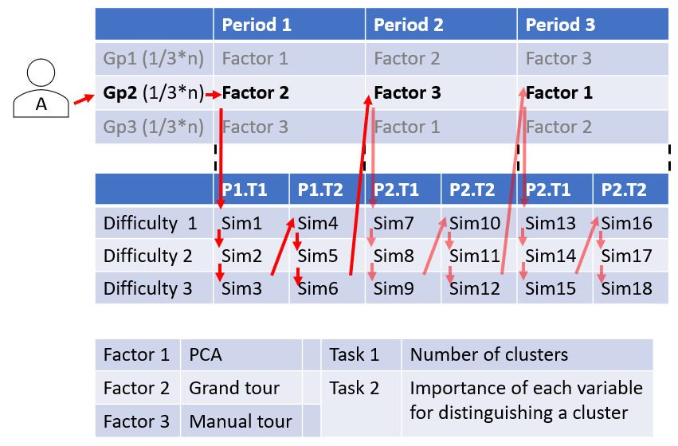

\bibliography{spyrison-cook-marriott}


```{r setup_paper, include=FALSE}
# ---
# author:
  # - name: Nicholas Spyrison
  #   # affiliation: Monash University
  #   # address:
  #   # - Faculty of Information Technology
  #   # email:  nicholas.spyrison@monash.edu
  # - name: Dianne Cook
  #   # affiliation: Monash University
  #   # address:
  #   # - Department of Econometrics and Business Statistics
  #   # email:  dicook@monash.edu
  # - name: Kim Marriott
  #   # affiliation: Monash University
  #   # address:
  #   # - Faculty of Information Technology
  #   # email:  Kim.Marriott@monash.edu
# preamble: >
#   % preamble packages
# link-citations: true
# fig_caption: yes
# toc: false
# 
# bibliography: spyrison-cook-marriott.bib
# output: rticles::ieee_article
# ---
# \bibliography{spyrison-cook-marriott}

knitr::opts_chunk$set(
  fig.align = "center", 
  echo = TRUE, 
  collapse = TRUE,
  message = FALSE, 
  warning = FALSE, 
  error = FALSE,
  cache = FALSE,
  cache.lazy = FALSE
)
library(spinifex)
library(ggplot2)
library(gridExtra)
library(dplyr)

# Hypothesis: 
# does the availability of the manual tour improve the ability of the analyst 
# to understand the importance of variables contributing to the structure?
#
#
# Other user studies to consider:
# DH Jeong 2009
# https://www.researchgate.net/profile/Brian_Fisher2/publication/220506453_IPCA_An_interactive_system_for_PCA-based_visual_analytics/links/59e395fa458515393d5b8f29/IPCA-An-interactive-system-for-PCA-based-visual-analytics.pdf 
# 
# a bit removed, for larger dimensions (100's):
# J Yang 2007  
# https://www.researchgate.net/profile/Matthew_Ward3/publication/6451414_Value_and_Relation_Display_Interactive_Visual_Exploration_of_Large_Data_Sets_with_Hundreds_of_Dimensions/links/00b495320b8f337d3a000000.pdf 
#
# Ben's Data Visceralization
# https://arxiv.org/pdf/2009.00059.pdf

#### inspiration; Other papers from kt, and kadek:
## It's a Wrap: 
## K. Chen et al.
## https://www.researchgate.net/profile/Kun_Ting_Chen2/publication/348620236_It's_a_Wrap_Toroidal_Wrapping_of_Network_Visualisations_Supports_Cluster_Understanding_Tasks/links/6007d5d5a6fdccdcb868b2ef/Its-a-Wrap-Toroidal-Wrapping-of-Network-Visualisations-Supports-Cluster-Understanding-Tasks.pdf
##
## Quantitative Data Visualisation on Virtual Globes,
## K. Satriadi et al. Chi2021
## https://www.researchgate.net/profile/Kadek_Satriadi/publication/348706131_Quantitative_Data_Visualisation_on_Virtual_Globes/links/600c1275a6fdccdcb873728a/Quantitative-Data-Visualisation-on-Virtual-Globes.pdf
```


# Introduction

<!-- Multivariate spaces and EDA -->
Multivariate data is ubiquitous. Yet exploratory data analysis (EDA) [@tukey_exploratory_1977] of such spaces becomes difficult, increasingly so as dimension increases. Numeric statistic summarization of data often doesn't explain the full complexity of the data or worse, can lead to missing obvious visual patterns [@anscombe_graphs_1973; @matejka_same_2017; @goodman_dirty_2008; @coleman_geometric_1986]. Data should be visually inspected in it's original variable-space before applying models or summarizations. This allows users to validate assumptions, identify outliers, and facilitates the identification of visual peculiarities.

<!-- Wickham [@wickham_visualizing_2015] introduces the terminologies of data-space. -->

<!-- Not Scatterplot matrices, PCP, want mapped to position -->
For these reasons, it is important to use visualizations of data spaces and extend the diversity of its application. However, visualizing data containing more than a handful of variables is not trivial. Scatterplot matricies or small multiples [@chambers_graphical_1983] looks at all permutation pairs of variables, but quickly becomes to vast a number of images to consider. On the other extreme, parallel coordinates plot [@ocagne_coordonnees_1885] and its radial variants, plot observations as lines varying across scaled variables as displayed in a line or circle. This scales well with dimensionality, while suffering from couple issues. The larger issue, being the loss of mapping multiple variables to graphic position, which is perhaps the most important visual cue for human perception [@munzner_visualization_2014]. The lesser being that they suffer from asymmetry, as their interpretation is dependent on variable ordering.

<!-- linear combinations of dimensions -->
Using a linear combinations of variables will allow us to keep position in 2 display axes while peering into information not contained in any one dimension. The idea of using a combination of variables may appear daunting at first, however we do it almost exclusively in the spatial dimensions. That is to say we are rarely completely aligned with rectangular objects at any one point in time. Consider a book or a filing cabinet any orientation that isn't fully a 2D rectangle, you are seeing as a linear combination of its variables, height, width, and depth. Generalizing this to arbitrary data dimensions we can project or embed a 2D profile of $p$-dimensional data. Its worth noting that the number of these embedded profiles, and thus the time it takes to explore them, increase exponentially with the dimensionality of the data.

<!-- Exclude non-linear embeddings -->
Non-linear emeddings, the compliment of the linear embedding, have also been well received recently especially with the emergence of t-Distributed stochastic neighbor embedding [@van_der_maaten_visualizing_2008]. Such techniques distort the fully dimensionality on to a low, typically 2D plane. The issue with doing so is that unit of distance is not consistent with location in the embedded space, which severely hinders the interoperabilty of these embeddings. Additionally they often have hyperparameters that need tuning. Doing so results in completely different or contradicting embeddings. Suffice it to say we exclude their consideration for such broad application for multivariate EDA.

<!-- <!-- nonlinear projections precluded --> 
<!-- More recently there have been advances and fanfare in non-linear projections such as self-organizing maps [@kohonen_self-organizing_1990], and t-SNE [@maaten_visualizing_2008]. Because of the use of non-affine transformations, they offer arbitrary model spaces, without inter-operability back to variable space. This precludes them as candidates for exploratory data analysis of the multivariate data in question. They can be useful for the rapid identification of possible candidates for outliers or classifications. However they can suffer from overfitting, and crucially cannot be interpreted in terms of the original variables.   -->

<!-- Exclude class supervised examples -->
Additionally there are many methods suitable for data with known classes. Linear discriminant analysis [@fisher_use_1936] for instance also produces linear combinations of variables, based not in order of variation of the data, but rather on the separation of known classes. In this work we want to be fully agnostic of any such class supervision and preclude them from our comparison as well.

<!-- Motivation statement and overview of this study -->
In multivariate spaces, performance measures and computational complexity are regularly compare to like algorithms and models. Human perception and inference from visuals is notably missing. We perform a within-participant, crowd sourced user study exploring the efficacy of 3 methods of linear embedding visualizations.

<!-- structure of the paper -->
Section \ref{sec:background} discusses the visualization methods. Section \ref{sec:design} explains the experimental deign, with sections \ref{sec:factors} and \ref{sec:task} explaining the design factors and tasks. The results of the study are found in section \ref{sec:results}. An accompanying tool is discussed in section \ref{sec:spinifex}. Discussion is covered in section \ref{sec:discussion}.


# Background, visual methods {#sec:background}

## Linear projection notation

Consider a numeric data matrix with $n$ observations of $p$ variables,
$$ \textbf{X}_{[n, p]} = (\textbf{x}_{1},~...,~\textbf{x}_{p}) \\
\textbf{x}_{i} = (x_{1i},~...,~ x_{ni})~|~i \in [1, p] $$

Let $Y_{[n, d]}$ be the $d$-dimensional projection or embedding of $\textbf{X}_{[n, p]}$ via matrix multiplication of a particular orthonormal basis matrix $\textbf{B}_{[p, d]}$.

$$ \textbf{Y}_{[n, d]} = \textbf{X}_{[n, p]} \textbf{B}_{[p, d]}~|~\textbf{B}~is~orthonormal \\
\textbf{y}_{j} = (y_{1j},~...,~ y_{nj})~|~j \in [i, d] $$

A matrix is said to be orthonormal if and only if they are 1) orthogonal, that is all column pairs are independent, having a cross product of 0, and 2) normal, each columns has a norm distance of 1.

<!-- note on interchangeably, probably better to make consistent afterward -->
<!-- A quick note on terminology we use the terms projection & embedding and variable & dimension interchangeably. -->

## Principal Component Analysis

Considering that we want to explore multivariate data space, while maintaining position mapping of points. Linear combinations of variables becomes an ideal candidate. Principal component analysis (PCA) [@pearson_liii._1901] creates new components that are linear combinations of the original variables. The creation of these variables is ordered by decreasing variation which is orthogonally constrained to all previous components. while the full dimensionality is in tact the benefit comes from the ordered nature of the components. For instance if nearly all of the variation in a data-space can be explained in the first half of its components than the complexity of viewing such a space is exponentially simplified.

## Grand Tours

<!-- tours intro -->
Later, Asimov [@asimov_grand_1985], coined data vizualization _tour_, an animation of many linear projections across local changes in the basis. One of key features of the tour is the object permanence of the data points. That is to say by watching near by, orthogonally-interpolated frames one can track the relative changes of observations as variable contributions change.

<!-- Grand tour -->
Asimov originally purposed the _grand_ tour. To start, several target bases are randomly selected. These target bases are then orthogonally-interpolated between with a fixed target distance between interpolation frames. The data matrix is premultiplied to the array of interpolated bases and rendered into an animation. There is no user interaction in a grand tour and the target. 

## Manual Tours

<!-- Manual tour -->
The _manual_ tour [@cook_manual_1997; @spyrison_spinifex_2020] defines its basis path by manipulating the basis contribution of a single selected variable. A manipulation dimension is appended onto the projection plane, with a full contribution given to the selected variable. The target bases are then selected based on rotating this newly created manipulation space. The target bases are then similarly orthongally-interpolated, data projected, and rendered into an animation. In order for variables to remain independent of each other the contributions of the other variables must also change, ie. the orthonormally of the dimension space should be preserved. A key feature of the manual tour is that it affords users a way to control the variable contributions of the next target basis. This means that such manipulations can be select and queued in advance or select on the spot for human-in-the-loop analysis[@karwowski_international_2006]. Due to the huge volume of $p$-space (an aspect of the curse of dimensionality [@bellman_dynamic_1957]) and the abstraction constrained interpolation of the basis navigating large changes in the basis can become cumbersome. It is advisable to first identify a basis of particular interest and then use a manual tour as a finer, local exploration tool to observe how the contributions of the selected variable does or does not contribute to the feature of interest.

In order to simplify the task and keep its duration realistic we consider a variant of the manual tour, called a _radial_ tour. In a radial tour the selected variable is allowed to change its magnitude of contribution, but not it's angle; it must move along the direction of its original radius.

# User study {#sec:userstudy}


## Hypothesis {#sec:hypothesis}

<!-- hypothesis statement -->
_Does the animated removal of single variables via the radial tour improve the ability of the analyst to understand the importance of variables contribution to the separation of clusters?_

PCA will be compared as a baseline as it is a popular stationary linear embedding. The grand tour will act as a secondary control that includes the object permanence of the data to near by frames, but with the ability to check individual variable or influence it's path. using these as comparisons we want to identify how much, if any, the radial tour helps an analyst to interpret the contributions of individual variables.

_TODO: XXX CONTINUE HERE_
## Task and evaluation {#sec:task}

The display was a 2D scatterplot with observations supervised into like clusters (3 in the case of p)

## Experimental design {#sec:design}

Below we discuss the n = 108 within-participant exploratory study across 3 factors,

## Factor application {#sec:factors}

<!-- factors: PCA, grand, manual -->
We explored performance across three factors. The first factor is PCA. The second factor is an animated walk of interpolation frames between target bases, called a _grand_ tour. The third factor allows for the manual control of the individual variable's contribution to the projection, performing a _manual_ tour.

<!-- Plot and axes -->
All factors are shown as a scatterplot. The basis axes projection was also illustrated to the left of the plot. They are shown in a unit circle and show the magnitude and direction each variable contributes to the projection.

<!-- interface differences -->
The user interface was kept the same whenever possible, but the control inputs did change slightly to accommodate the differences between factors. PCA had 2 side-by-side radio button inputs that select principal components to display on the x- and y-axes. The manual tour had the same axes selection, with the addition of a drop-down bar and slider control. The drop-down selects the variable to manipulate the contribution of, while the slider controlled the magnitude [0-1] of the contribution of that variable on the projection. Performing this manipulation does require the contributions of the other variables to change if they are to keep their orthogonal relationship. The grand tour has no axis or variable inputs and comes precompiled as an animation of a 15 second showing 90 frames at 6 frames per second. The user can control the location or play/pause the animation at will. Each frame is a geodesic interpolation that is close to 0.1 radians away from the previous frame. These frames will typically include 6 or 7 bases identified randomly.


## Blocks and grouping 

```{r designExample, echo = F, out.width = '100%',                             fig.cap = "Example case. Person 'A' is assigned to group 2, where they will use factor 2 (grand tour) for the first period. They perform 3 block difficulties of task 1 on simulations of increasing difficulty. Then 3 block difficulties of task 2 on unique simulations sampled from the same distributions of increasing difficulty. After this, they proceed to period 2, where they are use factor 3 (manual tour) to perform 3 block difficulties of each task. Lastly, in the third period, they use factor 1 (PCA) to perform the tasks."}

```

## Synthetic data and fixed parmeters

The data used for the study were sampled from 3 multivariate normal distributions. The distributions were parameterized with the number of clusters, the number of noise variables, and the number of variables. Simulations with 4 dimensions contained 3 clusters, while those with 6 dimensions were given 4 clusters. Each cluster containing 140 observations each. Each simulation contained 3 or 4 noise variables, which were distributed as $~ \mathcal{N}(0, \sigma^2)$. Non-noise variables were distributed $~ X_i \stackrel{d}{\sim} \mathcal{N}(\mu = 0, \sigma^2 = 1) | \textbf{K}$ . The variance-covariance matrix was constrained with non-diagonal elements selected between -0.1 to 0.6, before being constrained into a positive definitive matrix.
<!-- __#TODO: This is correct for 200 series, but Cl means are Very generous__ -->

<!-- \ref{fig:design} -->
From the 4 sets of parameterizations, 20 simulations were drawn. The 2 most simple simulations were used during the training section of the study. All participants were exposed to the same training data sets, shown in the same order to standardize training. The remaining 18 simulations were drawn such that the remaining 3 parameterizations were sampled 6 times each. These correspond to the 3 block difficulties of a given factor and task with increasing difficulty. Referring to the middle of figure \ref{fig:design}, a participant would perform each factor-task for 3 block difficulties with increasing difficultly before proceeding. The next factor-task has 3 new data sets but parameterized for the same order of increasing difficulty. All participants experience the same order of simulations while the order of the factor visualization was changed as controlled by a partition into 3 even groups (top of the same figure).


## Post study survey

The plot display of the first task was limited to 1 minute and 3 minutes on the second task. Responses we available during and after the timer was running. The value and time of each response were captured in a temporary variable that was written to the response table once the user proceeded to the next page. The number of plot manipulations and response entries was also captured for each page including training. 

After responses for each task were collected, participants were given a short survey containing questions gauging demographics, experience, and subjective evaluation of each factor on a 5-point Likert scale. The questions and possible responses are as follows:

1) What are your preferred pronouns? [decline to answer, he/him, she/her, they/them or other]
2) Which age group do you belong to? [decline to answer, 18 to 24, 25 to 35, 36 to 45, 45 to 60, 60 and up]
3) What is your highest completed education? [decline to answer, Undergraduate degree (BA/BSc/other), Graduate degree (MA/MSc/MPhil/other), Doctorate degree (PhD/other); prolific.co participants were filtered to those stating they had an least an undergraduate degree]

__likert scale [1-5], least agreement to most agreement:__
4) I understand the how to perform the task.
5) I am experienced with data visualization.
6) I am educated in multivariate statistical analysis.

__for each factor:__ 

7-9) I was already familiar with visualization.
10-12) I found this visualization easy to use.
13-15) I felt confident in my answers with this visualization.
15-18) I liked using this visualization.

The code, response files, their analyses, and study application are made publicly available at on GitHub at [github.com/nspyrison/spinifex_study](https://github.com/nspyrison/spinifex_study).

## Sampling population {#sec:population}

<!-- see Tory 2006 for example of ease/confidence/likeability -->
cite Kadek's paper or another pointing to prolific.co?

A sample of convenience was taken from postgraduate students in the department of econometrics and business statistics and the faculty of information technology at Monash University, based in Melbourne, Australia. Participants were required to have prior knowledge of multivariate data visualizations.

## Training {#sec:training}

The training was controlled for all participants as much as possible. All participants received the same written interface instructions and watched the same training video introducing the methods and the same task prompts were displayed for their respective tasks. The factor-, interface-, and task- training took place in a continuous block where questions were invited. Questions were disallowed once the formal evaluation section started.


# Results {#sec:results}

__#TODO: XXX Need to run study and add results here.__


# Discussion {#sec:discussion}

# Accompanying tool: spinifex application {#sec:spinifex}

To accompany this study we have produced a more general use tool to perform such exploratory analysis of high dimensional data. The R package, `spinifex`, {@spyrison_spinifex_2020} R package  contains a free, open-source `shiny` [@chang_shiny_2020] application. The application allows users to explore their data with either interactive or predefined manual tours without the need for any coding. Limited implementations of grand, little, and local tours are also made available. Data can be imported in .csv and .rda format, and projections or animations can be saved as .png, .gif, and .csv formats where applicable. Run the following R code for help getting started.
```{r getting_started, eval = F}
install.packages("spinifex", dependencies = TRUE)
spinifex::run_app("intro")
spinifex::run_app("primary")
```

# Acknowledgments {#sec:acknowledgments}

This article was created in R [@r_core_team_r:_2020], using `knitr` [@stodden_knitr:_2014] and `rmarkdown` [@xie_r_2018], with code generating the examples inline. The source files for this article, application, data, and analysis can be found at [github.com/nspyrison/spinifex_study/](https://github.com/nspyrison/spinifex_paper/). The source code for the `spinifex` package and accompanying shiny application can be found at [github.com/nspyrison/spinifex/](https://github.com/nspyrison/spinifex/).

# Bibliography {#sec:bib}