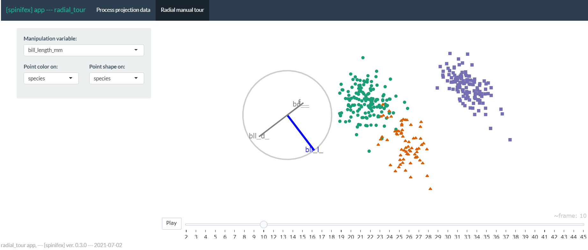

\bibliography{spyrison-cook-marriott}
```{r setup_paper, include=FALSE}
## Install latest CRAN ver of  packages used in compiling paper
if(F){ ## Manually run
  install.packages("knitr")
  install.packages("kableExtra")
  install.packages("magrittr")
  install.packages("tourr")
  install.packages("spinifex")
  install.packages("gganimate")
}
## try to fix error from kableExtra:
#Package xcolor Error: Undefined color `shadecolor'.
options(kableExtra.latex.load_packages = FALSE) 
options(knitr.table.format = "latex")
## kableExtra also has a new error with column_spec():
# Undefined control sequence.
# <argument> >{\raggedright \arraybackslash 
if(interactive()) setwd("./paper")
require("knitr")
require("kableExtra")
require("magrittr")
## Work packages
require("tourr")
require("spinifex")
require("gganimate")
## chunk options
knitr::opts_chunk$set(
  fig.align = "center",
  echo       = FALSE,
  collapse   = TRUE,
  message    = FALSE,
  warning    = FALSE,
  error      = FALSE,
  cache      = FALSE,
  cache.lazy = FALSE
)
```

\newpage

# Introduction

<!-- Context and motivation; multivariate spaces and EDA -->
Despite decades of research, multivariate data continues to provide fascinating challenges for visualization. Data visualization is important because it is a key element of exploratory data analysis, [EDA, @tukey_exploratory_1977], assessing model assumptions, and as a cross-check on numerical summarization [@anscombe_graphs_1973; @matejka_same_2017; @yanai_hypothesis_2020]. One of the challenges is determining whether a new technique yields a better perception of information than current practices for multivariate data.

<!-- Common options; few principal components -->
Dimension reduction is commonly used with visualization to provide informative low-dimensional summaries of multivariate data. (Note that this is usually only appropriate when all variables are quantitative.) Principal component analysis [PCA, @pearson_liii._1901] is one of the first methods developed, and it remains very popular. Visualization of PCA is typically in the form of static scatterplots of a few leading components. This is usually accompanied by a representation of the basis, where the magnitude and angles of the variable contributions are inscribed on a unit circle, called a biplot [@gabriel_biplot_1971].

The class of dynamic linear projections known as _tours_ [@asimov_grand_1985], shown as scatterplots or biplots, can be used to animate multiple principal components. Instead of a static view of two orthogonal components, interpolations between multiple components can be viewed. Asimov originally animated between randomly selected bases in the _grand_ tour. The _manual_ tour [@cook_manual_1997] uniquely allows for user-control over the basis changes. A selected variable (or component) can be rotated to the desired contribution. A radial tour [@spyrison_spinifex_2020] is a special version of the manual tour, available in the R package `spinifex`. The permanence of the data points from frame to frame and information held in intermediate interpolated frames or user-control of the basis could plausibly lead to more information perception than a static display. This is a hypothesis that a user study could assess.

<!-- 2D vs D3, mostly PCA reduced -->
@gracia_new_2016 conducted an $n=40$ user study comparing between 2D and 3D scatterplots on traditional 2D monitors. Participants perform point classification, distance perception, and outlier identification tasks. The results are mixed and mostly small differences. There is some evidence to suggest a lower error in distance perception from 3D scatterplot. @wagner_filho_immersive_2018 performed an $n=30$ within participants using scatterplot display between 2D, 3D displays on monitors and 3D display with a head-mounted display on PCA reduced spaces. None of the tasks on any dataset lead to a significant difference in accuracy. However, the immersive display reduced effort and navigation while resulting in higher perceived accuracy and engagement. @sedlmair_empirical_2013 instead uses two expert coders to evaluate 75 datasets and four dimension reduction techniques for 2D scatterplots, interactive 3D scatterplots, and 2D scatterplot matrices. They suggest a tiered guidance approach finding that 2D scatterplots are often 'good enough'. If not, try 2D scatterplots on a different dimension reduction technique before going to scatterplot matrix display or concluding a true negative. They find that interactive 3D scatterplots help in very few cases.

<!-- Nonlinear DR quality review -->
Empirical studies scarcely compare tours. However, @nelson_xgobi_1999 compare scatterplots of grand tours on 2D monitor with 3D (stereoscopic, not head-mounted) over $n=15$ participants. Participants perform clusters detection, dimensionality and radial sparseness tasks on six dimensional data. They find that stereoscopic 3D leads to more accuracy in the cluster identification, though interaction time was much increased in the in 3D case. In this work we extend the evaluation of tours which novelly compares the radial tour as benchmarked against the grand tour and discrete pairs of principal components.

<!-- Overview of the study -->
We are particularly interested in assessing the effectiveness of the new radial tour relative to common practice with PCA and grand tour.<!-- thesis_ns introduction --> The user influence over a basis, uniquely available in the radial tour, is crucial to testing variable sensitivity to the structure visible in projection. If the contribution of a variable is reduced and the feature disappears, then we say that the variable was sensitive to that structure. For example, Figure \@ref(fig:figClSep) shows two frames of simulated data. Panel (a) has identified separation between the two clusters. The contributions in panel (b) show no such cluster separation. The former has a large contribution to V2 in the direction of separation, while it is negligible in the right frame. Because of this we say that V2 is sensitive to the separation of the clusters.

```{r figClSep, echo = F, out.width = "100%", fig.cap = "Illustration of cluster separation. Panel (a) shows clear separation in V2 and no separation in the direction of V3. While V1 and v4 have relatively small contributions to the frame. Panel (b) has a random basis with a minimal contribution from V2, and no separation between the cluster means is resolved."}
if(F)
  file.edit("./paper/R/fig_biplot_scoring.r")
knitr::include_graphics("./figures/figClSep.pdf")
```

<!--- black-box models-->
Knowing which variables to use is also important for statistical modeling and their interpretations. Models are becoming increasingly complex, and the non-linear interactions of the terms cause an opaqueness to model interpretability. Exploratory Artificial Intelligence [XAI, @adadi_peeking_2018; @arrieta_explainable_2020] is an emerging field that extends the interpretability of such black-box models. Multivariate data visualization is essential for exploring features spaces and communicating interpretations of models [@biecek_dalex_2018; @biecek_explanatory_2021; @wickham_visualizing_2015].

<!-- Structure of the paper -->
The paper is structured as follows. Section \@ref(sec:background) discusses several visualization methods and orthogonal and observation-based visuals before arriving at the three linear dimension reduction techniques compared in the study. Section \@ref(sec:userstudy) describes the experimental factors, task, and accuracy measure used. The results of the study are discussed in Section \@ref(sec:results). Conclusions and potential future directions are discussed in Section \@ref(sec:conclusion). The software used for the study is described in Section \@ref(sec:spinifex).


# Background {#sec:background}

Before discussing PCA, the grand tour, and the radial tour, this section covers orthogonal views and observation-based visuals of the full variable space. Consider data to be a complete matrix of $n$ observations across $p$ variables, $X_{n \times p}$.


## Scatterplot matrix

One could consider looking at $p$ histograms or univariate densities. Doing so will miss features in two or more dimensions. A scatterplot matrix [@chambers_graphical_1983] is a $p \times p$ matrix with univariate densities on the diagonal and all combinations of pairs of variables in off-diagonal elements. Figure \@ref(fig:figFactorPca) shows a scatterplot matrix of the first four components of simulated data. Such displays do not scale well with dimension, quickly becoming dense. Scatterplot matrices also display information in two orthogonal dimensions; features in three dimensions will never be fully resolved.

## Parallel coordinates plot

<!-- PCP -->
Another common way to display multivariate data is with a parallel coordinates plot [@ocagne_coordonnees_1885], which shows observations by quantile or normalized values for each variable connected by lines to the quantile value in subsequent variables. Parallel coordinates plots and other observations-based visuals, such as pixel plots or Chernoff faces scale well with dimensions but poorly with observations. These are perhaps best used when there are more variables than observations.

<!-- extending to other obs-based visuals -->
Observations-based visuals have a couple of issues. They are asymmetric across variable ordering in that a change in the order can leading to different conclusions. Another notable observation-based visual is the graphical channel used to convey information. Munzner suggests that position is the visual channel that is most perceptible to humans [@munzner_visualization_2014]. In the case of parallel coordinates plots, the horizontal axes span variables rather than the values of one variable; the loss of a display dimension to be used by our most perceptible visual channel.

<!-- Turning to Linear DR -->
At some point, we will be forced to turn to dimension reduction to scale well. Non-linear transformations bend and distort spaces are not entirely accurate or faithful to the original variable space. In light of this, we preclude non-linear techniques and instead decide on PCA, the grand tour, and the radial tour.


## Principal component analysis

PCA is a good baseline of comparison for linear projections because of its frequent and broad use across disciplines. PCA [@pearson_liii._1901] defines new components, linear combinations of the original variables, ordered by decreasing variation through the help of eigenvalue matrix decomposition. While the resulting dimensionality is the same size, the benefit comes from the ordered nature of the components. The data can be said to be approximated by the first several components. The exact number is subjectively selected given the variance contained by each component, typically guided using a scree plot [@cattell_scree_1966]. Features with sizable signal regularly appear in the leading components that commonly approximate data. However, this is not always the case, and component spaces should be fully explored to look for signal in components that hold less variation.

```{r figFactorPca, echo = F, out.width = "100%", fig.cap = "Scatterplot matrix of the first four principal components simulated data in six dimensions. An analyst would have to view both PC1 by PC2 and PC1 by PC4 to have a thorough take on which variables attribute to the separation between clusters."}
if(F)
  file.edit("./paper/R/fig_pca_splom.r")
knitr::include_graphics("./figures/fig_pca_splom.pdf")
```

## Animated linear projections, tours {#sec:tours}

<!-- tours intro -->
A data visualization _tour_ animates many linear projections over small changes in the projection basis. One of the insightful features of the tour is the object permanence of the data points; one can track the relative changes of observations as the basis moves, as opposed to discretely jumping to an orthogonal view with no intermediate information. Types of tours are distinguished by the generation of their basis paths [@lee_state_2021; @cook_grand_2008]. To contrast with the discrete orientations of PCA, we compare continuous linear projection changes with grand and radial tours.


### Grand tours

<!-- Grand tour -->
Target bases are selected randomly in a grand tour [@asimov_grand_1985]. These target bases are then geodesically interpolated for a smooth, continuous path. The grand tour is the first and most widely known tour. The random selection of target bases makes it a general unguided exploratory tool. The grand tour will make a good comparison that has continuity of data points similar to the radial tour but lacks the user control enjoyed by PCA and radial tours.


### Manual and radial tours

<!-- Segue, highlighting lack of control -->
Whether an analyst uses PCA or the grand tour, they cannot influence the basis. They cannot explore the structure identified or change the contribution of the variables. User-control-steering is a key aspect of _manual_ tours that should facilitate testing variable attribution.

<!-- Manual tour -->
The manual tour [@cook_manual_1997] defines its basis path by manipulating the basis contribution of a selected variable. A manipulation dimension is appended onto the projection plane, giving a full contribution to the selected variable. The target bases are then chosen to rotate this newly created manipulation space. This manipulation space is similarly orthogonally restrained. The data is projected through its interpolated frames and rendered into an animation. When the contribution of one variable changes, the contributions of the other variables must also change, maintaining the orthonormality of the basis and space. A key feature of the manual tour is that it allows users to control the variable contributions to the basis. Such manipulations can be queued in advance or selected in real-time for human-in-the-loop analysis [@karwowski_international_2006]. Manual navigation is relatively time-consuming due to the vast volume of resulting view space and the abstract method of steering the projection basis. It is advisable to first identify a basis of particular interest and then use the manual tour as a more directed, local exploration tool to explore the sensitivity of a variable's contribution to the feature of interest.

<!-- Radial tour variant -->
To simplify the task and keep its duration realistic, we consider a variant of the manual tour called a _radial_ tour. In a radial tour, the magnitude of along the radius with a fixed angle of contribution to the frame; it must move along the direction of its original contribution radius. The radial tour benefits from both continuity of the data alongside grand tours and user-steering via choosing the variable to rotate.

<!-- spinifex -->
Manual tours have been recently made available in the __R__ package __spinifex__ [@spyrison_spinifex_2020], which facilitates manual tours (and radial variant). It also provides an interface for a layered composition of tours and exporting to .gif and .mp4 with __gganimate__ [@pedersen_gganimate_2020] or .html widget with __plotly__ [@sievert_interactive_2020]. It is also compatible with tours made by __tourr__ [@wickham_tourr:_2011]. Now that we have a readily available means to produce various tours, we want to see how they fare against traditional discrete displays commonly used with PCA.


# User study {#sec:userstudy}

<!-- Overview of visual -->
An experiment was constructed to assess the performance of the radial tour relative to the grand tour and PCA for interpreting the variable attribution contributing to separation between two clusters. <!-- Introduce experimental factors --> Data were simulated across three experimental factors: cluster shape, location of the cluster separation, and data dimensionality. Participant responses were collected using a web application and crowdsourced through prolific.co, [@palan_prolific_2018] an alternative to MTurk.


## Objective {#sec:objective}

<!-- Rational for factor levels -->
PCA will be used as a baseline for comparison as it is the most common linear embedding. The grand tour will act as a secondary control that will help evaluate the benefit of animation without influencing its path. Lastly, the radial tour should perform best as it benefits from animation and user control.

<!-- Prior expectations -->
Then for some subset of tasks, we expect to find that the radial tour performs most accurately. In the appendix, section \@ref(sec:appendix), we also regress on the last response time. Due to the absence of inputs, we expect the grand tour to perform faster than the alternatives since users can focus all of their attention on interpreting the fixed path. Conversely, we are less sure about the accuracy of such limited grand tours as there is no objective function in selecting the bases; it is possible that the random selection of the target bases altogether avoids bases showing cluster separation. However, given that the data dimensionality was modest, it seems plausible that the grand tour coincidentally regularly crossed frames with the correct information for the task.

<!-- Explicit hypothesis tests -->
We measure the accuracy and response time over the support of the discussed experimental factors. The null hypothesis can be stated as:

$~~~~H_0: \text{task accuracy does not change across visualization method} \\$
$~~~~~H_\alpha: \text{task accuracy does change across visualization method} \\$


## Experimental factors {#sec:expfactors}

<!-- Introduction to experimental factors -->
In addition to visual factor, we simulate the data across three aspects. First, the _location_ of the difference between clusters by mixing a signal and a noise variable at different ratios, we vary the number of variables and their magnitude of cluster separation. Secondly, the _shape_ of the clusters reflects varying distributions of the data. And third, the _dimension_-ality of the data. Below we describe the levels within each factor, while Figure \@ref(fig:figExpFactors) gives a visual representation of the levels.

<!-- Illustration of experimental factors -->
```{r figExpFactors, out.width='100%', fig.cap = "Illustration of the experimental factors, the parameter space of the independent variables, the support of our study."}
if(F)
  file.edit("./paper/R/fig_model_families.r")
knitr::include_graphics("./figures/figExpFactors.pdf")
```

<!-- Location mixing -->
The _location_ of the separation of the clusters is at the heart of the measure. It would be good to test a few varying levels. To test the sensitivity, we mix a noise variable with the signal-containing variable. The difference in the clusters is mixed at the following percentages: 0/100% (not mixed), 33/66%, 50/50% (evenly mixed).

<!-- Shape, vc matrix -->
In selecting the _shape_ of the clusters, we follow the convention given by @scrucca_mclust_2016, where 14 variants of model families containing three clusters are defined. The name of the model family is the abbreviation of its respective volume, shape, and orientation of the clusters, the levels of which are either _E_qual or _V_ary. We use the models EEE, EEV, and EVV. For Instance, in the EEV model, the volume and shape of clusters are constant, while the shape's orientation varies. The latter model is further modified by moving four-fifths of the data out in a "V" or banana-like shape.

<!-- Dimensionality -->
_Dimension_-ality is tested at two modest levels, namely, in four dimensions containing three clusters and six dimensions with four clusters. Such modest dimensionality is required to bound the difficulty and search space to keep the task realistic for crowdsourcing.


## Task and evaluation {#sec:task}

<!-- segue to task and evaluation -->
With our hypothesis formulated and data at hand, let us turn our attention to the task and how to evaluate it. Regardless of the visual method, the elements of the display are held constant, shown as a 2D scatterplot with an axis biplot to its left. Observations were supervised with the cluster level mapped to color and shape.

<!-- Geom, clusters, explicit task -->
Participants were asked to 'check any/all variables that contribute more than average to the cluster separation green circles and orange triangles,' which was further explained in the explanatory video as 'mark any and all variable that carries more than their fair share of the weight, or one quarter in the case of four variables'.

<!-- Instruction and video -->
The instructions iterated several times in the video was: 1) use the input controls to find a frame that contains separation between the clusters of green circles and orange triangles, 2) look at the orientation of the variable contributions in the gray circle (biplot axes orientation), and 3) select all variables that contribute more than uniformed distributed cluster separation in the scatterplot. Independent with experimental level, participants were limited to 60 seconds for each evaluation of this task. This restriction did not impact many participants as the 25th, 50th, 75th quantiles of the response time were about 7, 21, and 30 seconds respectively.

<!-- Evaluating measure -->
The evaluation measure of this task was designed with a few features in mind: 1) the sum of squares of the individual variable weights should be one, 2) symmetric about zero, that is, without preference to under- or over-guessing 3) heavier than linear weight with increasing distance from a uniform height. We define the following measure for evaluating the task with these in mind.

Let a data $\textbf{X}_{n,~p,~k}$ be a simulation containing clusters of observations of different distributions. Where $n$ is the number of observations, $p$ is the number of variables, and $k$ indicates the cluster an observation belongs. Cluster membership is exclusive; an observation cannot belong to more than one cluster.

<!-- W, weights -->
We define weights, $w$ as a vector explaining the variable-wise difference between two clusters. Namely, the difference of each variable between clusters, as a proportion of the total difference, less $1/p$, the expected cluster separation if it were uniformly distributed. <!-- R, participant responses -->Participant responses are a logical value for each variable - whether or not the participant thinks each variable separates the two clusters more than uniformly distributed separation.

<!-- __v1 measure sqrt__ -->
<!-- \begin{align*} -->
<!-- W_{j} &=\frac -->
<!-- {(\overline{X_{j=1, k=1}} - \overline{X_{1, 2}}, ~...~ -->
<!-- (\overline{X_{p, 1}} - \overline{X_{p, 2}})} -->
<!-- {\sum_{j=1}^{p}(|\overline{X_{j, k=1}} - \overline{X_{j, k=2}}|)} -->
<!-- - \frac{1}{p} \\ -->
<!-- \\ -->
<!-- \text{Accuracy}, Y &= \sum_{j=1}^{p}I(r_j) \cdot sign(w_j) \cdot \sqrt{|w_j|} \\ -->
<!-- \end{align*} -->

<!-- __v2 measure 01 scaled__ -->
<!--\left\{ \begin{aligned}
    \frac{w_+^2}{\sum w_+^2}  &&\Bigg\vert w_+ \text{ the positive elements of } w \\
    \frac{w_-^2}{\sum w_-^2}  &&\Bigg\vert w_- \text{ the negative elements of } w \\ \end{aligned} \right. -->

<!-- __v2 measure sq__ -->
\begin{align*}
  w_{j} &=\frac{(\overline{X}_{\cdot, j=1, k=1} - \overline{X}_{\cdot, 1, 2}, ~...~ 
    (\overline{X}_{\cdot, p, 1} - \overline{X}_{\cdot, p, 2})}
    {\sum_{j=1}^{p}(|\overline{X}_{\cdot, j, k=1} - \overline{X}_{\cdot, j, 2}|)} - \frac{1}{p} \shortintertext{Where accuracy, A, is defined as:}
  A &= \sum_{j=1}^{p}I(j) \cdot sign(w_j) \cdot w^2
\end{align*}

Where $I(j)$ is the indicator function, the binary response for variable $j$. Figure \@ref(fig:figBiplotScoring) shows one frame of a simulation with its observed variable separation (wide bars), expected uniform separation (dashed line), and accuracy if selected (thin lines).

```{r, figBiplotScoring, out.width="100%", fig.cap = "(L), PCA biplot of the components showing the most cluster separation with (R) illustration of the magnitude of cluster separation is for each variable (bars) and the weight of the variable accuracy if selected (red/green lines). The horizontal dashed line is $1 / p$, the amount of separation each variable would have if evenly distributed. The weights equal the signed square of the difference between each variable value and the dashed line."}
if(F)
  file.edit("./paper/R/fig_biplot_scoring.r")
knitr::include_graphics("./figures/figBiplotScoring.pdf")
```


## Visual design standardization {#sec:standardization}

<!-- Background for methodology, application here -->
The factors are tested within-participant, with each visual being evaluated twice by each participant. The order that experimental factors are experienced is controlled with the assignment, as illustrated in Figure \@ref(fig:figParmeterizationExample). Below we cover the visual design standardization and the input and display within each factor.

<!-- Aesthetic standardization -->
The visualization methods were standardized wherever possible. Data were displayed as 2D scatterplots with biplots [@gabriel_biplot_1971], a visual with variable contributions inscribed on a unit circle. All aesthetic values (colors, shapes, sizes, absence of legend, and axis titles) were constant. Variable contributions were always shown left of the scatterplot embeddings with their aesthetic values consistent. What did vary between factors were their inputs.

<!-- PCA -->
PCA inputs allowed users to select between the top four principal components for both axes regardless of the data dimensionality (four or six). Data were simulated to have cluster separation within the 2nd to 4th components. Cluster separation was sampled to not bury signal in 5th and 6th components (not selectable in PCA input) in the interest of simplicity and time. <!-- Grand tours -->There was no user input for the grand tour; users were instead shown a 15-second animation of the same randomly selected path. Participants could view the same clip up to four times within the time limit. <!-- Radial tours -->Radial tours were also displayed at five frames per second with a step size of 0.1 radians between interpolated frames. Users were able to swap between variables. Selecting a new variable resets the animation where the new variable is manipulated to a full, zero, and then back to its initial contribution. The complete animation of any variable takes about 20 seconds and is almost entirely in the projection frame at around six seconds. The starting basis was initialized to a half-clock design, where the variables were evenly distributed in half of the circle. This design was created to be variable agnostic while maximizing the independence of the variables.


## Data simulation

<!-- Clusters and correlation -->
Each dimension is originally distributed as $\mathcal{N}(0, 1)$, given the covariance set by the shape factor. Clusters were originally separated by a distance of two before location mixing. Signal variables had a correlation of 0.9 when they had equal orientation and -0.9 when their orientations varies. Noise variables were restricted to zero correlation. Each cluster is simulated with 140 observations and is offset in a variable that did not distinguish previous variables.
 
<!-- Apply shape and location transformations -->
Clusters of the EVV shape are transformed to the banana-chevron shape (illustrated in figure \@ref(fig:figExpFactors), shape row). Then location mixing is applied by post-multiplying a (2x2) rotation matrix to the signal variable and a noise variable for the clusters in question.<!-- Preprocess and replicate and save --> All variables are then standardized by standard deviation. The rows and columns are then shuffled randomly. The observation's cluster and order of shuffling are attached to the data and saved.

<!-- Iterating over factor -->
Each of these replications is then iterated with each level of the factor. For PCA, projections were saved for each of the 12 pairs of the top four principal components. We first save two basis paths of differing dimensions for the grand tour before each replication is projected through the common basis path. Each simulation's variable order was previously shuffled, effectually randomizing cluster separation shown. The resulting animations were saved as .gif files. The radial tour starts at either the four or six variable "half-clock" basis, where each variable has a uniform contribution in the right half with no variable contributing in the opposite direction. This acts to minimize the dependence between variable contributions. A radial tour is then produced for each variable and saved as a .gif.


## Randomized factor assignment

<!-- Introduction -->
Now, with simulation and their artifacts in hand, we explain how the experimental factors are assigned and illustrate how this is experienced from a participant's perspective.

<!-- Periods, exp factor assignment -->
We section the study into three periods. Each period is linked to a randomized level of factor visualization and the location. The order of dimension and shape are of secondary interest and are held constant in increasing order of difficulty; four then six dimensions and EEE, EEV, then EVV-banana, respectively.

<!-- Training and evaluation -->
Each period starts with an untimed training task at the simplest remaining experimental levels; location = 0/100%, shape = EEE, and four dimensions with three clusters. This serves to introduce and familiarize participants with input and visual differences. After the training, the participant performs on two trials with the same factor and location level across the increasing difficulty of dimension and shape. The plot was removed after 60 seconds, though participants rarely reached this limit.

<!-- Factor*location nested latin square -->
The order of the factor and location levels is randomized with a nested Latin square where all levels of the visual factor are exhausted before advancing to the next level of location. That means we need $3!^2 = 36$ participants to evaluate all permutations of the experimental factors once. This randomization controls for potential learning effects the participant may receive. Figure \@ref(fig:figParmeterizationExample) illustrates how an arbitrary participant experiences the experimental factors.

<!-- Nested latin square assignment -->
```{r figParmeterizationExample, out.width="100%", fig.cap = "Illustration of how a hypothetical participant 63 is assigned experimental factors. Each of the six factor order permutations is exhausted before iterating to the next permutation of location order."}
knitr::include_graphics("./figures/figParmeterizationExample.png") 
## This is a .pttx screen cap, .png ok.
```

<!-- Pilot study; 3 even evaluations of each -->
Through pilot studies sampled by convenience (information technology and statistics Ph.D. students attending Monash University), we predict that we need three full evaluations to properly power our study; we set out to crowdsource $N = 3 \cdot 3!^2 = 108$ participants.


## Participants {#sec:articipants}

We recruited $N = 108$ participants via prolific.co [@palan_prolific_2018]. We filtered participants based on their claimed education requiring that they have completed at least an undergraduate degree (some 58,700 of the 150,400 users at the time); we apply this filter under the premise that linear projections and biplot displays will not be regularly used for consumption by general audiences. There is also the implicit filter that Prolific participants must be at least 18 years of age and implicit biases of timezone, location, and language. Participants were compensated for their time at \pounds 7.50 per hour, whereas the mean duration of the survey was about 16 minutes. We cannot preclude previous knowledge or experience with the factors but validate this assumption in the follow-up survey asking about familiarity with the methods. The appendix contains a heatmap distribution of age and education paneled across preferred pronouns of the participants that completed the survey, who are relatively young, well educated, and slightly more likely to identify as males.


## Data collection

<!-- App, data collection, network issues -->
Data were recorded in __shiny__ application and written to a Google Sheet after each third of the study. Especially at the start of the study, participants experienced adverse network conditions due to the volume of participants hitting the application with modest allocated resources. In addition to this, API read/write limitations further hindered data collection. To mitigate this, we throttled the number of participants and over-collect survey trials until we received our target three evaluations of all permutation levels.

<!-- Preprocessing steps -->
The processing steps were minimal. First, we format to an analysis-ready form, decoding values to a more human-readable state, and add a flag indicating whether the survey had complete data. We filter to only the latest three complete studies of each experimental factor, which should have experienced the least adverse network conditions. The bulk of the studies removed were partial data and a few over-sampled permutations. This brings us to the 108 studies described in the paper, from which models and aggregation tables were built. The post-study surveys were similarly decoded to human-readable format and then filtered to include only those 84 associated with the final 108 studies.

The code, response files, their analyses, and the study application are publicly available at on GitHub; \url{https://github.com/nspyrison/spinifex_study}.


# Results {#sec:results}

To recap, the primary response variable is task accuracy, as defined in section \@ref(sec:task). The parallel analysis of the log response time is provided in the appendix. We have two primary data sets; the user study evaluations and the post-study survey. The former is the 108 participants with the explanatory variables: visual factor, location of the cluster separation signal, the shape of variance-covariance matrix, and the dimensionality of the data. Experimental factors and randomization were discussed in section \@ref(sec:expfactors). The survey was completed by 84 of these 108 people. It collected demographic information (preferred pronoun, age, and education), and subjective measures for each factor (preference, familiarity, ease of use, and confidence).

Below we build a battery of mixed regression models to explore the degree of the evidence and the size of the effects from the experimental factors. Then, we use Likert plots and rank-sum tests to compare the subjective measures between the visual factors.


## Accuracy regression

<!-- Introduce regression model, explaining accuracy, and random effect term -->
To more thoroughly examine explanatory variables, we regress against accuracy. All models have a random effect term on the participant and the simulation. These terms explain the error attributed to the individual participant's effect and variation due to the random sampling data.

<!-- Building a battery of models -->
In building a set of models to test, we include all single term models with all independent terms. We also include an interaction term for factor and location, allowing for the slope of each location to change across each level of the factor. For comparison, an overly complex model with all interaction terms is included. The matrices for models with more than two terms is rank deficient; there is not enough varying information in the data to explain all interacting terms.

<!-- Y1 accuracy regression -->
$$
\begin{array}{ll}
\textbf{Fixed effects}           &\textbf{Full model} \\
\alpha                           &\widehat{Y} = \mu + \alpha_i + \textbf{Z} + \textbf{W} + \epsilon \\
\alpha + \beta + \gamma + \delta &\widehat{Y} = \mu + \alpha_i + \beta_j + \gamma_k + \delta_l + \textbf{Z} + \textbf{W} + \epsilon \\
\alpha \cdot \beta + \gamma + \delta &\widehat{Y} = \mu + \alpha_i \cdot \beta_j + \gamma_k + \delta_l + \textbf{Z} + \textbf{W} + \epsilon \\
\alpha \cdot \beta \cdot \gamma + \delta &\widehat{Y} = \mu + \alpha_i \cdot \beta_j \cdot \gamma_k + \delta_l + \textbf{Z} + \textbf{W} + \epsilon \\
\alpha \cdot \beta \cdot \gamma \cdot \delta &\widehat{Y} = \mu + \alpha_i \cdot \beta_j \cdot \gamma_k \cdot \delta_l + \textbf{Z} + \textbf{W} + \epsilon
\end{array}
$$
$$
\begin{array}{ll}
\text{where }
&\alpha_i \text{, fixed term for factor}~|~i\in (\text{pca, grand, radial}) \\
&\beta_j  \text{, fixed term for location}~|~j\in (\text{0/100\%, 33/66\%, 50/50\%}) \text{ \% noise/signal mixing} \\
&\gamma_k \text{, fixed term for shape}~|~k\in (\text{EEE, EEV, EVV banana}) \text{ model shapes} \\
&\delta_l \text{, fixed term for dimension}~|~l\in (\text{4 variables \& 3 cluster, 6 variables \& 4 clusters}) \\
&\mu \text{ is the intercept of the model including the mean of random effect} \\
&\textbf{Z} \sim \mathcal{N}(0,~\tau), \text{ the error of the random effect of participant} \\
&\textbf{W} \sim \mathcal{N}(0,~\upsilon), \text{ the error of the random effect of simulation} \\
&\epsilon   \sim \mathcal{N}(0,~\sigma), \text{ the remaining error in the model} \\
\end{array}
$$
<!-- Y1 model comparisons -->
```{r marksCompTbl, fig.cap = "Use the caption arg in kable(), not this."}
if(F) ## Creation and saving at:
  file.edit("./paper/R/mixed_model_regression.rmd")
model_comp_tbl_ls <- readRDS("./figures/modelCompLs.rds")

## 1) Eval parameters
model_comp <- kableExtra::kbl(
  model_comp_tbl_ls[[1]], "latex", align = c("l", rep("l", 2), rep("c", 5)),
  booktabs = TRUE, linesep = "", escape = FALSE, ## Allow cell_spec formatting
  caption = "Model performance of random effect models regressing accuracy. Each model includes a random effect term of the participant explaining the individual's influence on accuracy. Complex models perform better in terms of $R^2$ and RMSE, yet AIC and BIC penalize their large number of fixed effects in favor of the much simpler model containing only the visual factor. Conditional $R^2$ includes the random effects, while marginal does not.") %>%
  kableExtra::kable_classic(font_size = 10)
if(F)
  saveRDS(object = model_comp, "./paper/figures/model_comp_y1.rds")
model_comp
#knitr::kable(model_comp_tbl_ls[[1]])
```


<!-- Y1 coefficients of ABcd -->
```{r marksCoefTbl, fig.cap = "Use the caption arg in kable(), not this."}
if(F) ## Creation and saving at:
  file.edit("./paper/R/mixed_model_regression.rmd")
coef_ls <- readRDS("./figures/modelCoefLs.rds")

## For grouping rows see:
if(F)
  browseURL("https://cran.r-project.org/web/packages/kableExtra/vignettes/awesome_table_in_html.html#Group_rows_via_labeling")
kableExtra::kbl(
  coef_ls[[1]], format = "latex", booktabs = TRUE, linesep = "", digits = 5,
  caption = "The task accuracy model coefficients for $\\widehat{Y} = \\alpha \\cdot \\beta + \\gamma + \\delta$, with factor = pca, location = 0/100\\%, shape = EEE, and dim = 4 held as baselines. Factor being radial is the fixed term with the strongest evidence supporting the hypothesis. Interacting with the location term there is evidence suggesting radial performs worse with 33/66\\% mixing.") %>%
  kableExtra::pack_rows("Factor", 2, 3) %>%
  kableExtra::pack_rows("Fixed effects", 4, 8) %>%
  kableExtra::pack_rows("Interactions", 9, 12) %>%
  kableExtra::kable_classic(font_size = 10) # bootstrap_options = "striped",
```

<!-- Model selection and coefficients -->
Table \@ref(tab:marksCompTbl) compares the model summaries across increasing complexity. We select the $\alpha \cdot \beta + \gamma + \delta$ model to explore in more detail. Table \@ref(tab:marksCoefTbl) looks at the coefficients for this model.

<!-- Conditional effects of variables -->
We also want to visually explore the conditional variables in the model. Figure \@ref(fig:figMarksABcd) explores violin plots of accuracy by factor while faceting on the location (vertical) and shape (horizontal). Use of the radial visual, on average, increases the accuracy, and especially so when the location of signal mixing is not 33/66%.

<!-- Violin plots and test overlay for Y1 factors -->
```{r, figMarksABcd, out.width="100%", fig.cap = "Violin plots of terms of the model $\\widehat{Y} = \\alpha \\cdot \\beta + \\gamma + \\delta$. Overlaid with global significance from the Kruskal-Wallis test and pairwise significance from the Wilcoxon test, both are non-parametric, ranked-sum tests suitable for handling discrete data. Participants are more confident and find the radial tour easier to use than the grand tour. Participants claim low familiarity, as we expect from crowdsourced participants. Radial is more preferred compared with either alternative for this task."}
if(F) ## Creation and saving figure at:
  file.edit("./paper/R/mixed_model_regression.rmd")
knitr::include_graphics("./figures/figMarksABcd.pdf")
```


## Subjective measures

<!-- Introduce subjective measures from n=84 survey responses -->
The 84 evaluations of the post-study survey also collect four subjective measures for each factor. Figure \@ref(fig:figSubjectiveMeasures) shows the Likert plots, or stacked percentage bar plots, alongside violin plots with the same non-parametric, ranked sum tests previously used. Participants preferred to use radial for this task. Participants were also more confident of their answers and found radial tours easier than grand tours. All factors have reportedly low familiarity, as expected from crowdsourced participants.

```{r figSubjectiveMeasures, out.width="100%", fig.show="asis", fig.cap = "The subjective measures of the 84 responses of the post-study survey, five discrete Likert scale levels of agreement (L) Likert plots (stacked percent bar plots) with (R) violin plots of the same measures. Violin plots are overlaid with global significance from the Kruskal-Wallis test and pairwise significance from the Wilcoxon test, both are non-parametric, ranked sum tests."}
if(F)
  browseURL("https://bookdown.org/Rmadillo/likert/is-there-a-significant-difference.html#permutation-mann-whitney-tests")

if(F) ## Creation and saving figure at:
  file.edit("./paper/R/fig_population_demographics.r")
knitr::include_graphics("./figures/figSubjectiveMeasures_w.violin_hori.pdf")
```


# Conclusion {#sec:conclusion}

<!-- Context -->
Data visualization is an integral part of EDA. However, thorough exploration of data in high dimensions becomes difficult. Previous methods offer no means for an analyst to impact the projection basis. The manual tour provides a mechanism for changing the contribution of a selected variable to the basis. Giving analysts such control should facilitate the exploration of variable-level sensitivity to the identified structure. We find strong evidence that using the radial tour improves the accuracy relative to PCA or the grand tour on the supervised cluster task assigning variable attribution to the separation of the two clusters.

<!-- Recap study -->
This paper discussed a with-in participant user study ($n=108$) comparing the efficacy of three linear projection techniques. The participants performed a supervised cluster task, explicitly identifying which variables contribute to separating two target clusters. This was evaluated evenly over four experimental factors. In summary, we find strong evidence that using the radial tour leads to a sizable accuracy increase. In the appendix, we find evidence for a small change in response time, with PCA being fastest, then the grand tour followed by the radial tour. The effect sizes on accuracy are large relative to the change from the other experimental factors, though smaller than the random effect of the participant. The radial tour was subjectively preferred, leading to more confidence in answers, and increased ease of use than the alternatives.

<!-- Discussion and going further -->
There are several ways that this study could be extended. In addition to expanding the support of the experimental factors, more exciting directions include: changing the task, visualizations used, and experience level of the target population. It is difficult to achieve good coverage given the number of possible permutations. Keep in mind the traffic volume and low effort of responses from participants when crowdsourcing.


# Accompanying tool: radial tour application {#sec:spinifex}

We have produced an application to illustrate the radial tour to accompany this study. The __R__ package, __spinifex__, [@spyrison_spinifex_2020] is free, open-source and now contains a __shiny__ [@chang_shiny_2020] application allowing users to apply various preprocessing tasks and interactively explore their data via interactive radial tour. Example datasets are provided with the ability to upload data. The .html widget produced is a more interactive variant relative to the one used in the user study. Screen captures and more details are provided in the appendix. Run the following __R__ code will run the application locally.

```{r getting_started, eval=FALSE, echo=TRUE}
## Download:
install.packages("spinifex", dependencies = TRUE)
## Run interactive app demonstrating the radial tour:
spinifex::run_app()
```

```{r radialTourAppPg1, out.width="100%", fig.show="asis", fig.cap = "Process data tab, interactively loads or select data, check which variables to project, and optionally scale columns by standard deviation."}
## Manual screen capture via: spinifex::run_app()
knitr::include_graphics("./figures/app_pg1.png")
```

In the initial tab, Figure \@ref(fig:radialTourAppPg1), users upload their own (.csv, .rds, or .rda) data or select from predefined data sets. The numeric columns appear as a list of variables to include in the projection. Below that, a line displays whether or not missing rows were removed. Scaling by standard deviation is included by default, as this is a common transformation used to explore linear projections of spaces. Summaries of the raw data and processed numeric data are displayed to illustrate how the data was read and its transformation.

```{r radialTourAppPg2, out.width="100%", fig.show="asis", fig.cap = "Radial tour tab, interactively create radial tours, changing the manipulation variable, color, or shape of the resulting manual tour. Here, the palmer penguins data is being explored, bill length was selected to manipulate as it is the only variable separating the green cluster from the orange. By mapping shape to island of observation, we also notice that the species in green live on all three islands, while the other species live only on one of the islands."}
## Manual screen capture via: spinifex::run_app()

```

The second tab, Figure \@ref(fig:radialTourAppPg2) contains interaction for selecting the manipulation variable, and non-numeric columns can be used to change the color and shape of the data points in the projection. The radial tour is created in real-time, animated as an interactive __plotly__ .html widget. The application offers users a fast, intuitive introduction elucidating what the radial tour does and some of the features offered.


# Acknowledgments {#sec:acknowledgments}

This research was supported by an Australian Government Research Training Program (RTP) scholarship. This article was created in __R__ [@r_core_team_r:_2020] and __rmarkdown__ [@xie_r_2018]. Visuals were prepared with __spinifex__. All packages used are available from the Comprehensive R Archive Network [CRAN](https://CRAN.R-project.org/). The source files for this article, application, data, and analysis can be found on [GitHub](https://github.com/nspyrison/spinifex_study/). The source code for the __spinifex__ package and accompanying application can be found [here](https://github.com/nspyrison/spinifex/). We thank Jieyang Chong for his help in proofreading this article.


# References

<div id="refs"></div>

# Appendix {#sec:appendix}

```{r, child="appendix.rmd"}
```